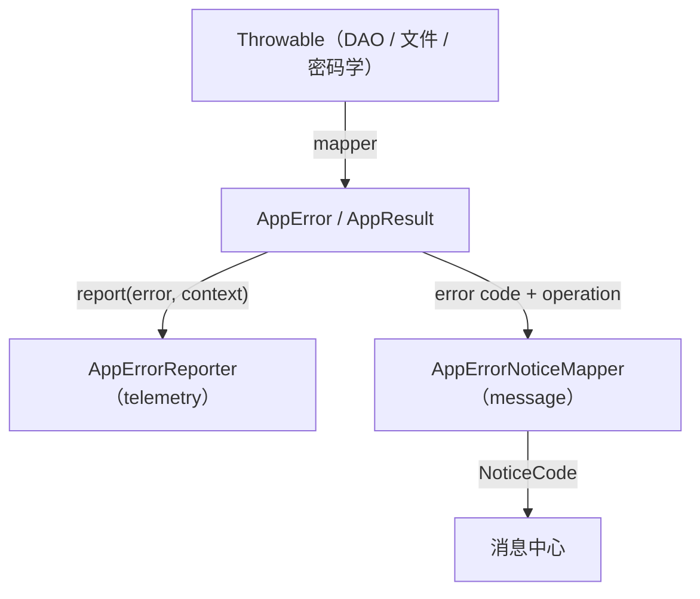

# 错误处理架构

## 三层分离

错误处理拆分为三个独立层，只允许单向协作：



- **core/error**：只表达失败和控制流（`AppError`、`AppResult`）。不记录日志、不发布消息、不依赖 Android。
- **core/telemetry**：可观察 Error，但 Error 不知道 Telemetry 的存在。通过 `AppErrorReporter`
  契约在边界统一记录。
- **app/message**：根据 error code + operation 映射为 `NoticeCode`，由消息中心决定展示方式。

## 禁止反向依赖

```
core/error -X-> telemetry
core/error -X-> AppTelemetry
core/error -X-> message center
telemetry  -X-> UI 文案
message    -X-> Throwable
```

## 目录结构

```
core/error/
  model/
    AppError.kt          -- 纯错误模型（code、layer、severity、recoverable、errorId）
    ErrorCode.kt         -- 集中错误码常量
    DataErrors.kt        -- 数据层错误子类
    DomainErrors.kt      -- 领域层错误子类
  result/
    AppResult.kt         -- Success/Failure、map/fold、异常转换
  mapping/
    AppErrorMapper.kt    -- Throwable → AppError 安全映射
  boundary/
    CryptoException.kt   -- 密码学边界异常
    DatabaseException.kt -- 数据库边界异常

core/telemetry/
  model/
  policy/
  reporting/
    AppErrorReporter.kt   -- Reporter 契约（属 telemetry，不属 error）
    ErrorReportContext.kt -- 上报上下文（operation + category）

app/diagnostics/
  TelemetryAppErrorReporter.kt -- Reporter 实现
  AppTelemetry.kt              -- 框架回调桥接

app/message/
  mapping/
    AppErrorNoticeMapper.kt -- Error → NoticeCode 映射
```

## 数据流

### 异常 → AppError

```
DAO / 文件 / 密码学抛出异常
  ↓ (在 Repository 边界被 AppResult.runSuspendCatching 捕获)
AppErrorMapper.fromThrowable() 映射为 AppError
  ↓
AppResult.Failure(AppError)
```

低层可以抛异常（`CryptoException`、`DatabaseException`、`IOException`），但 UI 不收到任意 `Throwable`
。Repository 边界统一返回 `AppResult`。

### AppError → Reporter

```kotlin
fun interface AppErrorReporter {
    fun report(error: AppError, context: ErrorReportContext)
}

data class ErrorReportContext(
    val operation: OperationCode,
    val category: EventCategory,
)
```

在 repository / use case 边界统一调用一次，避免重复记录。实现只能写入白名单字段：

| 允许                    | 禁止                   |
|-----------------------|----------------------|
| error_code            | error.message        |
| error_layer           | Throwable.message    |
| severity              | entryId              |
| recoverable           | 文件路径                 |
| operation             | URL / 域名             |
| correlation_id        | 包名                   |
| throwable_type（白名单校验） | 用户名、备份 URI、密码、密钥、OTP |

### AppError → UI / Notice

```
页面根据 error code + operation 映射 NoticeCode
  ↓
AppErrorNoticeMapper
  ↓
消息中心（AppNotice）
```

Error 不直接发布 `AppNotice`。内联显示（Snackbar、输入框错误）由页面根据 error code 决定。

## 记录策略

不是所有失败都应该写日志：

| 错误类型      | 日志               | 用户消息          |
|-----------|------------------|---------------|
| 输入校验失败    | 通常不记录            | 内联显示          |
| 条目不存在     | 通常不记录            | Snackbar / 刷新 |
| 乐观锁冲突     | WARN，可计数         | 提示刷新          |
| 用户取消认证    | 不记录              | 不显示           |
| 密码错误      | 匿名计数，不能记录密码或次数明细 | 输入框错误         |
| 数据库初始化失败  | ERROR            | 强制消息 / 恢复入口   |
| 加密 Tag 失败 | ERROR            | 数据损坏提示        |
| 备份格式错误    | WARN             | 导入失败提示        |
| 未知异常      | ERROR            | 通用失败提示        |

## AppError 模型

```kotlin
sealed class AppError(
    open val code: String,          // 稳定错误码，如 "DATABASE_LOCKED"
    open val layer: ErrorLayer,     // DATA / DOMAIN / UI
    open val severity: ErrorSeverity, // WARNING / ERROR
    open val recoverable: Boolean,  // 是否可恢复
    open val errorId: String,       // 关联 ID，用于诊断
)
```

- `code` 是稳定标识符，UI 文案通过 `ErrorMessages.toUiMessage(code)` 映射。
- 不保存 `message`、`cause`、日志字段、Android 类型。
- 当前仍扩展 `Exception` 以兼容 `throw`/`catch` 语义。`throwableType` 字段记录原始异常类型名（白名单校验后可用于遥测）。
- 长期目标：Repository 边界统一返回 `AppResult`，不再 `throw AppError` 子类，届时可移除 `Exception` 继承。

## 相关文档

- [遥测与诊断日志](telemetry.md)
- [消息中心](message-center.md)
- [包边界](package-boundaries.md)
- [安全总览](../security/overview.md)