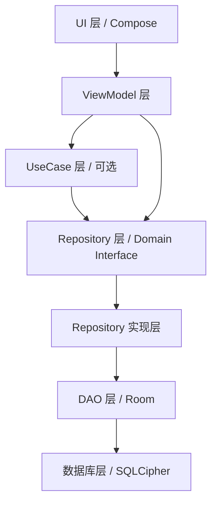
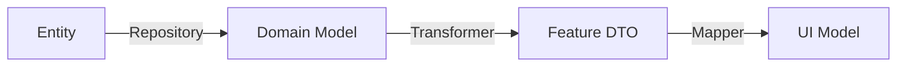
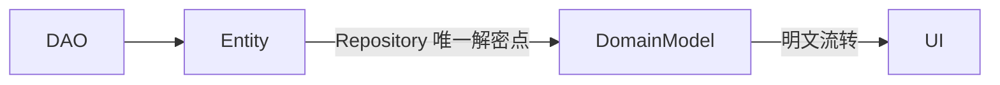
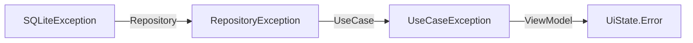

# Passly 分层架构规范 (Layering Architecture)

> 本文档定义 Passly 的软件分层、依赖方向及各层职责。
>
> Passly 遵循 **单向依赖** 与 **职责分离** 的核心原则，确立系统的可维护性、可测试性及安全性边界。

---

## 1. 设计目标

Passly 的分层设计遵循以下核心原则：

- **单向依赖**：依赖方向始终向下，严禁循环依赖或反向依赖。
- **职责单一**：每层仅处理其职责范围内的逻辑，确立清晰的边界。
- **高内聚低耦合**：模块化设计，确保各组件易于替换与独立测试。
- **禁止越级访问**：任何模块均不得跨层访问底层组件（如 UI 直接访问 DAO）。
- **易于测试**：每一层均可通过 Mock 下层实现进行独立的单元测试。

---

## 2. 总体结构模型

Passly 的分层模型如下，依赖方向由上至下严格单向流动：

---

## 3. UI 层 (UI Layer)

### 3.1 核心职责

- **技术栈**：Compose, Activity, Fragment, Navigation。
- **主要工作**：展示数据、接收用户输入、分发界面事件。

### 3.2 行为约束

- **严禁** 直接查询数据库。
- **严禁** 执行加密解密逻辑。
- **严禁** 直接调用 DAO。
- **严禁** 持有 Entity 对象。

---

## 4. ViewModel 层 (ViewModel Layer)

### 4.1 核心职责

- **主要工作**：管理 **UI State**、分发业务事件、管理生命周期感知的状态。
- **调用规则**：仅允许调用 UseCase 或 Repository。

### 4.2 行为约束

- **严禁** 直接操作 SQL 或 DAO。
- **严禁** 执行密码学逻辑或访问 Android Keystore。
- **逻辑限制**：ViewModel 不应包含复杂的业务规则，仅负责 UI 状态驱动。

---

## 5. UseCase 层 (Domain Logic Layer)

### 5.1 适用场景

UseCase 为 **可选层**，仅在以下场景推荐使用：

- **跨模块协调**：涉及多个 Repository 的复杂操作。
- **逻辑复用**：跨多个 ViewModel 的核心业务流程。

### 5.2 设计约定

若逻辑仅为 Repository 的简单包装且无额外业务价值，应省略此层，由 ViewModel 直接调用
Repository。例如：Autofill 中的 CandidateResolver 可直接依赖 Repository。

---

## 6. Repository 层 (Data Entrance Layer)

### 6.1 核心职责

- **数据入口**：Repository 是领域层获取数据的唯一入口。
- **关键处理**：负责数据查询、保存、**数据解密**及数据映射。

### 6.2 安全边界

- **解密出口**：Repository 是系统中 **唯一允许** 执行字段解密（AES-256-GCM）的组件。
- **返回契约**：对外统一返回已解密的 **Domain Model**。

---

## 7. DAO 层 (Data Access Layer)

### 7.1 核心职责

- **基础操作**：负责 SQL 查询、插入、更新及 Room 映射。
- **模型范围**：DAO 永远只处理 **Entity**。

### 7.2 行为约束

- **职责限制**：严禁处理解密、加密、数据校验或任何业务逻辑。

---

## 8. 数据模型流转 (Model Flow)

Passly 严格区分不同用途的模型，防止底层实现细节污染上层。

### 8.1 模型职责定义

- **Entity**：数据库表映射模型。**禁止传递到 UI 层**。
- **Domain Model**：核心业务模型。Repository 向外提供的唯一标准对象。
- **Feature DTO**：功能专用 DTO（如 `ResolvedCandidate`）。用于隔离模块，避免上层依赖完整的业务模型。
- **UI Model**：界面展示模型。仅包含 View 渲染所需的轻量化数据。

---

## 9. 依赖规则对照表

- **允许**：ViewModel → Repository (标准路径)
- **允许**：Repository → DAO (数据持久化)
- **允许**：CandidateResolver → Repository (模块内获取)
- **禁止**：UI ⇎ DAO (严禁跨层)
- **禁止**：Factory ⇎ Repository (转换逻辑不持有数据源)
- **禁止**：Entity ⇎ UI (数据库模型不进入渲染链路)
- **禁止**：DAO ⇎ Repository (严禁反向依赖)

---

## 10. Feature 边界规范

不同功能模块（Feature）之间不得直接依赖具体实现：

- **Autofill 模块**：仅允许依赖 `CredentialRepository` 接口。
- **严禁依赖**：禁止直接依赖 **Room**、**DatabaseSessionManager** 或底层 **EncryptionManager**。

---

## 11. 解密边界与单向流转

解密逻辑遵循 **单点解密** 准则：

- **单次解密**：字段解密仅在 Repository 层发生一次。
- **明文环境**：解密之后的所有对象（Domain Model, DTO, UI Model）均为明文。
- **禁止行为**：严禁在 UI 或 Factory 层再次尝试调用解密逻辑。

---

## 12. 错误处理与转换

异常处理应逐层抽象转换，避免底层细节暴露：

- **准则**：UI 不应直接处理原始的数据库或加密异常。

---

## 13. 可测试性要求

每一层均需支持独立单元测试：

- **Repository**：通过 Mock DAO 验证数据逻辑。
- **ViewModel**：通过 Mock Repository 验证 UI 状态驱动。
- **Resolver/Factory**：通过纯单元测试验证模型转换的准确性。

---

## 14. 总结

Passly 的分层架构不仅是代码组织方式，更是 **安全防线**。通过 Repository 的单点解密入口、严格的单向依赖以及专用
DTO 隔离，确保了敏感数据在受控的边界内流转，UI 层永远不接触数据库及加密细节。