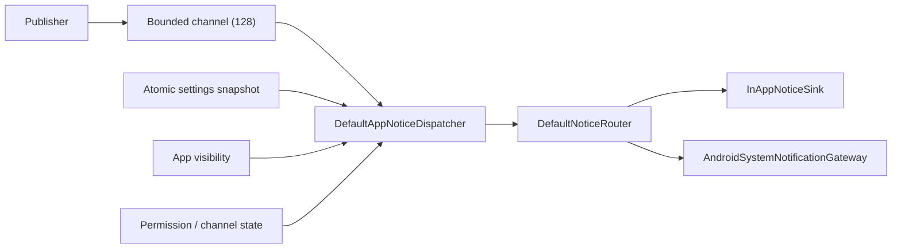

# 消息中心

## 边界与数据流

业务代码只发布 `AppNotice(eventId, code, arguments)`。`topic`、`level`、投递策略、强制性与
去重窗口由可信 `NoticeCodeRegistry` 决定，发布者不能伪造。参数只能使用 `Count`、
`DurationMs`、`EnumCode`、`ReasonCode` 或 `Flag`，不得传入自由文本、凭据、路径或 URL。

`publish()` 只返回入队结果；需要确定投递结果的调用方使用 `dispatch()` 获得
`NoticeDispatchReceipt`。Dispatcher 串行处理消息并在一次处理开始时原子读取设置版本，整条消息使用同一快照。

## 判定顺序

1. 以 `eventId` 获取两阶段去重 claim；同一事件正在处理或仍在 TTL 内时拒绝。
2. 读取 `NoticeCodePolicy`。非 mandatory 消息依次检查总开关、topic 开关和最低等级。
3. 根据 `DeliveryPolicy` 与前后台状态生成初始目标。
4. 系统目标同时检查产品设置、`POST_NOTIFICATIONS`、系统通知总开关和 channel。
5. `PREFER_*` 在首选目标不可用或投递失败时按策略回退；`SYSTEM_ONLY` 不回退。
6. 路由允许后再执行按 `NoticeCode` 的语义去重；成功完成 eventId claim，异常或取消则释放。

强制消息只绕过产品总开关、topic 和最低等级，不绕过 Android 权限或系统 channel。

## 事件注册表

事件编号使用 `NoticeCode` 枚举名这一稳定字符串，不使用或持久化 Kotlin ordinal；枚举调整顺序不会改变事件编号。
所有事件的精确 `eventId` TTL 当前为 120 秒。语义去重为 0 表示只做 eventId 去重。

| NoticeCode | Topic | Level | Delivery | Mandatory | 语义去重 |
|---|---|---|---|---:|---:|
| `CLIPBOARD_CLEARED` | CLIPBOARD | INFO | IN_APP_ONLY | 否 | 5 秒 |
| `CLIPBOARD_CLEAR_FAILED` | CLIPBOARD | ERROR | IN_APP_ONLY | 否 | 5 秒 |
| `APP_LOCKED` | APP_LIFECYCLE | INFO | IN_APP_ONLY | 否 | 10 秒 |
| `APP_CLOSE_REMINDER` | APP_LIFECYCLE | WARNING | IN_APP_ONLY | 否 | 10 秒 |
| `ICON_DOWNLOAD_COMPLETED` | ICON_DOWNLOAD | SUCCESS | PREFER_SYSTEM | 否 | 5 秒 |
| `ICON_DOWNLOAD_FAILED` | ICON_DOWNLOAD | ERROR | PREFER_SYSTEM | 否 | 10 秒 |
| `BACKUP_EXPORT_COMPLETED` | BACKUP | SUCCESS | PREFER_IN_APP | 否 | 30 秒 |
| `BACKUP_EXPORT_FAILED` | BACKUP | ERROR | PREFER_IN_APP | 否 | 30 秒 |
| `BACKUP_IMPORT_COMPLETED` | BACKUP | SUCCESS | PREFER_IN_APP | 否 | 30 秒 |
| `BACKUP_IMPORT_FAILED` | BACKUP | ERROR | PREFER_IN_APP | 否 | 30 秒 |
| `SECURITY_KEY_INVALIDATED` | SECURITY | CRITICAL | PREFER_SYSTEM | 是 | 0 |
| `SECURITY_RECOVERY_REQUIRED` | SECURITY | CRITICAL | PREFER_IN_APP | 是 | 0 |
| `SECURITY_ACTION_FAILED` | SECURITY | ERROR | PREFER_SYSTEM | 是 | 0 |
| `DATABASE_INDEX_REBUILD_COMPLETED` | DATABASE | SUCCESS | PREFER_IN_APP | 否 | 30 秒 |
| `DATABASE_INDEX_REBUILD_FAILED` | DATABASE | ERROR | PREFER_IN_APP | 否 | 30 秒 |
| `DATABASE_OPERATION_FAILED` | DATABASE | ERROR | PREFER_IN_APP | 是 | 0 |
| `NOTIFICATION_PERMISSION_DENIED` | APP_LIFECYCLE | WARNING | IN_APP_ONLY | 否 | 0 |

新增事件必须同时增加：枚举、注册策略、受控文本资源与解析映射、参数契约、Router/Dispatcher 测试以及本表。
不得增加 `StubSystemNotificationGateway` 或在 feature 中直接调用 `NotificationManager`。
