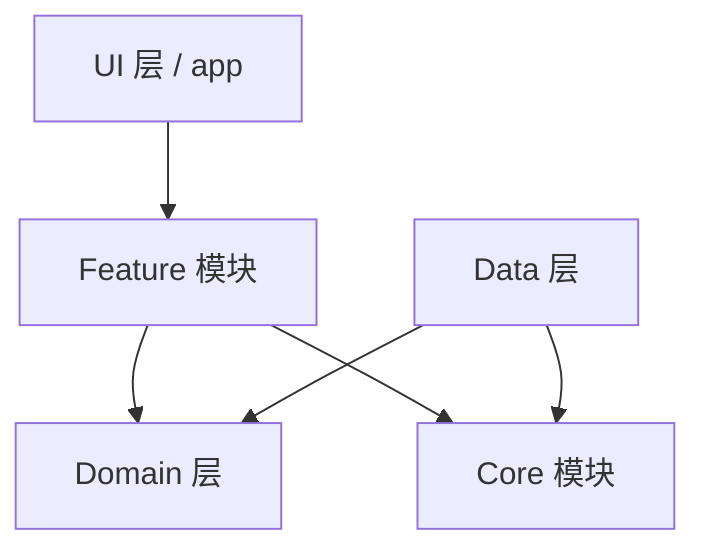

# Passly 模块边界规范 (Module Boundaries)

> 本文档定义 Passly 各模块的职责、公开接口、依赖关系及边界约束。
>
> Passly 遵循 **单一职责** 与 **最小公开接口** 原则，确保各模块内部实现可替换且保持低耦合，构建高度自治的软件体系。

---

## 1. 模块设计目标

Passly 的模块划分遵循以下核心原则：

- **单一职责**：每个模块仅解决一个核心领域的业务或技术问题。
- **最小公开接口**：仅通过接口或特定的 Public API 通信，隐藏内部实现细节。
- **内部实现可替换**：只要满足接口契约，模块内部逻辑可随时重构。
- **模块低耦合**：模块之间仅通过公开 API 通信，严禁访问内部实现类。
- **单向依赖原则**：严禁循环依赖，确保数据流向清晰可控。

---

## 2. 模块依赖拓扑

Passly 遵循单向向下依赖原则，确保架构的稳定性。

---

## 3. 核心分层职责

### 3.1 core：基础能力层

- **核心定位**：提供全局通用的技术基石。
- **包含组件**：Crypto（算法）、Autofill（填充管道）、Security（策略）、Common（工具）。
- **硬性约束**：不得依赖任何 Feature 或 Data 实现。

### 3.2 data：数据持久化层

- **主要职责**：具体的数据来源实现。
- **包含组件**：Room 配置、SQLCipher 挂载、Repository 实现、数据 Mapper。
- **硬性约束**：不得包含 Compose 代码，不得持有任何 ViewModel。

### 3.3 domain：业务抽象层

- **主要职责**：系统的业务逻辑骨架。
- **包含组件**：Domain Model（领域模型）、Repository Interface（接口）、UseCase。
- **硬性约束**：保持纯 Kotlin 实现，不依赖 Android Framework。

### 3.4 feature：业务功能层

- **主要职责**：具体的端到端业务流程。
- **包含组件**：Vault、Settings、Authentication、Autofill UI。
- **硬性约束**：不应直接访问具体 DAO，仅通过 Domain 接口获取数据。

---

## 4. 细分模块职责明细

### 4.1 core.autofill (填充管道)

- **职责范围**：`CandidateResolver`、`FillRequestDispatcher`、`ResponseFactory`。
- **非职责范围**：严禁处理 Room 存储、SQLCipher 配置或 AES 底层算法。

### 4.2 core.security (安全策略)

- **职责范围**：`Vault 状态管理`、`Authentication 流程`、`Session 生命周期`。
- **非职责范围**：严禁包含任何 UI 渲染逻辑。

### 4.3 core.crypto (密码学核心)

- **职责范围**：`AES-GCM`、`HMAC 派生`、`Envelope 信封逻辑`、`Key 密钥管理`。
- **非职责范围**：严禁持有任何 Repository 或业务模型引用。

### 4.4 data.database (持久化底座)

- **职责范围**：`Room Database 配置`、`Migration 迁移逻辑`、`DAO 基础操作`。
- **安全禁令**：严禁在这一层执行任何业务字段的加解密逻辑（由 Repository 负责）。

---

## 5. 模型与 DTO 规范

### 5.1 domain.model

- **模型职责**：标准业务对象（如 `VaultEntry`, `Folder`）。
- **硬性约束**：严禁包含持久化注解（如 `@Entity`）或 Android 特有 API。

### 5.2 Feature DTO

- **模型职责**：功能模块内部定义的专用展示模型（如 `ResolvedCandidate`）。
- **约束要求**：生命周期仅限当前 Feature 模块，严禁跨模块滥用。

---

## 6. 依赖规则对照表

- **允许的行为**：
    - **feature** → **domain** (获取业务契约)
    - **feature** → **core** (使用基础工具)
    - **data** → **domain** (实现持久化接口)
- **严禁的行为**：
    - **禁止**：**core** 依赖 **feature**（基础层严禁反向依赖）。
    - **禁止**：**domain** 依赖 **data implementation**（抽象层严禁依赖实现细节）。
    - **禁止**：**ui / feature** 依赖 **database**（界面严禁绕过 Repository 访问数据库）。

---

## 7. 公开 API 与内部实现

### 7.1 封装规范

- **内部隐藏**：模块内部实现类应优先使用 `internal class`。
- **契约暴露**：模块仅公开稳定的 Interface（如 `CredentialRepository`）或 Public API（如
  `VaultManager`）。

### 7.2 访问限制

- **引用隔离**：上层模块不得绕过接口直接引用下层的内部实现类。

---

## 8. 总结

Passly 的模块设计强调 **模块自治** 与 **单向依赖**
。通过最小化公开接口与严格的模型流转规范，确保了在复杂的密码学业务中，各模块能够各司其职且边界分明。未来新增功能时，应优先复用已有模块，严禁跨模块直接访问内部实现。