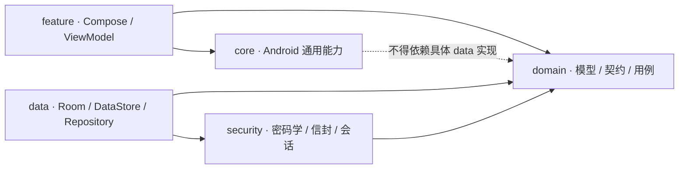
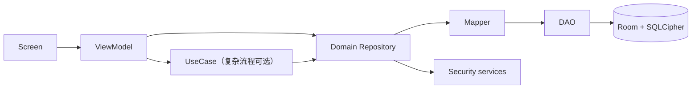

# 架构总览

Passly 当前保持单 Gradle 模块，以 Kotlin 包维护 `core / domain / data / security / feature` 边界。Gradle
多模块化是后续工程选择，不应在当前文档中假装已经完成。

## 依赖方向



依赖注入只负责在应用边界把 Domain 契约与 Data/Security 实现连接起来，不改变源码依赖方向。

## 数据流



- UI 只消费 UI state 和一次性 effect，不读取 DAO/Entity。
- Domain Repository 使用领域模型，不暴露 Android、Room、Feature 类型。
- Data 在 Mapper 边界转换 Entity 与 Domain model，并负责持久化错误映射。
- 解密集中在 Repository/Security 协作边界；明文领域对象只在解锁会话中存活。

## Feature 与 UI

`feature/<name>` 是业务垂直切片，可包含 `navigation`、`presentation`、`ui`。Compose 页面和通用视觉组件放在
UI 子包；ViewModel、UI state/effect 留在 presentation 子包。跨 Feature 的纯视觉组件放
`feature/common/ui` 或独立顶层 `ui` 包，但不能反向依赖具体 Feature。

推荐布局：

```text
feature/settings/
  navigation/
  presentation/
  ui/
    component/
```

## UseCase 何时需要

单一 Repository 调用可由 ViewModel 直接编排。跨仓库事务、安全校验、恢复码创建/重置等具有业务不变量的流程使用
UseCase，避免把领域规则放进 Compose 或 Android 回调。

## 相关文档

- [包边界](package-boundaries.md)
- [运行时流程](runtime-flows.md)
- [安全总览](../security/overview.md)
- [ADR-0007：UseCase 可选](../decisions/ADR-0007-usecase-is-optional.md)

