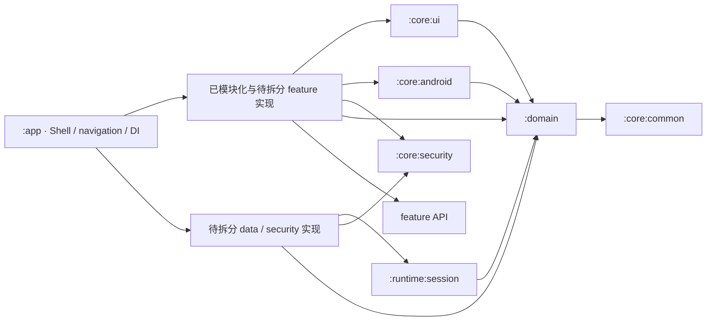
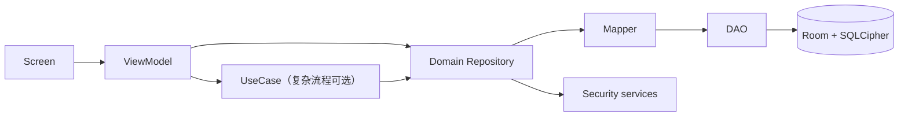

# 架构总览

Passly 已开始按依赖方向拆分 Gradle 模块。稳定的通用契约与运行时能力已离开 `app`；尚未完成模块化的
`data / security / feature` 实现仍暂时位于 `app`，不能把包目录误认为已经存在的模块边界。

当前模块：

- `:domain`：纯领域模型、契约与用例；
- `:core:common`：纯 Kotlin 错误与通用能力；
- `:core:telemetry`：遥测模型和报告契约；
- `:core:android`：Android 平台能力及其实现；
- `:core:security`：敏感值与内存擦除等纯 JVM 安全基础能力；
- `:core:ui`：不依赖业务 feature 和 app 资源的共享 Compose UI；
- `:runtime:session`：资源无关的安全会话状态机与租约管理；
- `:feature:auth:api`：认证 feature 的稳定 Intent/UI state 集成契约；
- `:feature:recovery:api`：恢复模式 feature 的稳定 Intent/UI state/effect 契约；
- `:feature:recovery`：恢复模式 UI、ViewModel 和状态归约实现；
- `:app`：应用壳、导航和 DI 组装，以及尚待拆分的 data/security/feature 实现。

## 依赖方向



依赖注入只负责在应用边界把 Domain 契约与 Data/Security 实现连接起来，不改变源码依赖方向。共享模块不得
依赖 `:app`；这一规则由 Gradle/编译器边界保证。

`verifyModuleBoundaries` 校验每个真实 Gradle 模块的直接项目依赖白名单和依赖环，并自动接入各模块的
`check` 生命周期。新增模块必须先声明允许的依赖方向；未加入依赖的实现类型不会进入编译 classpath，因此
类型可见性继续由 Kotlin/Java 编译器保证。仍位于 `:app` 的包目录不等同于模块边界，其临时包级护栏要在对应
feature/data 模块迁出后删除。

## 数据流



- UI 只消费 UI state 和一次性 effect，不读取 DAO/Entity。
- Domain Repository 使用领域模型，不暴露 Android、Room、Feature 类型。
- Data 在 Mapper 边界转换 Entity 与 Domain model，并负责持久化错误映射。
- 解密集中在 Repository/Security 协作边界；明文领域对象只在解锁会话中存活。

## Feature 与 UI

`feature/<name>` 是尚在迁移中的业务垂直切片，可包含 `navigation`、`presentation`、`contract`、`ui`。
Compose 页面和 ViewModel 由 feature 自己拥有；跨 Feature 的纯视觉组件进入 `:core:ui`，但必须通过参数或
Composable slot 接收文案和内容，不能依赖 app 的 `R` 或具体业务类型。App 级组合位于 `app/shell`，不再使用
`feature/main` 伪装成业务 feature。

推荐布局：

```text
feature/settings/
  contract/
  navigation/
  presentation/
  ui/
    component/
```

## UseCase 何时需要

单一 Repository 调用可由 ViewModel 直接编排。跨仓库事务、安全校验、恢复码创建/重置等具有业务不变量的流程使用
UseCase，避免把领域规则放进 Compose 或 Android 回调。

## 相关文档

- [包边界](package-boundaries.md)
- [运行时流程](runtime-flows.md)
- [安全总览](../security/overview.md)
- [ADR-0007：UseCase 可选](../decisions/ADR-0007-usecase-is-optional.md)

