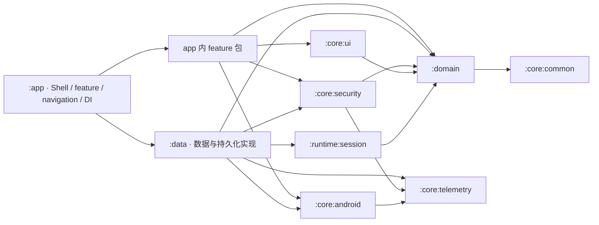
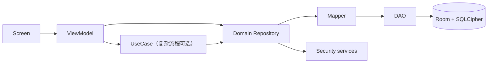

# 架构总览

Passly 只按稳定、可复用的技术边界拆分 Gradle 模块。业务 feature 保留在 `app` 内，以包组织职责；当前规模下
不再为每个页面或流程建立 `:feature:*` 模块，避免 API/implementation 空壳和过细依赖图。

当前模块：

- `:domain`：纯领域模型、契约与用例；
- `:core:common`：纯 Kotlin 错误与通用能力；
- `:core:telemetry`：遥测模型和报告契约；
- `:core:android`：Android 平台能力及其实现，包括包信息、文件路径与存储选择支持；
- `:core:security`：密码学、DEK/会话密钥、信封与 Blind Index 安全能力；因 Argon2 为 AAR，模块是
  Android library，但源码不反向依赖 Data 或 App；
- `:core:ui`：不依赖业务 feature 和 app 资源的共享 Compose UI；
- `:runtime:session`：资源无关的安全会话状态机与租约管理；
- `:data`：Room、Proto DataStore、Repository、Mapper 与加密诊断存储实现；
- `:app`：应用壳、导航、平台入口、Notice 运行时和全部业务 feature。Backup 的协议、格式、文件 I/O、
  数据库快照编排也归 `app/feature/backup`，不属于 `:data`。

## 依赖方向



Data 自己拥有 Repository、存储与数据策略的 Hilt binding。App 负责业务流程和 Android 入口；Backup 的
数据库快照代码是一个明确、局部的数据集成点，其他 feature 继续通过 Domain 契约使用 Data。

`verifyModuleBoundaries` 校验每个真实 Gradle 模块的直接项目依赖白名单和依赖环，并自动接入各模块的
`check` 生命周期。新增模块必须先声明允许的依赖方向；未加入依赖的实现类型不会进入编译 classpath，因此
类型可见性继续由 Kotlin/Java 编译器保证。`app/feature/<name>` 是代码组织边界，不伪装成 Gradle 模块。

## 数据流



- UI 只消费 UI state 和一次性 effect，不读取 DAO/Entity。
- Domain Repository 使用领域模型，不暴露 Android、Room、Feature 类型。
- Data 在 Mapper 边界转换 Entity 与 Domain model，并负责持久化错误映射。
- 解密集中在 Repository/Security 协作边界；明文领域对象只在解锁会话中存活。

## Feature 与 UI

`feature/<name>` 是 app 内的业务垂直切片，可包含 `navigation`、`presentation`、`contract`、`ui`。
Compose 页面和 ViewModel 由 feature 自己拥有；跨 Feature 的纯视觉组件进入 `:core:ui`，但必须通过参数或
Composable slot 接收文案和内容，不能依赖 app 的 `R` 或具体业务类型。只有出现真实的独立发布、显著构建隔离
或多宿主复用需求时，才重新评估 feature Gradle 模块。

推荐布局：

```text
feature/settings/
  contract/
  navigation/
  presentation/
  ui/
    component/
```

## UseCase 何时需要

单一 Repository 调用可由 ViewModel 直接编排。跨仓库事务、安全校验、恢复码创建/重置等具有业务不变量的流程使用
UseCase，避免把领域规则放进 Compose 或 Android 回调。

## 相关文档

- [包边界](package-boundaries.md)
- [运行时流程](runtime-flows.md)
- [安全总览](../security/overview.md)
- [ADR-0007：UseCase 可选](../decisions/ADR-0007-usecase-is-optional.md)

