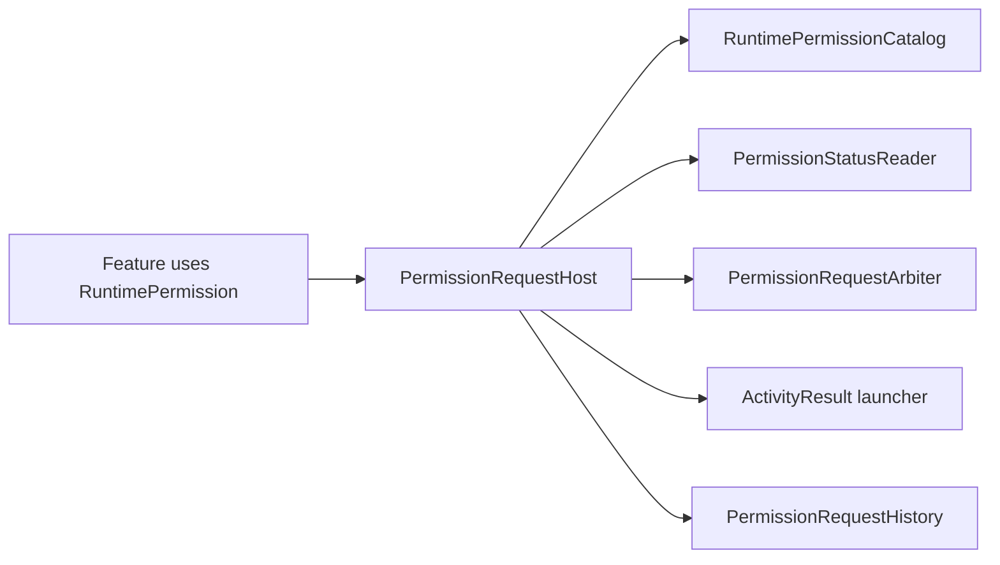

# 权限中心

## 模型

`RuntimePermission` 只包含应用实际请求的运行时权限：

| RuntimePermission | Android 权限 | 适用范围 | 请求所有者 |
|---|---|---|---|
| `CAMERA` | `CAMERA` | 所有支持版本 | 扫码入口 |
| `POST_NOTIFICATIONS` | `POST_NOTIFICATIONS` | API 33+ | 消息设置 |

`INTERNET`、`VIBRATE`、`USE_BIOMETRIC` 和 package visibility 属于 Manifest capability，
不能进入运行时 requester。应用不再声明 `QUERY_ALL_PACKAGES`；应用匹配依赖 `<queries>` 的 launcher intent
可见性，新增包查询场景必须先完成最小权限审计。

## 请求流程

- feature 只能使用 `RuntimePermission`，不得拼写 `Manifest.permission` 或创建自己的 launcher。
- `PermissionStatusReader` 返回 `GRANTED`、`DENIED` 或版本不适用的 `NOT_APPLICABLE`。
- `PermissionRequestArbiter` 在整个进程中只允许一个系统权限弹窗 owner 持有 lease。
- `PermissionRequestHistory` 仅用于区分首次拒绝与永久拒绝，不存储授权真值。
- requester 返回明确的 start/outcome 类型，不使用 Boolean 表示多种状态。
- 产品开关与授权状态分离；永久拒绝后由 UI 引导系统设置，中心不自动循环请求。

新增运行时权限必须更新枚举、Catalog、Manifest、请求所有者、状态/拒绝测试和本表。Hilt EntryPoint
service locator、Boolean requester、旧 `AppPermission` 混合模型不得恢复。
