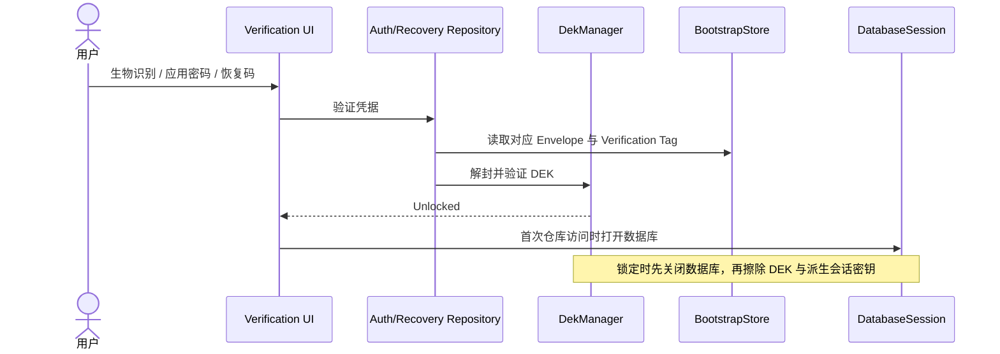
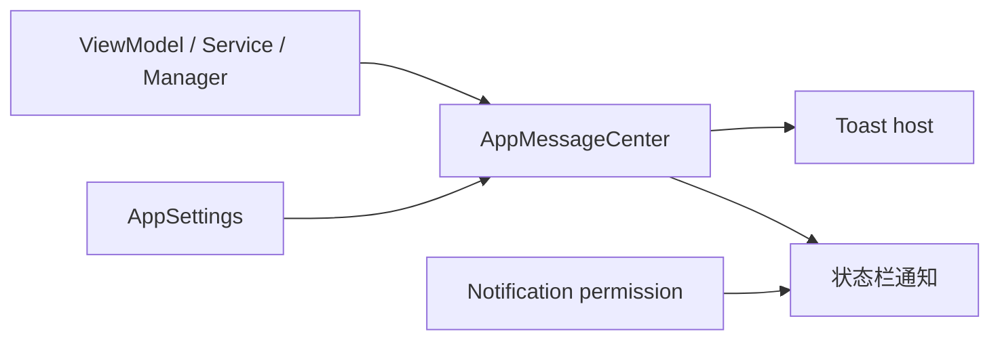

# 运行时流程

## 解锁与锁定

`BootstrapStore` 位于数据库之外，使应用在 SQLCipher 尚未打开时也能取得信封。当前实现由 Proto DataStore
提供，DEK 解锁后 `DatabaseProvider` 才能创建 Room 实例。

## 一次性消息

同一业务事件只能发布一次，并明确选择 Toast 或状态栏通知，避免 Verification 和 Main
两条通道重复显示。通知偏好控制产品行为，系统权限决定状态栏通知是否可投递，两者不能混为一个布尔值。

## 备份

导出先生成一致性快照与附件，再写入 ZIP 负载，最后用备份密码派生的密钥进行 AES-GCM
加密。导入必须先完整验证容器、解密和校验路径，再在事务中执行覆盖或合并；失败不得留下部分数据。

详细格式见[备份格式](../data/backup-format.md)。
