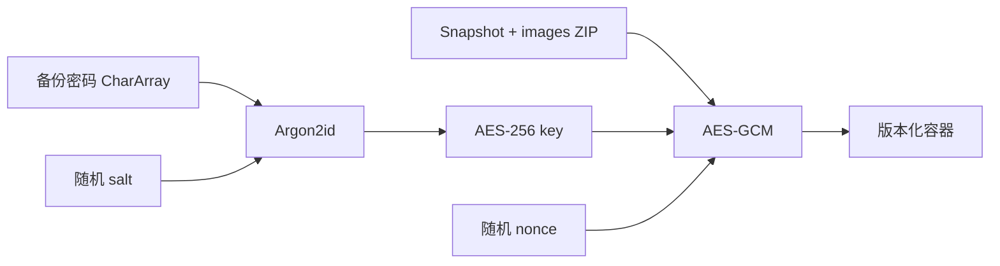

# 备份格式

状态：当前格式版本 1。旧格式不保证兼容。

## 容器

```text
magic(8) | version(i32) | salt | nonce(12) | ciphertextLength(i32) | AES-GCM ciphertext
```

magic 为 `PASSLYBK`。密文解开后是 ZIP：

```text
data.json
images/<safe-name>
```

`data.json` 保存 Vault 快照；`images/` 保存可选图标和附件。条目必须使用受限相对路径，拒绝 `..`
、反斜杠、绝对路径、重复条目、目录条目及超限数据。

## 加密流程



备份密码独立于 Vault 恢复码。恢复码只用于解锁保险库，不能作为备份选项。

## 导入约束

- 流读取必须保证读满固定头和声明的密文长度，并拒绝尾随数据。
- 未知 magic、版本、截断和认证标签失败分别映射为可理解错误。
- 在修改数据库前完成容器校验、解密、ZIP 校验和快照解析。
- 覆盖/合并及附件恢复在事务边界内完成；空输入流不能报告成功。

## 已知格式缺口

版本 1 的头只保存 salt 与 nonce，没有保存 KDF 算法及参数。代码当前依赖应用内固定 Argon2id
配置；参数变化会破坏备份的自描述性。下一格式版本应把 KDF 标识、内存、迭代和并行度写入头，并用 AAD 认证整个头部。

相关决策见 [ADR-0016](../decisions/ADR-0016-backup-format.md)。
