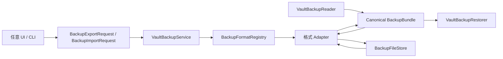

# Passly 备份协议

状态：正式格式 v1
最后修订：2026-07-24

本文描述可恢复的 Vault 内容备份，不描述 Room 数据库镜像。正式 v1 使用新的
magic，因此不兼容开发期间产生的任何 `PASSLYBK`、旧 Snapshot 或旧 ZIP 文件。

## 1. 范围

默认的完整 Passly 备份包含：

- 所有 Vault 条目，包括回收站条目；
- Entry Summary 和 Entry Secret 的业务字段；
- 所有 `COMMITTED` 附件；
- 可选的自定义图标；
- 资源大小、SHA-256 和附件创建时间。

以下内容有意不进入备份：

- Draft、Search Token 和可重建索引；
- Activity、Revision 等本机历史；
- 设置、会话、DEK、Bootstrap 密钥和认证材料；
- Room 主键之外的数据库实现细节；
- 本机绝对路径和未提交附件。

因此该格式叫 Vault Backup，不叫 Database Snapshot。导入后搜索索引按
`searchIndexVersion` 重建。

## 2. 支持的外部格式

| formatId           | 方向    | 资源        | 保密性                    |
|--------------------|-------|-----------|------------------------|
| `passly.encrypted` | 导入、导出 | 附件；图标可选   | Argon2id + AES-256-GCM |
| `passly.json`      | 导入、导出 | Base64 内嵌 | 无                      |
| `passly.text`      | 仅导出   | 无         | 无                      |
| `bitwarden.json`   | 仅导入   | 不支持附件 ZIP | 取决于源文件；当前只接收明文 JSON    |

TXT 是给人阅读的有损报告，不是备份。明文 JSON 和 TXT 都包含敏感字段，调用方
必须显示风险提示。

## 3. 与 UI 解耦的处理流程



`VaultBackupService` 只有通用的 `export(request)` 和 `import(request)`。格式实现不读取
数据库、不访问 Android URI，也不依赖 UI 状态。

新增外部导入格式的步骤：

1. 实现 `BackupImportAdapter`；
2. 提供稳定的 `formatId`；
3. 实现只读、低成本的 `probe(payload)`；
4. 将源数据映射为 `BackupBundle`；
5. 在 `BackupModule` 中增加一个 `@IntoSet` 绑定；
6. 增加格式样例、拒绝场景和字段映射测试。

不需要修改 `VaultBackupService`、Reader、Restorer 或现有 UI。未指定导入格式时，
Registry 按内容评分选择唯一适配器；无法识别或同分歧义时拒绝导入。

## 4. Passly 文档 v1

### 4.1 顶层文档

| 字段           | 类型           | 必需 | 含义                 |
|--------------|--------------|---:|--------------------|
| `format`     | string       |  是 | 固定为 `passly-vault` |
| `version`    | integer      |  是 | 当前为 `1`            |
| `exportedAt` | epoch millis |  是 | 导出时间               |
| `appVersion` | string       |  否 | 导出应用版本             |
| `entries`    | array        |  是 | 条目列表               |
| `resources`  | array        |  否 | 资源元数据；空时省略         |

导出器不写 `null`、默认值和默认空集合。v1 的 wire model 位于
`data/backup/model/`，独立于 Room Payload 和 Domain Model，修改数据库 DTO 不会改变
备份协议。

### 4.2 Entry

| 字段              | 类型           | 必需 | 约束                          |
|-----------------|--------------|---:|-----------------------------|
| `id`            | string       |  是 | `[A-Za-z0-9_-]{1,160}`，全局唯一 |
| `type`          | string       |  是 | Passly `EntryType` 名称       |
| `version`       | integer      |  是 | `>= 1`                      |
| `createdAt`     | epoch millis |  是 | `>= 0`                      |
| `updatedAt`     | epoch millis |  是 | `>= createdAt`              |
| `deletedAt`     | epoch millis |  否 | 回收站时间                       |
| `summary`       | object       |  是 | 非秘密展示字段                     |
| `secret`        | object       |  是 | 凭据字段                        |
| `attachmentIds` | string array |  否 | 与 ATTACHMENT 资源集合必须完全一致     |

### 4.3 Summary

`summary` 字段：

- `title`、`username`；
- `website.primaryUrl`；
- `website.matchDomains`、`website.packageNames`；
- `icon`：逻辑或远程图标标识；
- `favorite`、`tags`、`color`、`expiresAt`。

`iconCustomPath` 永远不序列化。本地图标通过 `resources` 中的 `ICON` 表达。

### 4.4 Secret

`secret` 是可组合对象，同一条目可以同时拥有 Login、OTP 和其他能力：

| 对象         | 字段                                                                                   |
|------------|--------------------------------------------------------------------------------------|
| `login`    | `email`, `password`                                                                  |
| `card`     | `cardNumber`, `cardExpiry`, `cardCvv`, `cardHolder`, `paymentPin`, `paymentPlatform` |
| `identity` | `idNumber`, `securityQuestion`, `securityAnswer`, `seedPhrase`, `recoveryCodes`      |
| `ssh`      | `privateKey`, `publicKey`, `passphrase`                                              |
| `wifi`     | `password`, `securityType`, `hidden`                                                 |
| `passkey`  | `credentialId`, `rpId`, `userHandle`, `privateKeyReference`, `hardwareKeyInfo`       |
| `otp`      | `config`                                                                             |
| 根字段        | `notes`, `customFields[]`                                                            |

`customFields[]` 包含 `name`、`value`、`type`。

OTP config：

| 字段                      | 含义                         |
|-------------------------|----------------------------|
| `type`                  | `TOTP`, `HOTP`, `STEAM`    |
| `secret`                | OTP Secret                 |
| `algorithm`             | `SHA1`, `SHA256`, `SHA512` |
| `digits`                | 5–10                       |
| `periodSeconds`         | TOTP/Steam 周期，1–300        |
| `counter`               | HOTP 非负计数器                 |
| `encoding`              | `BASE32`, `BASE64`         |
| `issuer`, `accountName` | 可选显示信息                     |

### 4.5 Resource

| 字段          | 类型           | 必需 | 含义                    |
|-------------|--------------|---:|-----------------------|
| `id`        | string       |  是 | 全局唯一资源 ID             |
| `entryId`   | string       |  是 | 所属 Entry              |
| `kind`      | enum         |  是 | `ICON` 或 `ATTACHMENT` |
| `fileName`  | string       |  否 | 展示文件名，不作为磁盘路径         |
| `mimeType`  | string       |  否 | MIME                  |
| `size`      | integer      |  是 | 原文字节数                 |
| `sha256`    | 64 hex chars |  是 | 原文 SHA-256            |
| `createdAt` | epoch millis |  否 | 附件创建时间                |

每个 Entry 最多一个 `ICON`。资源数据必须与元数据集合完全一致，不能多也不能少。

## 5. 明文 JSON

JSON 是一个单文件包：

```json
{
  "document": {
    "format": "passly-vault",
    "version": 1,
    "exportedAt": 0,
    "entries": []
  },
  "resourcesBase64": {}
}
```

`resourcesBase64` 的 key 是 Resource ID，value 是资源原文的标准 Base64。读取时先限制
Base64 字符数，再解码并核对 `size` 与 `sha256`。输入必须是严格 UTF-8。

## 6. 加密容器 v1

### 6.1 标识和端序

- magic：ASCII `PSLYBKP1`，8 字节；
- container version：`1`；
- 所有 `i32` 使用 Java `DataOutputStream` 的 big-endian；
- 正式 v1 明确拒绝旧 `PASSLYBK` magic。

### 6.2 二进制头

```text
magic[8]
formatVersion:i32
headerLength:i32
kdfId:i32
cipherId:i32
argon2Version:i32
iterations:i32
memoryKiB:i32
parallelism:i32
keyLengthBits:i32
saltLength:i32
nonceLength:i32
tagLengthBits:i32
ciphertextLength:i32
salt[saltLength]
nonce[nonceLength]
ciphertext[ciphertextLength]
```

固定头为 60 字节。默认 salt 为 16 字节、nonce 为 12 字节，因此默认完整头为
88 字节。

算法 ID：

- `kdfId = 1`：Argon2id v1.3；
- `cipherId = 1`：AES-256-GCM；
- `keyLengthBits = 256`；
- `tagLengthBits = 128`。

当前导出参数：

- iterations：3；
- memory：65536 KiB；
- parallelism：4。

为防止恶意文件在认证前制造 KDF 资源耗尽，导入上限为：

- iterations：10；
- memory：262144 KiB；
- parallelism：8。

超出上限的文件在执行 Argon2 前拒绝。

### 6.3 Salt、nonce、AAD 和密钥生命周期

- 每次导出生成独立的 128-bit random salt；
- 每次导出生成独立的 96-bit random GCM nonce；
- 两者都使用进程级 `SecureRandom`；
- salt 和 nonce 是公开参数，会明文存放在容器头；
- 随机 salt 令每次派生的 AES key 不同，随机 nonce 防止同 key 下 nonce 重用；
- 从 magic 第一个字节到 nonce 最后一个字节的完整头部都是 AES-GCM AAD；
- 算法 ID、版本、KDF 参数、所有长度、salt、nonce 被修改都会导致拒绝；
- 密码错误与认证失败统一报告为“密码错误或文件损坏”，不提供判别 oracle；
- UTF-8 密码字节、派生 key、ZIP 明文和读取到的输入缓冲在完成后尽力清零；
- 调用者拥有 `CharArray`，必须在调用结束后清零。

JVM/JCE 内部可能复制 key 或字符串，无法承诺所有托管内存立即物理擦除；实现避免额外
持久化和可控的长生命周期副本。

### 6.4 加密负载

AES-GCM 明文是完整 ZIP：

```text
document.json
resources/<resource-id>
```

文档、密码、OTP Secret、资源元数据、附件和图标全部位于同一加密边界。ZIP 外不出现
文件名、条目标题或资源内容。

## 7. 导出流程

1. `VaultBackupReader` 在已解锁会话中读取所选 Entry 和 Secret；
2. `BackupExportOptions` 独立控制自定义图标、已提交附件、回收站条目和
   `EntryType` 集合；至少必须选择一种条目类型；
3. 图标 canonical path 必须位于 `filesDir/vault_images`，拒绝路径和符号链接逃逸；
4. 将 Domain 映射到独立 v1 wire model；
5. 校验 ID、引用、时间、OTP、资源大小和 SHA-256；
6. Registry 选择 Export Adapter；
7. Adapter 编码；
8. `BackupFileStore` 写入目标 URI；
9. 清理资源、归档和编码缓冲。

“包含图标”和“包含附件”互不影响。格式 Adapter 的能力是最终上限：TXT 即使收到
资源选项也不会携带资源；加密和 JSON 可以分别选择图标与附件。筛选只影响本次导出的
内容，不修改 Vault 数据。

### 7.1 设置页交互

备份入口只位于“设置 → 备份与恢复”，Vault TopBar 不承担文件导入导出职责：

1. 点击导出后先显示格式 BottomSheet，以三个 outlined 选项选择加密、JSON 或 TXT；
2. 再显示格式专属的导出控制 BottomSheet；
3. 加密格式必须输入备份密码；JSON/TXT 必须显示明文风险；
4. 加密和 JSON 可选择图标、附件/图片、回收站条目和条目类型；
5. TXT 只保留可读字段，不显示资源开关；
6. 配置默认目录时持久化系统授予的原始 SAF tree URI；每次导出从设置读取最新 URI，
   再在授权树下查找或创建 `Passly` 子目录及带正确扩展名的新文件。不得持久化派生的
   子目录 URI 代替授权 URI；未配置目录时交给系统文件选择器；
7. 导出和导入在真正访问 Vault 前都必须通过对应的身份验证用途。

## 8. 导入与恢复

1. 限制输入最大 256 MiB；
2. 按 magic/JSON 结构自动探测格式；
3. 在数据库写入前完成解密、解压、反序列化和全部校验；
4. 外部格式 Adapter 映射为 canonical `BackupBundle`；
5. `VaultBackupRestorer` 重新生成本机 Summary/Secret 密文；
6. 附件内容使用新的 96-bit random nonce 加密，并以
   `entry_attachments:<entryId>:<attachmentId>:content` 作为 AAD；
7. 文件使用同目录临时文件和 Restore File Journal；
8. Room 写入在单一事务中完成；
9. 成功后提交文件，失败时恢复被替换的原文件；
10. 清理输入和资源 ByteArray。

导入模式：

- `APPEND`：保留已有 Entry ID，只插入缺失条目，不执行 Upsert；
- `OVERWRITE`：在同一 Room 事务内清理 Vault 表后严格插入；提交成功后清理专用
  附件/图标目录中未被新数据引用的文件。

Room 与文件系统无法提供跨介质的真正 ACID。Journal 可以覆盖普通异常和事务回滚，但
进程在极短的文件替换窗口被系统强杀仍可能需要启动时清理 `.importing/.previous`
文件。SAF Provider 也不保证覆盖已有文档时原子替换；正常 UI 会创建新目标文件，截断
文件会在长度或 GCM 认证阶段被拒绝。

## 9. Bitwarden JSON 导入

Adapter 依据 Bitwarden 官方明文 JSON 的 `items` 结构探测：

- Login → `LOGIN`，映射 username/password/URI/TOTP；
- Secure Note → `NOTE`；
- Card → `CARD`；
- Identity → `IDENTITY`，无法直接对应的身份字段保存在 Custom Fields；
- Folder 名称映射为 Tag；
- `otpauth://totp`、`otpauth://hotp`、raw secret 和 `steam://` 可转换。

为了避免静默丢失数据，当前明确拒绝：

- Bitwarden encrypted/account-restricted JSON；
- SSH item type；
- 含 FIDO2/Passkey credentials 的 Login；
- 带附件 ZIP 或附件描述；
- 含密码历史的条目。

参考：[Bitwarden Vault Export](https://bitwarden.com/help/export-your-data/)、
[Bitwarden JSON format](https://bitwarden.com/help/condition-bitwarden-import/)。

## 10. 限制与拒绝策略

- Entry 最多 100000；
- Resource 最多 100000；
- 单资源最多 16 MiB；
- 解压后资源总量最多 128 MiB；
- `document.json` 最多 16 MiB；
- 加密容器和外部输入最多 256 MiB；
- ZIP 拒绝目录、绝对路径、`..`、反斜杠、未知条目和重复条目；
- 容器声明长度必须与实际长度完全一致，拒绝截断和尾随字节；
- 未知文档版本、未知算法、非法 OTP 和资源引用全部拒绝；
- 不做“尽量恢复”或静默字段丢弃。

## 11. 版本演进规则

- container v1 和 document v1 是两个独立版本；
- v1 字段名和既有语义不可原地修改；
- 可增加不改变既有含义的可选元数据，v1 Reader 忽略未知字段；
- 破坏性文档变化必须增加 document version 并保留旧 Decoder；
- 破坏性容器变化必须使用新 container version，必要时使用新 magic；
- 外部格式变化由对应 Adapter 吸收，不修改 Passly v1 wire model；
- 删除旧 Reader 前必须保留覆盖真实历史样例的兼容测试。

相关决策见 [ADR-0016](../decisions/ADR-0016-backup-format.md)。
