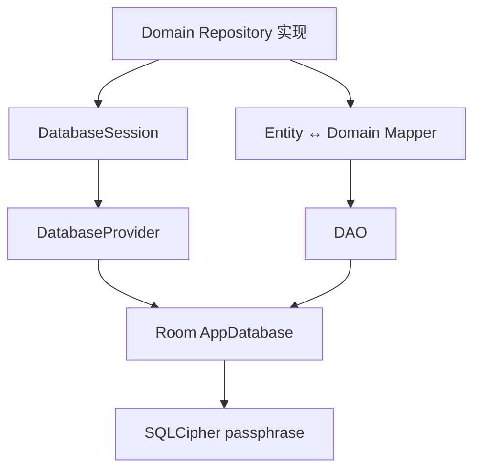
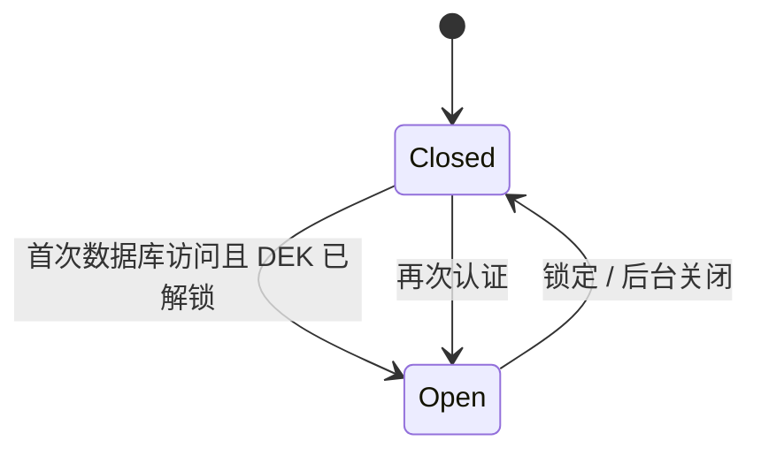

# 数据库

状态：当前实现（Room Schema v1）。本文只描述全新安装，不承诺旧 Schema 迁移。

## 组成

`DatabaseProvider` 负责用已解锁 DEK 创建加密数据库；`DatabaseSession` 延迟打开并在 Vault
锁定或进程进入后台时关闭实例。Repository 必须经 Session 访问数据库，不能长期缓存 DAO 或 Room 实例。

## 当前表

| 表 | 用途 |
|---|---|
| `vault_entries` | 条目身份、结构类型、能力位、时间戳和加密 `summaryBlob` |
| `entry_secrets` | 一条条目对应的一份加密 `secretBlob` |
| `entry_revisions` | 完整的加密历史快照 |
| `entry_activities` | 查看、复制、使用等审计/统计事件，不用于恢复 |
| `entry_attachments` | 可查询附件元数据及加密内容元数据；文件正文单独加密落盘 |
| `search_tokens` | keyed blind-index token |
| `entry_drafts` | 添加/编辑流程的暂存状态 |

Schema 的唯一事实源是 `AppDatabase`、Entity 和导出的 `app/schemas`，本文不复制完整字段声明。

## `entryType`、`vaultId` 与分类边界

- `entryType` 是条目的**结构类型**，决定可用字段、详情组件和能力，例如 `LOGIN`、
  `BANK_CARD`、`SSH_KEY`。数据库根记录不应全部写成 `LOGIN`；只有确实采用登录结构的条目才是
  `LOGIN`。
- `vaultId` 当前默认值为 `default`，预留给多保险库/工作区隔离。它既不是用户分类，也不是
  “同一账户的多种密码集合”。当前数据库仍是单保险库实现。
- 当前 UI 中名为 category 的筛选值实际直接来自 `entryType.name`。这意味着**自定义分类尚未实现**，
  也说明现有命名发生了概念混用。后续自定义分类应使用独立 `categoryId`/关联表；`tags` 继续用于
  多值标签，不能复用 `entryType`。
- `capabilityFlags` 表示一个条目实际具有的能力（密码、OTP、附件等），用于表达“登录 + OTP”
  这类组合，不能再制造一个新的混合 `entryType`。

## Blob 与 `color`

`summaryBlob` 是字段级 AES-GCM 密文，解密后为 `SummaryPayload`。`color` 位于该 payload 中，
是条目卡片/主题的可选展示元数据，不是加密参数、分类或类型判别字段。当前代码只透传该值，
尚未形成完整的颜色编辑功能；若 UI 不再使用，应通过 payload schema 演进移除，不能直接把
数据库 Blob 当 JSON 修改。

## 热冷分离与聚合

列表优先读取 metadata，详情再读取 credential 并解密；Repository 将两者聚合成领域模型。搜索使用基于会话密钥的
Blind Index，不能对明文敏感字段使用 SQLite `LIKE`。

历史、备份和导出共享 Vault Snapshot 语义，但数据库 Entity、备份 DTO 与 Domain model 仍应由 Mapper 隔离。

## 历史与附件体积策略

- 历史采用完整快照而非 diff。唯一格式为 `rev2:` + Base64(GZIP(snapshot))，再执行
  AES-GCM；不保留原始未版本化快照的转换兼容。解压设置 8 MiB 上限，组件长度也会校验，避免损坏数据
  导致超大分配。
- 附件正文不进入 Room Blob，而是保存为 `filesDir/attachments/<entryId>/<attachmentId>.enc`；
  表内 Blob 只包含加密路径、哈希等元数据。
- 附件不做通用压缩。图片、PDF、视频、ZIP 等通常已经压缩，再压缩收益小且增加内存和解压炸弹
  风险。若未来为纯文本附件启用压缩，必须记录算法、原始长度、压缩长度和硬性解压上限。

## 生命周期约束

- 错误密钥或 Schema 不匹配必须返回明确错误，禁止自动删库。
- 锁定顺序为：拒绝新操作 → 关闭数据库 → 擦除 DEK 与会话密钥。
- 导入的覆盖/合并操作必须在事务中完成，失败整体回滚。
- 数据库关闭超时不能制造“已关闭”的假象；详见[代码审查](../reviews/2026-07-code-review.md)。

## 初始化失败恢复

数据库初始化失败时提供两条严格分离的路径：

1. **保留故障库并创建新库**只出现在故障弹窗。完成新鲜认证后，先封存数据库租约，
   再将 SQLCipher 主文件、WAL/SHM/journal、附件和自定义图片复制到
   `noBackupFilesDir/database_recovery/<recoveryId>`。只有恢复包完整落盘后才清理活动位置，
   随后使用 Bootstrap Store 中原有 DEK 创建新的 `passly.db`。
2. **永久清除保险库数据库**只出现在“设置 → 数据管理 → 危险操作”。它必须经过
   明确确认和新鲜认证，会删除数据库、附件和自定义图片，不创建恢复包。

恢复包包含 `manifest.properties`，当前格式版本为 `1`。它是应用私有的灾难恢复材料，
不是用户备份格式，不进入 Android Auto Backup，也不能替代 v1 加密备份。`vaultId`
是行级归属字段，不是数据库文件路由键；后续恢复器打开旧 SQLCipher 文件后，可用它做
分组和一致性校验。当前实现负责可靠保留恢复包，旧库选择、预览与合并导入界面仍待实现。

## 相关实现

- `data/local/database/AppDatabase.kt`
- `data/local/database/DatabaseProvider.kt`
- `data/local/database/DatabaseSession.kt`
- `data/model/entity/`
- [ADR-0018](../decisions/ADR-0018-lookup-metadata-strategy.md)
