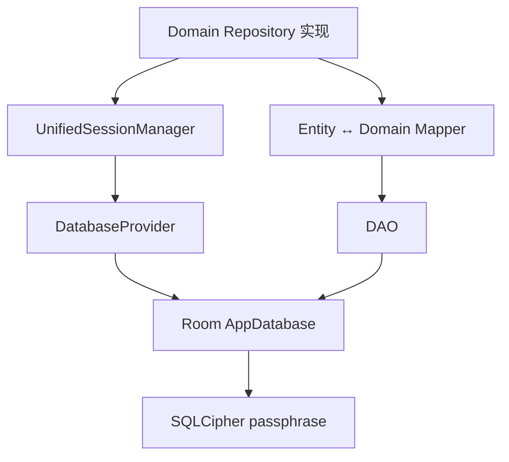
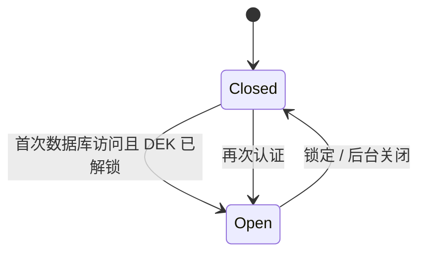

# 数据库

状态：当前实现（Room Schema v1）。本文只描述全新安装，不承诺旧 Schema 迁移。

## 模块与访问边界

`:data:database` 拥有 Room Entity、DAO、converter、Schema、`AppDatabase`、SQLCipher provider
及数据库强类型 session adapter。`DatabaseProvider` 使用调用方经 `SessionKeySource` 提供的会话密钥创建
加密数据库；`UnifiedSessionManager` 延迟打开，并在应用锁定或进入后台时关闭实例。Repository 必须经
session adapter 访问数据库，不能长期缓存 DAO 或 Room 实例。

数据库模块只依赖 Core、Domain 与 `:runtime:session`，不依赖 App 或 Feature。DEK 的具体实现仍由
App composition root 绑定到 `SessionKeySource`，因此数据库模块无法反向访问认证或 UI 实现。

## 当前表

| 表 | 用途 |
|---|---|
| `entries` | 原子条目的身份、结构类型、能力位、OTP 类型、索引版本、时间戳和加密 `summaryBlob` |
| `entry_secrets` | 一条条目对应的普通加密 `secretBlob` |
| `entry_sensitive_fields` | 按 `entryId + fieldKey` 隔离的高敏字段密文、密钥版本和更新时间 |
| `entry_links` | 原子 Entry 之间的类型化关系；任一端点删除时级联删除 link |
| `entry_revisions` | `entryContentCipher` 与 `sensitiveFieldCipherSet` 组成的完整 Entry 历史快照 |
| `entry_activities` | 查看、复制、使用等审计/统计事件，不用于恢复 |
| `attachment_resources` | 由 keyed content ID 标识的不可变加密附件内容元数据 |
| `attachment_refs` | 当前 Entry 的文件名、可空 MIME、顺序及 `PENDING`/`COMMITTED` 引用 |
| `revision_attachment_refs` | 历史 Revision 对不可变附件资源的引用 |
| `attachment_gc_queue` | 文件删除第二阶段的持久队列 |
| `entry_search_tokens` | keyed blind-index token；可由当前 Entry 重建 |

Schema 的唯一事实源是 `AppDatabase`、Entity 和导出的 `data/database/schemas`，本文不复制完整字段声明。
当前没有独立 `entry_drafts` 表；未提交的编辑表单只存在于 UI 生命周期，只有附件通过
`PENDING + stagingOwnerId` 支持进程重启后的暂存恢复。

## Entry 类型、关系与分类

- `entryType` 是条目的结构类型，决定可用字段、详情组件和能力，例如 `LOGIN`、`BANK_CARD`、
  `SSH_KEY`。它不是用户分类。
- 当前 `entries` 没有 `vaultId` 或 `parentEntryId`。密码、OTP、Passkey 等凭据保持原子 Entry，
  通过 `entry_links(sourceEntryId, targetEntryId, relationType)` 表达类型化关系，不能把多个凭据塞入
  一个巨型 Blob。Link 只表达关系，不拥有任何密文。
- 当前 UI 的筛选项来自 `entryType.name`，并以“条目类型”展示。自定义分类尚未实现；后续应使用
  独立 `categoryId` 或关联表，不能复用 `entryType`。
- `capabilityFlags` 表示一个原子条目实际具有的能力，用于列表和详情快速判断；它不表示跨条目的
  账户组合，也不能替代 `entryType` 或 `entry_links`。

## Blob 与读取边界

`summaryBlob` 是字段级 AES-GCM 密文，解密后为 `SummaryPayload`。其中的 `color` 是可选展示元数据，
不是加密参数、分类或类型判别字段。

普通敏感数据位于 `entry_secrets.secretBlob`。高敏值不进入普通 secret，而是在
`entry_sensitive_fields` 中按字段独立保存；当前已迁入银行卡号、CVV 和支付 PIN。普通详情查询不得
加载高敏行；高敏 reveal 必须消费与当前会话绑定且 scope 精确匹配的授权许可。

列表优先读取 metadata，详情读取普通 credential；Repository 将两者聚合成不含高敏字段的领域模型。
搜索使用基于会话密钥的 Blind Index，不能对明文敏感字段使用 SQLite `LIKE`。

数据库历史与用户备份是不同边界：Revision 是库内 Entry 快照，用户备份是独立全量 Snapshot。
数据库 Entity、备份 DTO 与 Domain model 必须由 Mapper 隔离。

## 历史与附件生命周期

- 历史采用完整快照而非 diff。`entryContentCipher` 自包含 Entry 内容，`sensitiveFieldCipherSet`
  保存该版本的高敏字段集合；附件正文不复制进 Revision Blob，而由 `revision_attachment_refs`
  共享不可变内容资源。单 Entry 最多保留 50 条，全库最多保留 1000 条。
- 软删除保留历史；永久删除和清空回收站在同一事务中删除相关历史，事务失败整体回滚。
- 附件正文不进入 Room Blob，而是保存为
  `filesDir/attachments/resources/<resourceId>.enc`。`resourceId` 是 keyed content ID，同时作为
  附件密文的 AAD；文件名、可空 MIME 和显示顺序属于 ref，不属于内容资源。
- 只有当前引用和历史引用均为 0 时，资源才进入 `attachment_gc_queue`。数据库事务先标记
  `PENDING_GC`，文件删除成功后再删除资源行；外键 `RESTRICT` 防止仍被引用的内容误删。
- 附件不做通用压缩。图片、PDF、视频、ZIP 等通常已经压缩；若未来为纯文本启用压缩，必须记录
  算法、原始长度、压缩长度和硬性解压上限。

## Session 生命周期

- 错误密钥或 Schema 不匹配必须返回明确错误，禁止自动删库。
- 锁定顺序为：拒绝新操作 → 等待租约排空并关闭数据库 → 擦除 DEK 与会话密钥。
- 导入的覆盖或合并操作必须在事务中完成，失败整体回滚。
- 当前开发期 Room Schema、Secret Payload、Revision 和 Backup Document 均保持版本 `1`；不提供旧字段
  转换或旧开发库迁移。安装已有开发版本时必须清除应用数据后再启动。
- 数据库关闭超时不能制造“已关闭”的假象；详见[代码审查](../reviews/2026-07-code-review.md)。

## 初始化失败恢复

数据库初始化失败时提供两条严格分离的路径：

1. **保留故障库并创建新库**只出现在故障弹窗。完成新鲜认证后，先封存数据库租约，再将 SQLCipher
   主文件、WAL/SHM/journal、附件和自定义图片复制到
   `noBackupFilesDir/database_recovery/<recoveryId>`。只有恢复包完整落盘后才清理活动位置，随后使用
   Bootstrap Store 中原有 DEK 创建新的 `passly.db`。
2. **永久清除数据库**只出现在“设置 → 数据管理 → 危险操作”。它必须经过明确确认和新鲜认证，
   会删除数据库、附件和自定义图片，不创建恢复包。

恢复包包含 `manifest.properties`，当前格式版本为 `1`。它是应用私有的灾难恢复材料，不是用户备份
格式，不进入 Android Auto Backup，也不能替代 v1 加密备份。当前实现负责可靠保留恢复包；旧库选择、
预览与合并导入界面仍待实现。

## 相关实现

- `data/database/src/main/java/com/aozijx/passly/data/local/database/AppDatabase.kt`
- `data/database/src/main/java/com/aozijx/passly/data/local/database/DatabaseProvider.kt`
- `data/database/src/main/java/com/aozijx/passly/data/local/database/session/UnifiedSessionManager.kt`
- `data/database/src/main/java/com/aozijx/passly/data/model/entity/`
- [ADR-0018](../decisions/ADR-0018-lookup-metadata-strategy.md)
