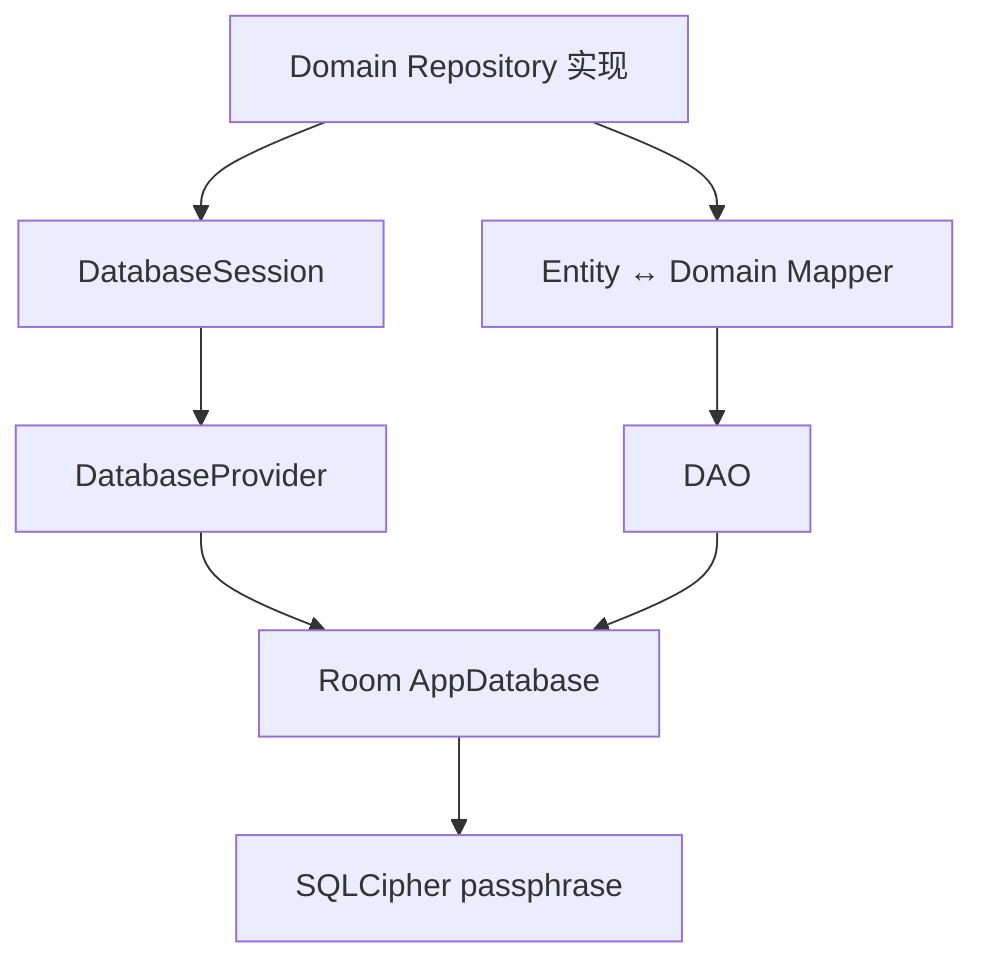
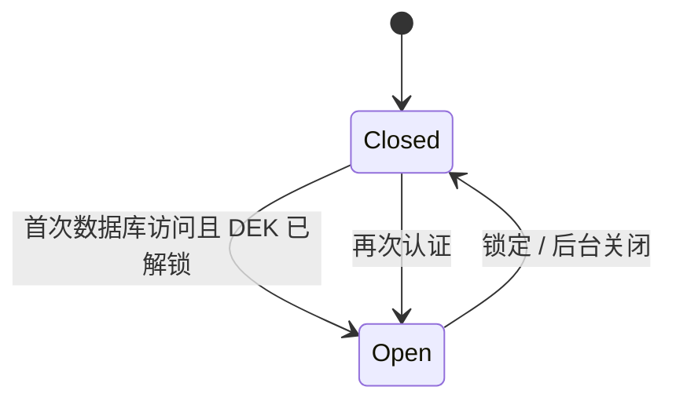

# 数据库

状态：当前实现（Room Schema v1）。本文只描述全新安装，不承诺旧 Schema 迁移。

## 组成

`DatabaseProvider` 负责用已解锁 DEK 创建加密数据库；`DatabaseSession` 延迟打开并在 Vault
锁定或进程进入后台时关闭实例。Repository 必须经 Session 访问数据库，不能长期缓存 DAO 或 Room 实例。

## 当前表

| 表                   | 用途                                 |
|---------------------|------------------------------------|
| `vault_metadata`    | 列表所需的低敏元数据                         |
| `vault_credentials` | 加密业务负载                             |
| `vault_historys`    | 条目快照历史；表名存在历史拼写问题                  |
| `vault_activities`  | 操作活动记录                             |
| `vault_attachments` | 附件元数据和内容引用                         |
| `lookup_index`      | Blind Index 检索数据                   |
| `key_envelopes`     | 遗留表，当前信封真相源已迁至 Bootstrap Proto，待移除 |

Schema 的唯一事实源是 `AppDatabase`、Entity 和导出的 `app/schemas`，本文不复制完整字段声明。

## 热冷分离与聚合

列表优先读取 metadata，详情再读取 credential 并解密；Repository 将两者聚合成领域模型。搜索使用基于会话密钥的
Blind Index，不能对明文敏感字段使用 SQLite `LIKE`。

历史、备份和导出共享 Vault Snapshot 语义，但数据库 Entity、备份 DTO 与 Domain model 仍应由 Mapper 隔离。

## 生命周期约束

- 错误密钥或 Schema 不匹配必须返回明确错误，禁止自动删库。
- 锁定顺序为：拒绝新操作 → 关闭数据库 → 擦除 DEK 与会话密钥。
- 导入的覆盖/合并操作必须在事务中完成，失败整体回滚。
- 数据库关闭超时不能制造“已关闭”的假象；详见[代码审查](../reviews/2026-07-code-review.md)。

## 初始化失败恢复

数据库初始化失败时提供两条严格分离的路径：

1. **保留故障库并创建新库**只出现在故障弹窗。完成新鲜认证后，先封存数据库租约，
   再将 SQLCipher 主文件、WAL/SHM/journal、附件和自定义图片复制到
   `noBackupFilesDir/database_recovery/<recoveryId>`。只有恢复包完整落盘后才清理活动位置，
   随后使用 Bootstrap Store 中原有 DEK 创建新的 `passly.db`。
2. **永久清除保险库数据库**只出现在“设置 → 数据管理 → 危险操作”。它必须经过
   明确确认和新鲜认证，会删除数据库、附件和自定义图片，不创建恢复包。

恢复包包含 `manifest.properties`，当前格式版本为 `1`。它是应用私有的灾难恢复材料，
不是用户备份格式，不进入 Android Auto Backup，也不能替代 v1 加密备份。`vaultId`
是行级归属字段，不是数据库文件路由键；后续恢复器打开旧 SQLCipher 文件后，可用它做
分组和一致性校验。当前实现负责可靠保留恢复包，旧库选择、预览与合并导入界面仍待实现。

## 相关实现

- `data/local/database/AppDatabase.kt`
- `data/local/database/DatabaseProvider.kt`
- `data/local/database/DatabaseSession.kt`
- `data/model/entity/`
- [ADR-0018](../decisions/ADR-0018-lookup-metadata-strategy.md)
