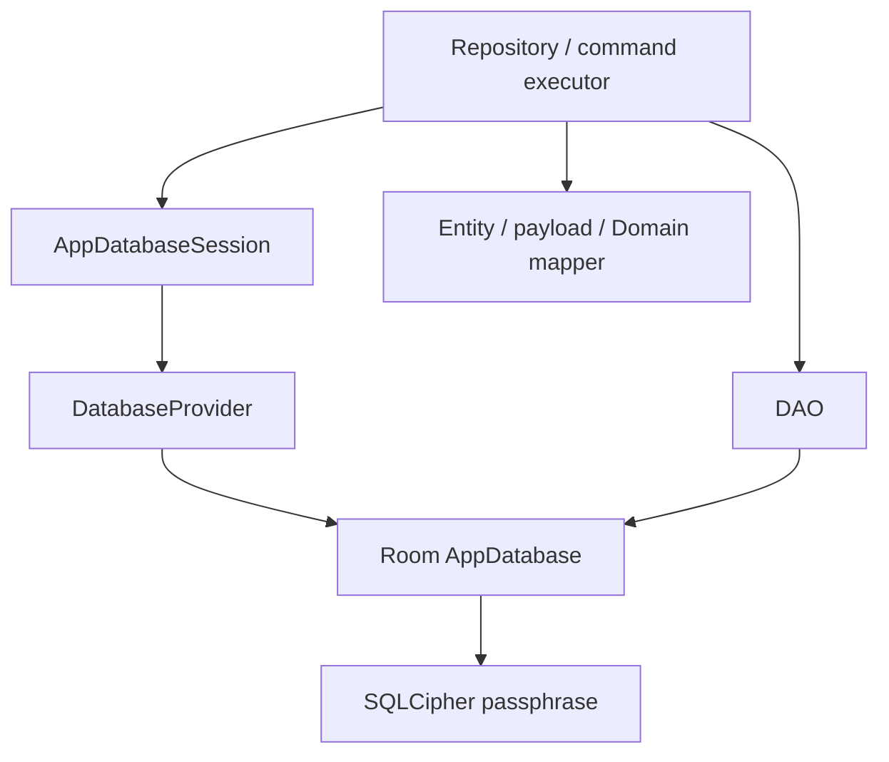
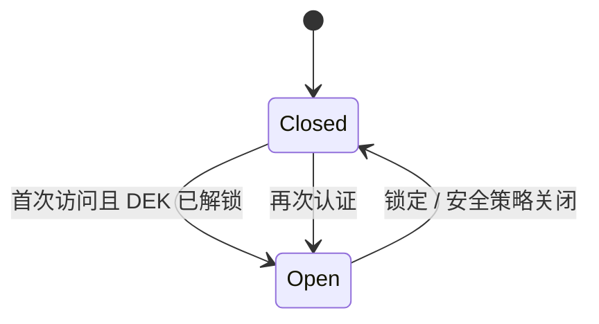

# 数据库

状态：当前实现（Room Schema v1）。本文描述当前代码与全新安装，不承诺旧开发 Schema 的迁移。

## 所有权与访问边界

`:data` 拥有 Room Entity、DAO、converter、Schema、SQLCipher provider、数据库 session adapter，以及
Entry、附件、历史等仓储实现。`:data` 不依赖 App 或 Feature。

```mermaid
flowchart TB
    Repository["Repository / command executor"] --> Session["AppDatabaseSession"]
    Session --> Provider["DatabaseProvider"]
    Provider --> Room["Room AppDatabase"]
    Room --> SQLCipher["SQLCipher passphrase"]
    Repository --> Mapper["Entity / payload / Domain mapper"]
    Repository --> DAO
    DAO --> Room
```

`DatabaseProvider` 使用 `SessionKeySource` 提供的会话密钥打开加密数据库；`AppDatabaseSession` 管理
租约、延迟打开和关闭。Repository 必须在 session adapter 提供的作用域内使用 DAO，不能长期缓存
Room 实例或越过锁定边界持有 DAO。

备份协议与交互属于 `app/feature/backup`；Feature 只能通过明确的快照适配边界接触数据库数据，不能把
Room Entity 当作可移植协议。

## 当前 Schema

`AppDatabase` 当前只注册以下八张表：

| 表 | 用途 |
|---|---|
| `entries` | Entry 身份、类型、能力位、OTP 类型、可查询的 Profile 元数据和时间戳 |
| `entry_secret_fields` | `entryId + fieldKey` 定位的密文行；高敏字段逐字段保存，低敏结构聚合在 `STRUCT_BUNDLE` |
| `entry_links` | Entry 之间的类型化关系；任一端点删除时级联删除 |
| `entry_revisions` | Entry Profile 与敏感字段集合的完整历史快照密文 |
| `entry_activities` | 查看、复制、使用等审计/统计事件，不用于恢复 |
| `attachment_resources` | keyed content ID 标识的不可变加密附件资源及其 GC 生命周期状态 |
| `attachment_refs` | 当前 Entry 对资源的引用、文件名、MIME、顺序和 staging 状态 |
| `revision_attachment_refs` | 历史 Revision 对不可变附件资源的引用 |

Schema 的唯一事实源是 `AppDatabase`、Entity 和导出的 `data/schemas`。当前没有 `entry_drafts`、
`attachment_gc_queue` 或 Autofill Inbox 导入日志表。Inbox 文件队列独立于 SQLCipher；导入幂等性由 draft ID
派生的稳定 Entry ID 实现，不新增 Room 表。

## Entry 元数据与查询

`entries` 使用结构化列保存 Profile 元数据：`title`、`username`、`primaryUrl`、`domains`、
`applicationIds`、图标字段、`favorite`、`tags`、过期时间和创建/更新时间。当前表中没有
`summaryBlob` 或 `indexVersion`。

- `entryType` 是结构类型，不是用户分类。
- `capabilityFlags` 表示条目实际具有的能力，不能替代 `entryType` 或 `entry_links`。
- 当前没有 `vaultId` 或 `parentEntryId`；关联凭据保持原子 Entry，通过 `entry_links` 表达关系。
- 列表和搜索直接查询 `entries` 的结构化列及 JSON 集合。动态查询始终使用参数绑定；文本搜索当前使用
  SQLite `LIKE`，不会扫描高敏字段密文。
- Profile 由 `EntryProfileMapper.fromEntity()` 直接映射，不需要先解密摘要 Blob。

数据库列、密文字段键和 Revision 快照中的枚举值通过 `StorageEnumMappings` 显式映射为稳定键。
持久化协议不得依赖 ordinal；新增领域枚举时必须补齐双向映射与 round-trip 测试。Room converter
负责 SQL 边界的强类型转换，未知持久化值必须明确失败，不能静默替换成合法默认值。

## Secret 读取边界

高敏字段按 `entryId + fieldKey` 分行 AES-GCM 加密，AAD 绑定对应记录身份。`PASSWORD`、银行卡号、
CVV、支付 PIN、身份号码、助记词、恢复码、SSH 私钥/口令、Passkey 私钥引用和 OTP Secret 都不进入
`entries` Profile 列。

`STRUCT_BUNDLE` 保存低敏凭据结构、notes 和 custom fields，并把逐字段高敏值置为 `null`。因此：

- 普通详情读取 `entries` Profile 与 `STRUCT_BUNDLE`，不物化高敏字段；
- 单字段 reveal 只查询并解密对应 `fieldKey`；
- 备份、恢复和完成授权后的 Autofill 等完整凭据流程，才通过 `readAll()` 合并全部字段；
- 普通更新用 `Preserve / Clear / Replace` 区分未加载、主动清空和替换，避免为了写低敏结构而解密全部
  高敏字段。

`SummaryPayload` 仍用于 Revision 的 Profile 快照编码，不是 `entries` 当前存储格式。

## 历史与附件生命周期

- Revision 使用完整快照而非 diff。Profile 快照和高敏字段集合分别加密；附件正文不复制进 Revision，
  只通过 `revision_attachment_refs` 引用不可变资源。
- 单 Entry 最多保留 50 条 Revision，全库最多 1000 条。永久删除和清空回收站在数据库事务中同步
  删除关联历史。
- 附件正文位于 `filesDir/attachments/content/<resourceId>.enc`。`resourceId` 是 keyed content ID，
  文件名、可空 MIME 和显示顺序属于引用行。
- 当当前引用和历史引用都为 0 时，资源行改为 `PENDING_GC`；`enqueuedAt`、`attemptCount` 和
  `lastAttemptAt` 就是持久重试状态。文件删除成功后再删除资源行。没有单独 GC 队列表。
- 条目写事务只负责把无引用附件标为 `PENDING_GC`。提交后附件清理与图标路径回收分开执行；普通清理异常
  记录结构化日志，不把已提交的数据库结果改成失败。附件 GC 监听完整 Vault 会话恢复并重试持久的
  `PENDING_GC` 行；进程中断也不丢失附件待办。
- 若调用方在数据库提交后、清理完成前取消，取消仍向上传播且不会回滚已提交数据。重新进入页面时以 Room
  查询结果为准，不应仅凭取消结果盲目重放写入；附件 GC 可在会话重开后继续，图标回收保留队列请求并由图片处理器重建时的候选扫描补齐中断窗口。
- 外键和删除前引用计数阻止仍被引用的内容被回收。附件不做通用压缩。

## Session 生命周期

```mermaid
stateDiagram-v2
    [*] --> Closed
    Closed --> Open: 首次访问且 DEK 已解锁
    Open --> Closed: 锁定 / 安全策略关闭
    Closed --> Open: 再次认证
```

- 错误密钥或 Schema 不匹配必须返回明确错误，禁止自动删库。
- 锁定顺序为：拒绝新操作 → 等待租约排空并关闭数据库 → 擦除 DEK 与会话密钥。
- 覆盖导入、Revision 恢复和多表写入必须在事务中完成，失败整体回滚。
- 当前 Room Schema、Secret Payload 和 Revision 格式均为版本 `1`；备份协议版本独立。
- 数据库关闭超时不能制造“已关闭”的假象；相关风险见[代码审查](../reviews/2026-07-code-review.md)。

Sealed Autofill Inbox 使用独立耐久文件队列，完整解锁后才写入 SQLCipher Entry。Room Schema 保持版本 1；
队列清理与幂等导入边界见 [Sealed Inbox](../features/autofill/sealed-inbox.md)。

## 初始化失败与数据重置

数据库初始化失败页只提供重试和关闭应用，不在故障路径提供清库。
`AppShellViewModel` 在协程调度前占用独立重试任务，连续点击只发起一次恢复；故障流发布新错误时仍保留在途状态。
任务在 `finally` 中释放重试状态，取消不产生失败提示。数据库可用性始终由故障流决定，不能仅凭一次 Ready 返回值
自行清除故障；故障流已经恢复或作用域销毁后，旧任务的迟到错误不得再次提示或改写界面。

“设置 → 数据管理”的永久重置必须经过确认和新鲜认证。它删除数据库及 WAL/SHM/journal、附件和
自定义图片，然后使用现有 Bootstrap DEK 创建空数据库；普通偏好、认证信封和密钥绑定仍由各自的
存储生命周期管理。

该操作不删除完整 Vault：Bootstrap DataStore、Autofill Inbox 密钥材料、pending/quarantine 文件队列都会保留。
因此数据库重置后，待导入 Inbox 草稿仍可在完整解锁后继续处理；Inbox 自身的过期和容量清理规则不变。

进入数据库封存后，重置会在不可取消区完成封存、删除数据库与托管资源并重新打开数据库，然后才向调用方传播取消。
尚未开始封存时收到的取消会阻止重置启动；执行期间的取消不能留下“已封存但未清理”的半完成状态。

数据库重置与认证锁定、解锁共用 Security 会话互斥。重置期间不报告完整 Vault 访问；重开成功后恢复会话，
重开失败则撤销授权、清除敏感数据密钥并转入锁定状态。活动查询流同时要求认证授权和数据库会话为 `UNLOCKED`；
数据库封存时取消 Room 观察并发出空结果，重开后重新订阅，不依赖认证状态先发生一次虚假变化。Vault Paging
直接随数据库 session state 重建 Pager，不再从重置控制器另发列表刷新事件。

## 代码位置

| 职责 | 类/函数 | 源码文件 |
| --- | --- | --- |
| Room schema 与数据库定义 | `AppDatabase` | [`AppDatabase.kt`](../../data/src/main/java/com/aozijx/passly/data/local/database/AppDatabase.kt) |
| 数据库依赖提供 | `DatabaseProvider` | [`DatabaseProvider.kt`](../../data/src/main/java/com/aozijx/passly/data/local/database/DatabaseProvider.kt) |
| 会话查询、事务、观察与锁定生命周期 | `AppDatabaseSession.query()`、`transaction()`、`observeFlow()`、`unlock()`、`softLock()`、`seal()`、`closeDatabase()` | [`AppDatabaseSession.kt`](../../data/src/main/java/com/aozijx/passly/data/local/database/session/AppDatabaseSession.kt) |
| Vault 数据库重置与可读观察 gate | `VaultDatabaseResetController.reset()`、`observeWhenReadable()` | [`VaultDatabaseResetController.kt`](../../data/src/main/java/com/aozijx/passly/data/local/database/port/VaultDatabaseResetController.kt)、[`AppDatabaseSessionObservations.kt`](../../data/src/main/java/com/aozijx/passly/data/local/database/session/AppDatabaseSessionObservations.kt) |
| 秘密字段替换、读取与 OTP 配置读取 | `SecretFieldStore.replaceAll()`、`readBundle()`、`readField()`、`readOtpConfig()` | [`SecretFieldStore.kt`](../../data/src/main/java/com/aozijx/passly/data/repository/entry/SecretFieldStore.kt) |
| 查找元数据策略决策 | [ADR-0018](../decisions/ADR-0018-lookup-metadata-strategy.md) | [`ADR-0018-lookup-metadata-strategy.md`](../decisions/ADR-0018-lookup-metadata-strategy.md) |
