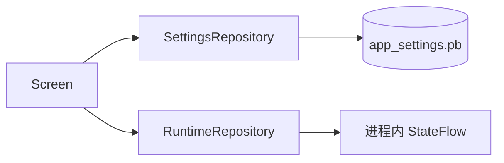

# 设置存储

应用设置使用 Proto DataStore，Schema 位于 `app/src/main/proto/app_settings.proto`。Proto2 presence
与显式默认值共同保证“未写入”不被误解为 Kotlin/Proto 的零值。

## 加密边界

Proto DataStore 只提供原子文件更新和结构化序列化，**不会自动加密整个文件**。本项目也没有引入
Google Tink（见 [ADR-0009](../decisions/ADR-0009-no-google-tink.md)）。

- `app_settings.pb`、`diagnostics_settings.pb` 是普通 Proto 文件，只能保存非秘密偏好。
- `bootstrap.pb` 文件本身同样不是整文件密文，但其中的 DEK 是已经由应用密码派生密钥或
  Android Keystore 密钥包裹后的 envelope ciphertext；salt、nonce、算法版本等可公开元数据也
  会随信封保存。
- 密码、OTP secret、恢复码明文、会话密钥和附件正文不得进入设置 DataStore。

如果未来引入 Tink，目标应是明确的 keyset/跨平台格式或整文件 AEAD，并通过新 ADR 定义迁移与
密钥生命周期；不能仅“给 DataStore 加 Tink”就假定所有字段自动获得正确的安全边界。

## 字段原则

- 有非零默认值的 scalar 使用 `optional` 与 `[default = ...]`。
- 固定集合优先 enum；多值使用 `repeated`；键值扩展使用 `map`。
- 不用逗号或分号拼接集合。
- 删除字段时保留 `reserved` 字段号，禁止复用。
- Serializer 遇到损坏输入抛出 `CorruptionException`，不静默恢复为默认值。

## 设置与会话状态

跨进程需要保留的主题、排序、标签、消息偏好和详情页偏好属于 Proto；当前解锁状态、临时输入和一次性页面
effect 属于内存 Flow。`runtime_extra` 只应用于尚未稳定的兼容字段，稳定业务设置应升级为强类型 Proto 字段。

## 当前注意事项

`dark_mode` 当前仍是可空布尔语义，而界面已要求浅色、深色、跟随系统三种模式。后续应使用强类型
enum，并保留旧字段号，避免继续用额外字符串修补。

消息相关设置分为状态栏通知、图标下载通知、剪贴板清除 Toast 和应用关闭
Toast。系统通知权限是交付条件，不是设置值本身；设计见[权限与消息](../features/permissions-and-messages.md)。

