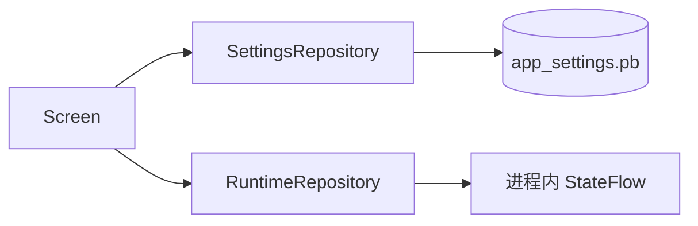

# 设置存储

应用设置使用 Proto DataStore，Schema 位于 `app/src/main/proto/app_settings.proto`。Proto2 presence
与显式默认值共同保证“未写入”不被误解为 Kotlin/Proto 的零值。

## 字段原则

- 有非零默认值的 scalar 使用 `optional` 与 `[default = ...]`。
- 固定集合优先 enum；多值使用 `repeated`；键值扩展使用 `map`。
- 不用逗号或分号拼接集合。
- 删除字段时保留 `reserved` 字段号，禁止复用。
- Serializer 遇到损坏输入抛出 `CorruptionException`，不静默恢复为默认值。

## 设置与会话状态

跨进程需要保留的主题、排序、标签、消息偏好和详情页偏好属于 Proto；当前解锁状态、临时输入和一次性页面
effect 属于内存 Flow。`runtime_extra` 只应用于尚未稳定的兼容字段，稳定业务设置应升级为强类型 Proto 字段。

## 当前注意事项

`dark_mode` 当前仍是可空布尔语义，而界面已要求浅色、深色、跟随系统三种模式。后续应使用强类型
enum，并保留旧字段号，避免继续用额外字符串修补。

消息相关设置分为状态栏通知、图标下载通知、剪贴板清除 Toast 和应用关闭
Toast。系统通知权限是交付条件，不是设置值本身；设计见[权限与消息](../features/permissions-and-messages.md)。

