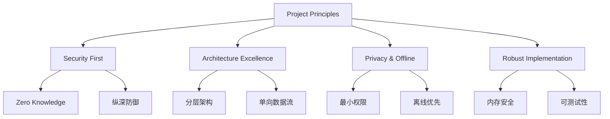

# ADR 0001: Passly 项目核心原则与设计哲学 (Project Principles)

> **状态**：已接受 (Accepted)
>
> **背景**：Passly 作为一个高安全性要求的密码管理器项目，需要一套统一的核心原则来指导技术决策、架构设计及代码实现，确保系统在安全性、可维护性和扩展性方面保持高度一致。

---

## 1. 设计哲学概览

Passly 的核心设计逻辑如下：

---

## 2. 安全至上 (Security First)

Passly 的安全设计遵循 Zero Knowledge 与纵深防御体系：

- **Zero Knowledge**：系统设计确保任何非授权方均无法接触到用户明文数据。所有加密操作均在本地完成。
- **纵深防御 (Defense in Depth)**：构建从硬件 Keystore 到应用层字段加密的多层防御体系，不依赖单一的安全边界。
- **信封加密 (Envelope Encryption)**：将认证方式与底层加密体系解耦。修改认证方式仅需重新封装密钥信封，无需重加密数据库。

---

## 3. 架构规范 (Architecture Excellence)

通过分层与单向依赖确保代码的健壮性：

- **Clean Architecture & Layering**：严格遵守分层架构，依赖关系始终单向向下。**Repository**
  是数据的唯一入口及加解密出口。
- **单向数据流 (UDF)**：数据流向清晰可预测，UI 状态由 **ViewModel** 统一分发，降低状态复杂度。
- **模块边界 (Module Boundaries)**：遵循单一职责与最小公开接口原则，各功能模块之间通过 **Interface**
  解耦。

---

## 4. 隐私与离线优先 (Privacy & Offline First)

最小化数据暴露窗口并确保离线可用：

- **离线优先 (Offline First)**：核心业务逻辑不依赖在线服务。数据持久化于本地加密数据库，同步仅作为可选辅助手段。
- **最小权限 (Least Privilege)**：每个组件、模块及 **DTO** 仅持有执行其任务所需的最小数据集，严禁敏感元数据在无关层级流转。

---

## 5. 健壮实现 (Robust Implementation)

在实现层面通过内存安全与测试保障质量：

- **内存安全 (Memory Safety)**：处理敏感数据时，优先使用 **ByteArray** 而非 JVM
  String，支持使用后立即进行物理擦除（Zeroing）。
- **可测试性 (Testability)**：每一层架构设计必须支持 **Mock**，确保核心加密逻辑与业务逻辑可进行 100%
  的单元测试覆盖。

---

## 6. 后果 (Consequences)

本决策对项目的长期影响：

- **开发规范**：所有新增功能及重构工作必须符合上述原则。
- **评审准则**：架构评审与代码审查应以本 ADR 为核心基准。
- **工程成本**：虽然初期会增加抽象层级与实现成本，但能显著降低系统的长期维护成本与安全风险。