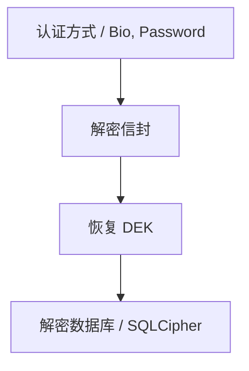

# ADR 0002: 采用信封加密机制 (Envelope Encryption)

> **状态**：已接受 (Accepted)
>
> **背景**
>
：密码管理器需要支持生物认证、应用密码、恢复码等多种认证方式。若数据库直接与特定认证凭据绑定加密，则每新增一种认证方式或修改现有凭据（如修改应用密码）时，均需重新加密整个数据库，这在性能和架构上是不可接受的。

---

## 1. 设计逻辑概览

信封加密机制实现了认证凭据与数据加密密钥的彻底解耦：

---

## 2. 决策说明

Passly 采用 **信封加密 (Envelope Encryption)** 作为核心加密方案：

- **DEK 独立性**：数据库始终由一个独立的数据加密密钥（DEK）加密，该密钥在创建 Vault 时随机生成。
- **凭据封装**：系统不直接保存 DEK 明文，而是使用不同的 Master Key（派生自认证凭据）将 DEK 加密保存为多个
  **Envelope (信封)**。
- **多路解密**：用户通过任何一种合法的认证方式，实际上都是在解密其对应的 Envelope 以恢复 DEK。

---

## 3. 核心优势

- **无损凭据变更**：修改应用密码时，仅需重新生成对应的信封，无需触碰 DEK，因此无需重新加密整个数据库。
- **高扩展性**：新增认证方式（如未来支持 Passkey）仅需利用已恢复的 DEK 新增一个信封，不涉及数据迁移。
- **离线灾备**：恢复码作为一种独立的信封，可以在其它认证方式完全失效时直接恢复 DEK。
- **架构简洁**：数据库底座保持稳定，安全逻辑集中在密钥恢复链路。

---

## 4. 后果与影响

- **职责分离**：成功实现了认证（Authentication）与加密（Encryption）的架构解耦。
- **存储开销**：每个新增的认证方式仅占用极少量的存储空间用于保存信封（通常为几十字节）。
- **流程规范**：所有涉及密钥恢复的代码必须遵循信封加解密的统一标准。

---

## 5. 不采纳方案

### 5.1 数据库直接使用凭据加密

- **不采纳原因**：修改密码需要全量重加密，性能开销极大，且无法同时支持指纹和密码共存。

### 5.2 数据库直接使用 Android Keystore

- **不采纳原因**：无法支持恢复码和跨设备迁移，缺乏灵活性，且对硬件密钥的依赖过于死板。

---

## 6. 总结

信封加密是 Passly 实现 **Zero Knowledge** 与 **认证灵活性**
的基石。它确保了数据库加密体系的长期稳定，同时赋予了用户自由切换和增减认证方式的能力，是满足现代安全软件需求的最优设计决策。