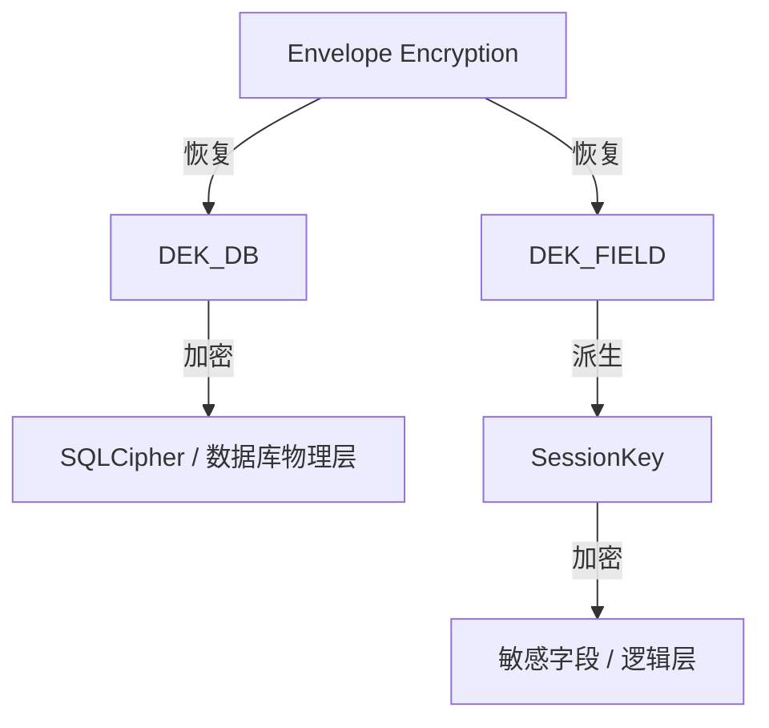

# ADR 0003: 采用双 DEK (双重数据加密密钥) 架构

> **状态**：已接受 (Accepted)
>
> **背景**：SQLCipher 已能保护整个数据库文件。在设计阶段，我们需要决定是否还需实施字段级加密，以及如何管理相关的加密密钥，以确保在数据库离线泄露场景下提供最高等级的防护。

---

## 1. 架构逻辑概览

双 DEK 架构确立了数据库物理层与业务逻辑层的纵深防御：

---

## 2. 决策说明

Passly 采用 **双 DEK (Dual DEK)** 架构，将数据库整体加密与字段级加密的根密钥彻底分离：

- **DEK_DB (Database Encryption Key)**：专用于 **SQLCipher**，负责整个数据库文件（Pages, WAL,
  Journal）的物理加密。
- **DEK_FIELD (Field Encryption Key)**：专用于敏感字段（如密码、密钥、备注），作为根密钥通过 KDF 派生会话密钥。
- **独立封装**：两把 DEK 分别通过独立的 **Envelope (信封)** 进行保存，互不依赖。

---

## 3. 核心设计目标：纵深防御

双 DEK 的设计核心并非针对运行时攻击，而是为了应对 **数据库静态泄露** 场景：

- **防止单点崩溃**：即使攻击者获取了数据库文件并奇迹般地绕过了 SQLCipher（或获取了 DEK_DB），敏感字段依然由
  DEK_FIELD 保护。
- **业务逻辑隔离**：DEK_FIELD 的泄露不代表数据库结构暴露，反之亦然。这种隔离确保了不同层级的安全策略可以独立演进。

---

## 4. 威胁模型评估

| 威胁等级          | 场景          | 防护收益                         |
|:--------------|:------------|:-----------------------------|
| **L2: 数据库泄露** | 脱机文件泄露      | **极高**。提供双重加密屏障。             |
| **L3: 系统级攻击** | Root 权限静态访问 | **显著**。攻击者需破解两层防御。           |
| **L4: 内存取证**  | 运行时内存 Dump  | **无额外收益**。解锁状态下两把 DEK 均在内存中。 |

---

## 5. 后果与影响

- **安全性提升**：显著提升了静态数据泄露场景下的防护能力。
- **复杂度增加**：系统需管理额外的 Envelope 和密钥派生链路。
- **存储开销**：由于信封极为轻量，对存储空间的影响可忽略不计。

---

## 6. 不采纳方案

### 6.1 单 DEK + HMAC 派生方案

- **描述**：仅使用一把 DEK，通过 `HMAC(DEK)` 派生 SessionKey。
- **不采纳原因**：数据库与字段共享同一根密钥，缺乏真正的隔离性，无法实现物理层与逻辑层的纵深防御。

---

## 7. 总结

采用双 DEK 架构是 Passly 贯彻 **纵深防御 (Defense in Depth)**
理念的具体实践。通过将数据库物理保护与敏感字段逻辑保护的密钥分离，我们为用户数据构建了两道独立且坚固的防线，确保了在极端泄露场景下的数据机密性。