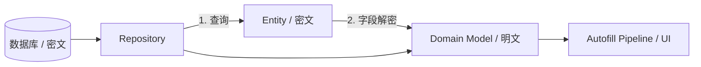

# ADR 0004: Repository 作为唯一解密边界 (Decryption Boundary)

> **状态**：已接受 (Accepted)
>
> **背景**：在项目设计初期，关于敏感数据的解密时机存在争议。如果允许 Autofill Pipeline 或 UI
> 层组件自行执行解密，会导致业务逻辑与底层密码学逻辑高度耦合，并增加密钥泄露的风险。

---

## 1. 架构逻辑概览

Repository 确立了系统中“密文进，明文出”的唯一安全边界：

---

## 2. 决策说明

Passly 规定 **Repository** 是系统中唯一允许执行敏感字段解密（AES-256-GCM）的组件：

- **单点解密**：Repository 负责从数据库获取 Entity，并立即通过 `FieldDecryptor` 完成解密。
- **明文契约**：Repository 返回的所有对象（Domain Model）均保证为明文。
- **解密禁令**：除 Repository 之外的任何组件（包括 CandidateResolver、Factory、UI）严禁调用解密函数，也严禁持有解密所需的
  SessionKey。

---

## 3. 核心设计目标

- **职责分离 (SoC)**：解密被视为数据访问的一部分而非业务逻辑。上层组件仅需关注业务数据，无需了解底层的密码学细节。
- **安全加固**：限制了解密逻辑的分布，极大减少了 SessionKey 在系统中的传播范围，降低了被误用或泄露的风险。
- **低耦合**：Autofill Pipeline 不再依赖具体的加密实现。后续若升级加密算法，仅需修改 Repository
  和加密核心，业务层完全透明。
- **状态管理一致性**：统一在 Repository 检查 Vault 锁定状态，确保数据访问的安全性。

---

## 4. 后果与影响

- **Pipeline 简化**：CandidateResolver 和 Factory 变得极其纯粹，仅负责数据转换。
- **开发规范**：新增的 Repository 实现必须严格遵守“返回明文”的契约。
- **架构清晰**：确立了“密钥零接触”的下游运行环境。

---

## 5. 不采纳方案

### 5.1 组件自行解密 (Lazy Decryption by Consumer)

- **描述**：Repository 返回密文，调用方（如 UI）按需调用解密。
- **不采纳原因**：会导致解密逻辑碎片化，业务组件必须依赖加密核心，增加复杂度且难以维护。

---

## 6. 总结

将 Repository 定义为唯一解密边界是 Passly 实现 **架构分层** 与 **职责隔离**
的核心手段。通过在数据入口处完成解密，我们为上层业务构建了一个安全且简单的运行环境，确保了敏感数据在受控的范围内流动。