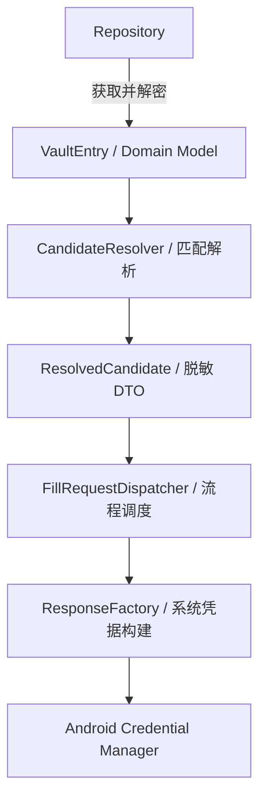

# ADR 0005: Autofill Pipeline 分层边界 (Layering Boundaries)

> **状态**：已接受 (Accepted)
>
> **背景**：Autofill 模块涉及从数据库查询到系统凭据构建的复杂全链路流程。为了确保安全边界并提高可测试性，我们需要明确定义
> Repository、Resolver、Dispatcher 及 Factory 等组件的职责范围，特别是关于数据库访问和敏感数据（VaultEntry）的持有权限。

---

## 1. 架构逻辑概览

Autofill 采用严格的单向 Pipeline 架构，确保数据逐层加工且职责不交叉：

---

## 2. 决策说明

Autofill Pipeline 的每一层被赋予了排他性的职责，确立了清晰的边界：

- **数据源层 (Repository)**：负责执行 SQL 查询，并在安全边界内完成字段解密，输出解密后的 `VaultEntry`。
- **逻辑转换层 (CandidateResolver)**：负责域名匹配、字段映射及展示逻辑计算。它将复杂的 Domain Model
  转换为轻量级的 `ResolvedCandidate` DTO。
- **流程协调层 (FillRequestDispatcher)**：作为管道的指挥中心，负责检查 Vault 锁定状态、协调解析器与工厂的调用，并处理异常。
- **协议适配层 (ResponseFactory)**：负责将业务 DTO 转换为 Android 系统可识别的 `CredentialEntry` (
  Modern) 或 `Dataset` (Legacy)。
- **交互表现层 (BottomSheet)**：仅负责展示脱敏后的候选列表，并处理用户点击事件。

---

## 3. 核心设计决策

- **职责单一化 (SRP)**：每个组件仅解决 Pipeline 中的一个环节，降低了代码复杂度。
- **最小化暴露**：通过 `ResolvedCandidate` 隔离了数据库 Entity，确保 UI 层和系统工厂层不接触非必要的敏感元数据。
- **高可测试性支持**：由于层级解耦，每一层逻辑（如 Resolver 的匹配逻辑）都可以通过纯单元测试进行验证，无需
  Mock 复杂的数据库环境。
- **多版本适配能力**：Resolver 计算出的 DTO 是版本无关的，这使得同时支持 Modern (API 34+) 与 Legacy
  Autofill 成为可能。

---

## 4. 架构禁令 (Prohibitions)

为了维持边界的严肃性，明确禁止以下跨层越权行为：

- **工厂越权**：- **ResponseFactory** 严禁持有 Repository 或查询数据库。
- **解析越权**：- **CandidateResolver** 严禁处理解密逻辑或持有 SessionKey。
- **UI 越权**：- **BottomSheet** 严禁持有 Repository 或直接访问 DAO 接口。
- **调度越权**：- **FillRequestDispatcher** 仅负责流程控制，严禁包含计算 TOTP 或匹配算法等业务逻辑。

---

## 5. 后果与影响

- **Pipeline 独立性**：整个 Autofill 管道可以独立于主应用 UI 运行，具备极强的复用性。
- **安全加固**：敏感数据的生命周期在 Pipeline 中被严格限制，减少了意外泄露的风险。
- **维护成本**：虽然增加了类与模型的数量，但通过职责隔离显著降低了长期维护和功能扩展的难度。

---

## 6. 总结

通过定义严格的分层边界，Passly 为 Autofill 流程构建了一套稳定、安全且易于扩展的“加工厂”模式。数据从
Repository 进入，经过逐层精简与转换，最终以系统要求的格式安全输出，完美贯彻了分层架构的设计哲学。