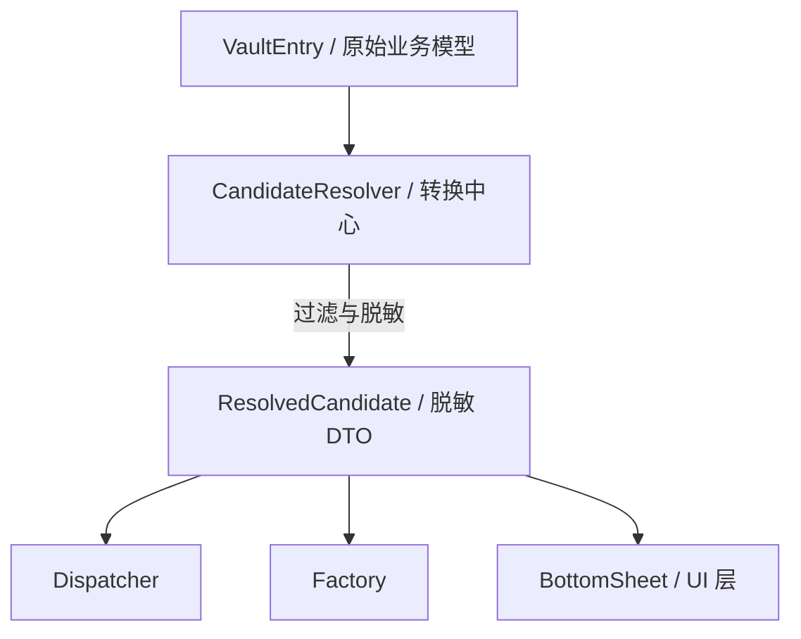

# ADR 0006: 使用 ResolvedCandidate 隔离 Domain Model (Domain Model Isolation)

> **状态**：已接受 (Accepted)
>
> **背景**：Autofill 流程可以直接使用全量的 `VaultEntry` 实体，也可以定义专用的数据传输对象（DTO）。项目最终决定采用
> DTO 方案，以确保敏感元数据（如非必要的业务字段和原始密文）不泄露至 UI 展现层或系统工厂类。

---

## 1. 架构隔离模型

`ResolvedCandidate` 作为一道“数据防火墙”，彻底隔离了数据库模型与表现层：

---

## 2. 决策说明

Passly 规定 `VaultEntry` 严禁穿透进入 Autofill 的下游管道，必须进行 DTO 转换：

- **唯一转换点**：**CandidateResolver** 是整个系统中唯一允许执行 `VaultEntry` -> `ResolvedCandidate`
  转换的位置。
- **数据流契约**：后续所有组件（Dispatcher, ResponseFactory, BottomSheet）均只能接触并持有
  `ResolvedCandidate` 对象。
- **职责剥离**：DTO 仅包含自动填充必需的字段，不再携带任何数据库操作能力。

---

## 3. 核心设计价值

- **最小化数据暴露 (Data Minimization)**：`VaultEntry` 包含 Notes, Credit Card, Identity, Attachments
  等大量与自动填充无关的敏感字段。通过 DTO 映射，仅将 Title, Username, Password, TOTP
  等核心字段暴露给展示层，极大缩减了攻击面。
- **职责与生命周期解耦**：UI 层组件不再持有复杂的 Domain Model。这防止了 UI 层意外触发 Repository
  更新，同时也优化了内存管理，因为 DTO 比包含大量业务逻辑和关系的实体对象轻量得多。
- **接口契约稳定性**：未来即便数据库 Schema 或领域模型发生重构，只要 `ResolvedCandidate` 结构保持稳定，整个自动填充
  UI 与 Android 系统适配层均无需任何改动。

---

## 4. 架构硬约束 (Hard Constraints)

- **禁止直传**：严禁将 `VaultEntry` 直接作为列表数据传递给 BottomSheet 或 UI 渲染函数。
- **单向可见性**：DTO 的构造逻辑应被封装在 Resolver 内部，外部组件不应感知转换细节。
- **不可变性**：该 DTO 应当设计为不可变（Immutable），确保数据在管道传递过程中不被意外篡改。

---

## 5. 后果与影响

- **安全加固**：即使 UI 层发生内存泄露，泄露的也仅仅是脱敏后的摘要信息，而非完整的数据库记录。
- **测试便利性**：由于 DTO 的轻量化，构造单元测试用例时无需模拟复杂的数据库环境或实体依赖。
- **开发开销**：虽然多定义了一个类和一套映射逻辑，但换取了长期的架构稳固性与安全性。

---

## 6. 总结

采用 `ResolvedCandidate` 是 Passly 践行 **最小权限原则**
的具体体现。它通过在管道上游强制执行“业务模型”向“展示模型”的转换，实现了职责的彻底分离，确保了敏感数据在受控的边界内流转。