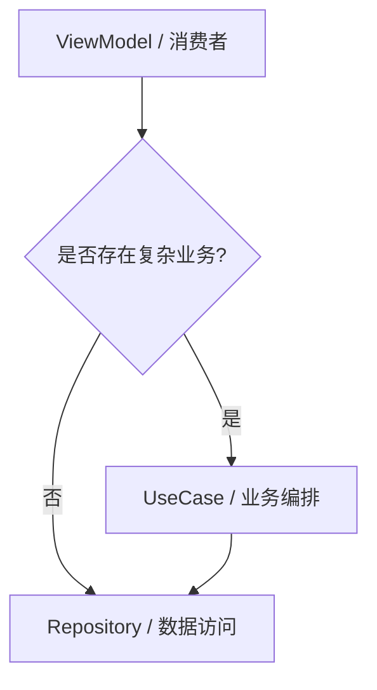

# ADR 0007: 将 UseCase 定义为可选架构层 (Optional UseCase Layer)

> **状态**：已接受 (Accepted)
>
> **背景**：Passly 初期严格遵循传统的 Clean Architecture：ViewModel -> UseCase -> Repository ->
> DAO。但在开发过程中，发现大量 UseCase 仅仅是对 Repository
> 方法的简单包装（Passthrough），并未增加任何业务价值，反而导致了调用链冗长和样板代码泛滥。

---

## 1. 架构逻辑演变

我们从“强制 UseCase”转向“按需使用”的灵活模型，以平衡架构严谨性与开发效率：

---

## 2. 决策说明

Passly 规定 **UseCase 属于可选层 (Optional Layer)**，不再强制所有数据访问请求必须经过 UseCase：

- **按需使用原则**：只有当涉及多 Repository 协调、跨模块业务流程、复杂的权限控制或核心业务规则复用时，才引入
  UseCase。
- **直接调用许可**：对于简单的 CRUD 或基础查询，ViewModel 或领域服务（如 CandidateResolver）可以直接依赖并调用
  Repository。
- **职责重定义**：UseCase 的核心职责应聚焦于“业务逻辑编排”，而非单纯的“数据转发”。

---

## 3. 核心设计价值

- **职责聚焦 (Responsibility Focusing)**：UseCase 应当解决“如何做业务”的问题，而 Repository
  解决“如何拿数据”的问题。将两者解耦后，当业务逻辑不存在时，直接访问数据层能显著提高代码的直观性。
- **减少样板代码 (Boilerplate Reduction)**：遵循 **YAGNI (You Aren't Gonna Need It)**
  原则。避免创建大量仅包含一行调用代码的 UseCase 类，从而减少了类文件数量，降低了系统的认知负担。
- **Autofill 管道优化**：在 Autofill 模块中，`CandidateResolver` 本身即承担了复杂的领域服务职责。允许其直接依赖
  `CredentialRepository`，避免了增加无意义的中间层级。

---

## 4. 架构硬约束 (Hard Constraints)

- **逻辑迁移义务**：一旦 ViewModel 中的逻辑开始涉及多个数据源或复杂的业务判定，必须将其重构并提取到
  UseCase 中。
- **Repository 纯粹性**：Repository 必须保持其数据访问者的本分，严禁为了省掉 UseCase 而在 Repository
  中塞入跨模块的业务逻辑。

---

## 5. 后果与影响

- **调用链缩短**：简单功能的实现速度加快，代码层级更加扁平，更符合 Android 现代开发实践。
- **架构灵活性**：未来若某个简单查询演变为复杂业务，可以平滑地在两者之间插入 UseCase 层，而无需修改底层的持久化实现。
- **评审准则变更**：在架构评审时，需额外关注是否有本应由 UseCase 处理的复杂逻辑被错误地留在 ViewModel
  或 Repository 中。

---

## 6. 不采纳方案

### 6.1 强制全量 UseCase 方案

- **不采纳原因**：违反了简洁设计原则，导致大量冗余代码，且在单元测试时需要 Mock 更多无意义的层级，降低了开发效率。

---

## 7. 总结

将 UseCase 定义为可选层是 Passly 对传统架构的一次实用主义改进。我们保留了 Clean Architecture
的解耦优势，同时赋予了开发者根据业务复杂度选择最优调用路径的自由，确保了系统在保持高度可测试性的同时，兼具开发效率与实现简洁性。