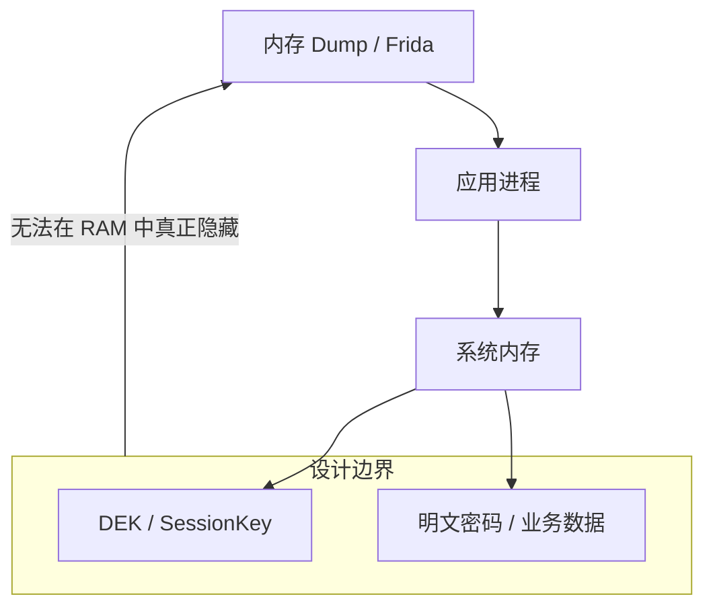

# ADR 0008: 运行时威胁边界定义 (Runtime Threat Boundary)

> **状态**：已接受 (Accepted)
>
> **背景**：在安全评审中，曾提出通过 Native Heap、mlock()、JNI 隔离以及 Frida 检测等手段来提升运行时的内存安全性。我们需要明确
> Passly 的安全边界：是否将对抗专业的运行时内存 Dump 作为核心设计目标。

---

## 1. 运行时威胁模型

本决策界定了应用层安全方案的物理极限：

---

## 2. 决策说明

Passly 明确：**不承诺抵抗专业的运行时内存 Dump 攻击**：

- **非目标场景**：不以防御 Frida 注入、ptrace 跟踪、Xposed 框架或具备 Root 权限的 Java Heap Dump 为设计目标。
- **核心防御点**：重点防御 L1（物理访问）、L2（应用层常规漏洞）和 L3（静态系统层泄露）。
- **防御重心**：从“试图隐藏内存”转向“**缩短密钥生命周期**”。

---

## 3. 核心设计价值

### 3.1 承认物理极限

- **分类描述**：一旦 Vault 解锁，DEK、SessionKey 及解密后的明文数据必然以某种形式存在于 RAM 或 CPU
  寄存器中。任何应用层的方案（如 Native Heap）都无法改变数据最终必须交由 JVM 处理并进入 Java Object
  的事实。

### 3.2 聚焦有效防御

- **分类描述**：通过 `MemoryCleaner` 主动擦除 ByteArray 并在锁定时彻底销毁密钥引用。这种方式能有效缩小攻击窗口，远比引入复杂的
  Native 隔离层更具性价比且更稳定。

### 3.3 保持架构简洁

- **分类描述**：不为了追求理论上的极致安全而引入大量难以维护的 JNI 代码或第三方加固库，确保项目长期可维护性和平台兼容性。

---

## 4. 后果与影响

- **技术选型**：项目将优先使用标准的 Kotlin/Java 密码学 API，辅以严格的 ByteArray 内存管理，而非转向全
  Native 加密。
- **稳定性保障**：避免了因内存锁定（mlock）或 Native 堆管理不当导致的进程崩溃或内存泄露风险。
- **文档诚实性**：在威胁模型中如实告知用户 L4 级攻击的风险，而非提供虚假的安全感。

---

## 5. 不采纳方案

### 5.1 Native-only 加密隔离方案

- **不采纳原因**：即使加密在 Native 层完成，明文最终仍需返回 JVM 进行 UI
  渲染或自动填充。该方案无法解决根本问题，反而极大增加了调试和维护成本。

---

## 6. 总结

Passly 选择了**实用主义安全观**。我们承认应用层无法完全对抗拥有 Root
权限或专业工具的内存取证。通过将精力集中在“物理层保护”和“生命周期最小化”上，我们为绝大多数用户场景提供了最坚固的防线，同时保证了软件的健壮与纯粹。