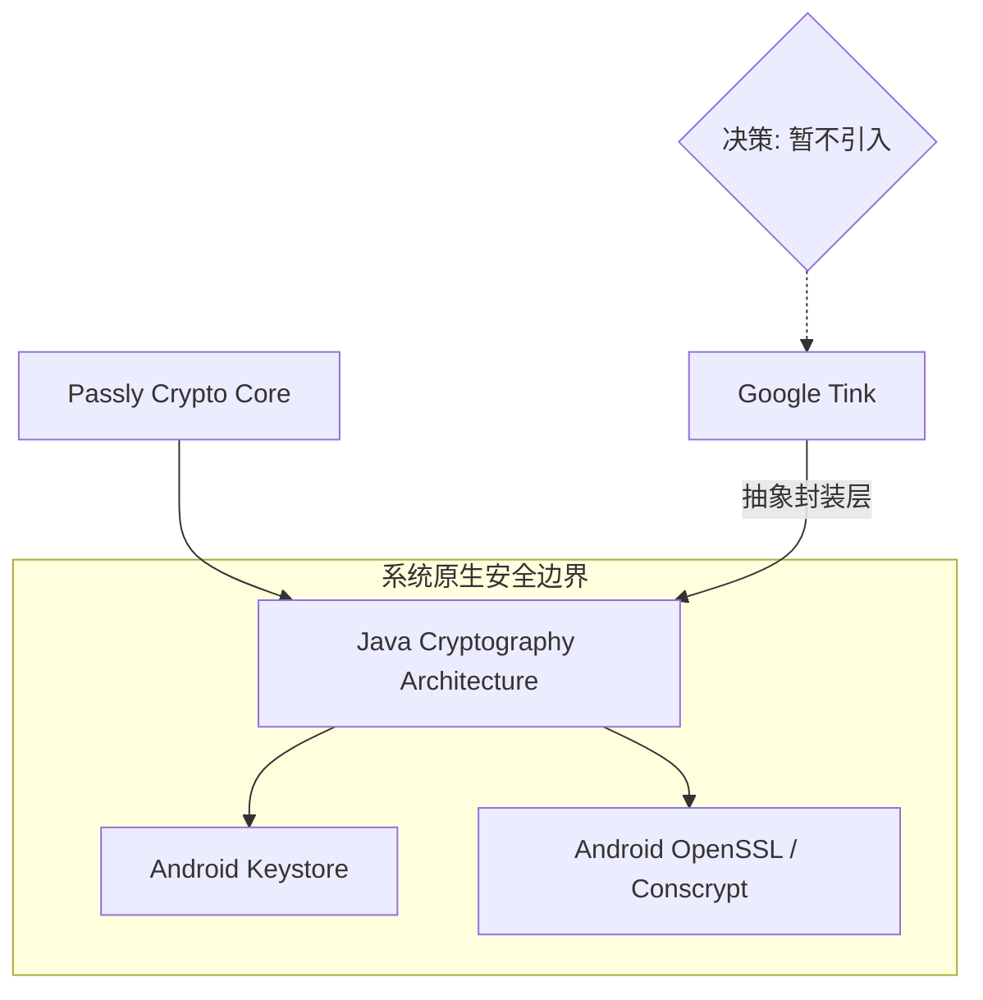

# ADR 0009: 暂不引入 Google Tink 库 (No Google Tink)

> **状态**：已接受 (Accepted)
>
> **背景**：在项目初期，团队讨论了是否应当引入 Google Tink 作为核心加解密框架。虽然 Tink
> 提供了高级的加密封装和密钥管理功能，但考虑到 Passly 的离线性质以及对底层密钥生命周期的极致控制需求，我们需要权衡第三方库引入的收益与成本。

---

## 1. 架构选择模型

Passly 选择直接基于系统级安全接口（JCA/Keystore）构建底层加密：

---

## 2. 决策说明

Passly 决定采用 **Android Keystore + 原生 JCA (AES-GCM)** 的组合，暂不引入 Google Tink：

- **自研闭环**：Passly 已自行实现了信封加密（Envelope）、密钥滚动、Session 生命周期及内存擦除逻辑。
- **底层直控**：直接使用 JCA 允许我们对 AAD 绑定、Nonce 生成以及内存中的 ByteArray 擦除拥有最高优先级的控制权。
- **原语一致性**：AES-GCM 等密码学原语在 JCA 底层（Conscrypt）与 Tink 是一致的，安全性并无本质区别。

---

## 3. 核心设计价值

### 3.1 减少外部依赖 (Minimal Dependency)

- **分类描述**：作为一个高安全性项目，减少第三方依赖有助于降低供应链攻击风险，并缩小 APK 体积。

### 3.2 离线场景适配

- **分类描述**：Tink 的核心价值之一是远程 KMS 集成与复杂的 Key Rotation 策略，而 Passly
  作为离线密码管理器，目前的信封加密机制已完全能满足现有的密钥管理需求。

### 3.3 极致生命周期管理

- **分类描述**：Tink 的封装往往会屏蔽底层字节处理的细节，而 Passly 需要通过 `MemoryCleaner`
  对每一处敏感字节进行物理清零。直接使用原生 API 能更方便地实施这一安全策略。

---

## 4. 后果与影响

- **维护成本**：团队需要负责维护底层的加解密封装代码，但这些逻辑目前已趋于稳定。
- **未来扩展性**：若未来 Passly 需要支持云同步、多平台统一 Crypto API 或企业级密钥托管，本项目将重新评估
  Tink 的引入。
- **工程纯粹性**：保持了代码库的轻量级与对 Android 系统原生 API 的深度利用。

---

## 5. 不采纳方案

### 5.1 全面切换至 Google Tink

- **不采纳原因**：目前 Tink 提供的高级抽象（如 KeysetHandle）会与 Passly 现有的 Session
  管理机制产生冲突，且无法显著提升现有的加密安全性。

---

## 6. 总结

暂不引入 Google Tink 是一项基于**工程纯粹性**与**职责可控性**
的决策。我们选择在系统原生安全接口之上，构建最符合密码管理器业务特性的轻量级加密层，确保每一行核心加密代码都在审计视野之内。