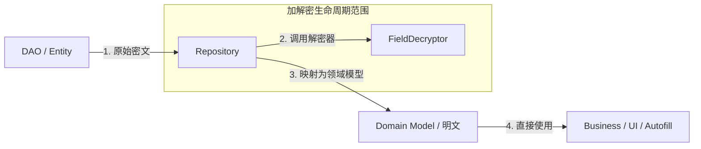

# ADR 0010: Repository 返回明文领域模型 (Plaintext Domain Model)

> **状态**：已接受 (Accepted)
>
> **背景**：在定义数据访问契约时，我们需要确定 Repository
> 应当向外部暴露何种状态的数据。一种方案是返回原始密文，由业务层自行解密；另一种是直接返回已解密的明文领域模型。该决策将直接决定业务模块与加解密实现的耦合程度。

---

## 1. 契约流转模型

本决策定义了系统各层级间的数据“透明度”：

---

## 2. 决策说明

Passly 规定 **Repository 必须返回完全解密的明文领域模型 (Domain Model)**：

- **解密闭环**：Repository 内部负责完成从数据库 `encryptedBlob` 到明文字段的转换。
- **契约保证**：上层组件（ViewModel, UseCase, Autofill Pipeline）接收到的任何数据对象（如 `VaultEntry`
  ）均被视为明文。
- **职责唯一性**：业务层严禁再次尝试调用任何 `decrypt()` 逻辑，所有数据获取操作均应在“明文环境”下进行。

---

## 3. 核心设计价值

### 3.1 职责分离 (Separation of Concerns)

- **分类描述**：密文存储属于“基础设施”层面的实现细节。业务层应当关注“用户有什么数据”，而不应关注“这些数据在磁盘上是如何加密的”。

### 3.2 UI 与逻辑的纯粹性

- **分类描述**：UI 组件与 Autofill Resolver 变得极其轻量，无需依赖任何 SessionKey 或
  EncryptionManager。这避免了加解密代码向展示层的扩散，极大地降低了误用风险。

### 3.3 架构灵活性

- **分类描述**：由于契约是明文模型，未来如果更换底层存储方案（如从 SQLCipher 迁移到其它加密库）或更改字段加密算法（如
  AES 切换到其它方案），业务代码完全无需改动。

---

## 4. 后果与影响

- **对 Autofill 的影响**：`CandidateResolver` 无需处理解密，仅负责匹配与 DTO 转换，提高了匹配逻辑的纯粹性与可测试性。
- **对 UI 的影响**：ViewModel 拿到的数据始终立即可用，消除了 UI 渲染时可能出现的“二次解密延迟”感。
- **开发规范**：Repository 的实现必须包含解密逻辑，并妥善处理解密失败（如抛出受控异常而非返回部分数据）。

---

## 5. 不采纳方案

### 5.1 Repository 返回密文 DTO

- **不采纳原因**：会导致解密逻辑散落到各个 Feature 模块中，造成严重的逻辑重复，并强制业务层与 Crypto
  模块产生深度耦合，违背了 Clean Architecture 的核心精神。

---

## 6. 总结

Repository 返回明文模型是 Passly 确立 **分层自治**
的关键步骤。通过在数据出口处强制完成解密，我们确立了一个“密文不出数据层”的架构铁律，在保证安全性的同时，为上层开发提供了极致的简洁性。