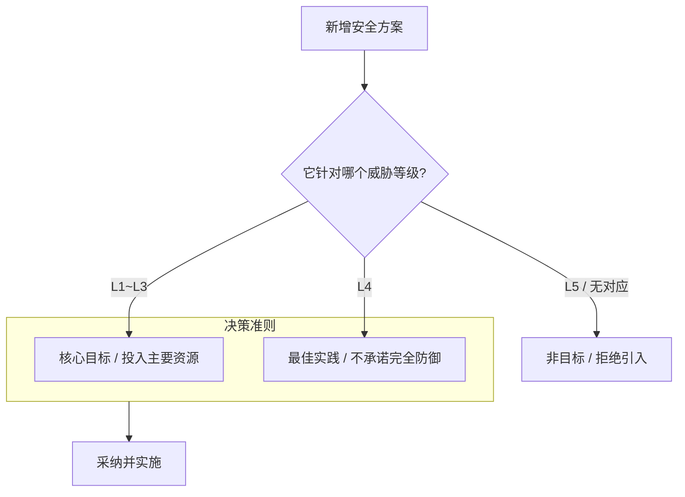

# ADR 0011: 威胁模型驱动架构设计 (Threat Model Driven Design)

> **状态**：已接受 (Accepted)
>
> **背景**：在安全设计过程中，常常出现关于双 DEK、Native Heap、mlock()、Frida
> 检测等方案的激烈讨论。为了避免在无限的安全加固中迷失方向，我们需要建立一套客观的标准，来衡量哪些安全能力属于项目核心目标，而哪些属于非目标。

---

## 1. 决策逻辑模型

Passly 的安全决策不再基于“是否更安全”，而是基于“风险驱动”：

---

## 2. 决策说明

Passly 规定：**所有安全设计必须首先明确其针对的威胁等级 (Threat Level)**。我们拒绝“为了安全而安全”的盲目堆砌。

- **核心聚焦 (L1~L3)**：主要开发资源应投入到防御设备遗失（L1）、数据库泄露（L2）和静态系统层提权（L3）上。
- **最佳实践 (L4)**：对于运行时内存攻击（L4），我们采取最佳实践（如 ByteArray 擦除），但不承诺完全防御，也不为此引入极高复杂度的
  Native 方案。
- **明确非目标 (L5)**：针对内核级攻击（L5）或芯片级硬件漏洞，明确定义为 Non-goal。

---

## 3. 核心设计价值

### 3.1 风险驱动 (Risk-driven)

- **分类描述**：安全预算应优先投入到能显著降低真实风险的设计上。每一项安全功能的引入都必须有明确的威胁场景支撑。

### 3.2 工程可行性权衡

- **分类描述**：避免“理论上的极致安全”破坏系统的稳定性和可维护性。例如，双 DEK 虽然增加了实现成本，但极大地增强了
  L2/L3 的防御力，因此被采纳。

### 3.3 拒绝过度设计

- **分类描述**：如果一项技术改进（如确定性 Nonce）不能实质性地提升 L1~L3
  的防护水平，即使它听起来很专业，原则上也应予以拒绝，以保持架构的纯粹性。

---

## 4. 典型决策示例

| 方案              | 针对威胁    | 决策结果     | 理由                  |
|:----------------|:--------|:---------|:--------------------|
| **双 DEK**       | L2 / L3 | ✅ **采纳** | 显著提升静态数据泄露下的纵深防御。   |
| **信封加密**        | L1 / L2 | ✅ **采纳** | 实现认证与加密解耦，降低管理风险。   |
| **Native Heap** | L4      | ❌ **拒绝** | 收益有限且大幅增加 JNI 维护成本。 |
| **Memory Wipe** | L4      | ✅ **采纳** | 极低成本的最佳实践，能缩短暴露窗口。  |

---

## 5. 后果与影响

- **设计依据**：威胁模型成为评审所有安全提案的终极基准。
- **开发优先级**：团队能够清晰地识别哪些是“必须做”的安全功能，哪些是“锦上添花”。
- **文档诚实性**：我们在架构文档中如实记录安全边界，不向用户提供虚假的安全承诺。

---

## 6. 总结

威胁模型驱动设计确立了 Passly 的**实用主义安全观**
。通过将防御精力集中在最可能发生的、且在应用层能够有效控制的风险上，我们确保了系统在拥有极高安全强度的同时，依然保持了工程上的健壮与可维护性。