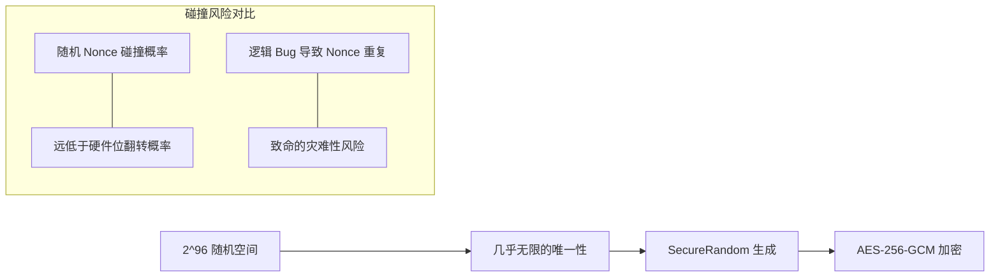

# ADR 0012: 坚持使用随机 Nonce (Random Nonce Strategy)

> **状态**：已接受 (Accepted)
>
> **背景**：AES-GCM 算法对安全性有一个硬性要求：在同一把密钥下，Nonce（或称 IV）绝对不得重复。项目组曾深入讨论是采用基于记录
> ID 的确定性 Nonce（Deterministic Nonce），还是采用符合 NIST 推荐的随机 Nonce。

---

## 1. 碰撞空间模型

本决策基于对 96-bit 随机空间的工程化评估：

---

## 2. 决策说明

Passly 统一采用 **96-bit 安全随机 Nonce (Random Nonce)** 方案：

- **实现方式**：每次执行 AES 加密时，利用 `SecureRandom` 产生新的 96-bit IV。
- **存储策略**：生成的 IV 紧随密文之后（或之前）存储在数据库的 `encryptedBlob` 中，作为密文包的一部分。
- **系统依赖**：直接利用 Android 系统 `Cipher.init()` 默认的安全随机能力。

---

## 3. 核心设计价值

### 3.1 极简主义与鲁棒性 (Keep It Simple)

- **分类描述**：随机 Nonce 无需维护全局状态或计数器。它不依赖于 `RecordId`
  的唯一性，这意味着在数据迁移、导入导出或同步冲突合并时，不会因 ID 重复而诱发灾难性的 Nonce 重用。

### 3.2 规避逻辑陷阱

- **分类描述**：确定性 Nonce 逻辑一旦出现 Bug（例如备份恢复导致 ID 计数器回退），会产生大面积的 Nonce
  重用。而随机 Nonce 的安全性由密码学原语保证，不随业务逻辑的演进而产生风险。

### 3.3 符合工程极限

- **分类描述**：对于个人密码管理器，记录数量级通常在 10^3 到 10^5 之间，远未达到 2^96
  空间的生日攻击极限。在工程上，随机碰撞的概率甚至低于 CPU 发生随机错误或硬盘损坏的概率。

---

## 4. 后果与影响

- **存储结构**：数据库每个加密字段将额外占用 12 字节（96-bit）用于存储 IV。
- **无状态特性**：加密逻辑完全无状态，极大简化了 Repository 的保存实现。
- **标准兼容**：完全符合 NIST SP 800-38D 标准建议，易于通过未来的第三方安全审计。

---

## 5. 不采纳方案

### 5.1 确定性 Nonce (RecordId + KDF)

- **不采纳原因**：虽然理论上节省了存储空间并消除了碰撞概率，但其增加了对“ID
  绝对唯一性”的深度依赖。在复杂的离线同步和备份场景下，维护这一唯一性的成本和风险远超随机方案。

---

## 6. 总结

坚持使用随机 Nonce 是 Passly 追求 **架构鲁棒性**
的体现。我们选择相信成熟的密码学统计特性，而非构建复杂的业务逻辑来消除理论上的碰撞可能。这一决策显著降低了实现复杂度，并确保了系统在极端运维场景下的安全性。