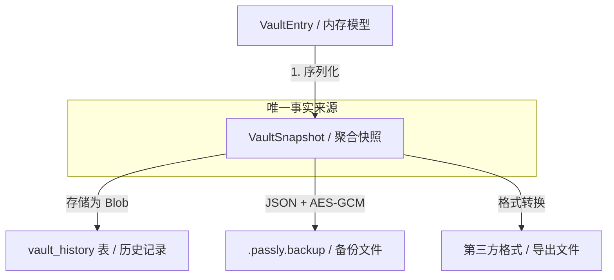

# ADR 0013: 采用聚合快照模型统一处理历史、备份与导出 (Vault Snapshot Model)

> **状态**：已接受 (Accepted)
>
> **背景**：Passly 需要在多种场景下处理 Vault 条目的全量数据，包括版本历史 (History)、本地备份 (Backup) 以及导入导出 (Import/Export)。如果为每个场景单独定义 Payload 模型，将导致字段重复维护及数据不一致风险。我们需要一个统一的、与存储介质无关的数据载体。

---

## 1. **数据流向模型**

聚合快照模型实现了“一次定义，多处复用”，确立了系统条目状态的唯一标准：

---

## 2. **核心决策说明**

Passly 采用 **聚合快照 (VaultSnapshot)** 机制，实现存储介质与数据模型的彻底解耦：

- **统一序列化载体**：全项目仅维护一套“完整条目序列化格式”。无论存入数据库历史表，还是导出到备份文件，均使用相同的结构。
- **全量快照策略**：每次修改均生成当前状态的全量快照，而非存储增量补丁（Patch），确保版本回滚的独立性。
- **存储与逻辑分离**：遵循正交设计原则，数据库表仅作为索引引擎，不关心具体的业务字段细节。

---

## 3. **核心设计价值**

### 3.1 维护性与一致性
- **单一事实来源 (SSOT)**：新增业务字段（如 Passkey 或附件）只需修改一次 Payload 模型，历史、备份和导出逻辑将自动继承变更。
- **减少样板代码**：序列化逻辑只需编写一次（kotlinx.serialization），显著降低了长期维护成本。

### 3.2 业务鲁棒性
- **回退透明化**：恢复历史版本时，直接从 Blob 反序列化并覆盖当前状态，无需处理复杂的字段映射或差分逻辑。
- **版本兼容性**：通过 `schemaVersion` 驱动迁移逻辑，确保旧版快照在未来版本中依然可用。

### 3.3 数据库设计优化
- **Schema 稳定性**：`vault_history` 表结构无需随业务需求频繁变动，极大降低了数据库 Migration 的复杂度。

---

## 4. **后果与权衡 (Trade-offs)**

- **存储开销**：- **磁盘占用**：每次修改存储全量快照会增加一定的空间。
    - **缓解措施**：鉴于密码管理器条目体积极小（通常 < 2KB）且编辑频率极低，该开销在现代移动设备上可忽略不计；未来可引入 GZIP 压缩。
- **性能影响**：- **反序列化开销**：反序列化大 JSON 相比直接读取单一字段略慢。
    - **缓解措施**：所有操作均在 `Dispatchers.IO` 中异步执行，处理耗时通常 < 5ms，用户无感知。

---

## 5. **实施约束 (Hard Constraints)**

- **包依赖限制**：`VaultSnapshot` 仅允许存在于 `data.model.payload` 中，严禁污染领域层 (Domain Layer)。
- **持久化规范**：数据库中的 `snapshotBlob` 列必须使用 ByteArray 存储，配合 Room 的 `@TypeConverter` 进行自动序列化。
- **序列化稳定性**：所有涉及快照的 Payload 类均必须标记为 `@Serializable`。

---

## 6. **总结**

通过采用聚合快照模型，Passly 将复杂的条目状态管理简化为标准化的序列化流。这不仅增强了数据的健壮性，也为未来可能的跨设备同步（Sync）奠定了统一的协议基础，完美契合“离线优先”的设计哲学。
