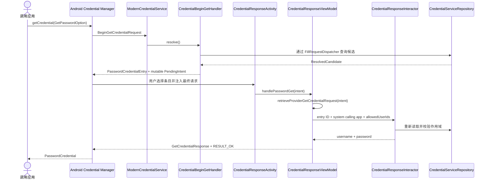
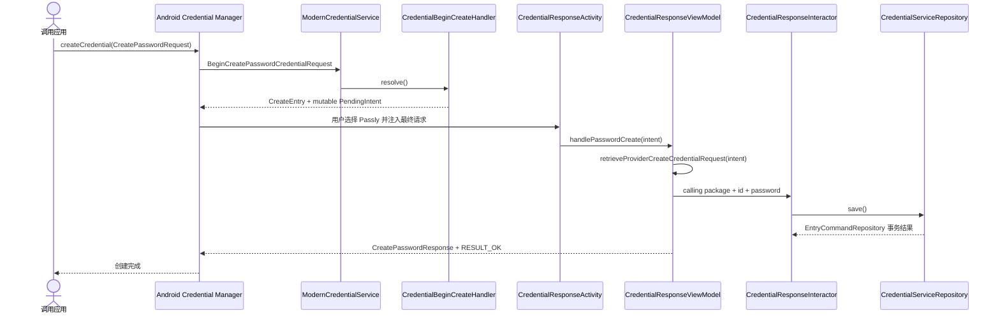

# Credential Manager Provider 实现

状态：当前实现。  
代码核对日期：2026-07-29。  
适用范围：Android 14（API 34）及以上的 Credential Provider；传统 Autofill 另见
[自动填充安全](../security/autofill.md)。

## 目标与非目标

Passly 作为 Android Credential Manager 的第三方 Credential Provider，当前目标是：

- 向原生 Android 应用提供已保存的用户名和密码；
- 在 Vault 锁定时通过系统 `AuthenticationAction` 解锁后重新给出候选；
- 接收原生 Android 应用的密码创建请求，并通过正式 Vault 事务保存；
- 保持 Credential Manager、传统 Autofill 和 Vault Domain 的边界清晰；
- 对尚不能进行密码学验证的 Passkey 能力保持关闭。

当前不声称支持：

- 浏览器代表网站发起的 Credential Manager 密码请求；
- Passkey 创建、查询、WebAuthn assertion 或 attestation；
- 远程凭据条目；
- 跨请求记忆“上次使用账号”的 sticky session；
- Android 15+ Credential Manager 托管的嵌入式生物识别流程。

## 版本与源码依据

项目锁定：

```toml
credentials = "1.6.0"
```

截至 2026-07-29，AndroidX 官方发布页把 1.6.0 列为 stable，同时已有 1.7.0 alpha。官方 Provider 指南可能展示
alpha 依赖示例，这不表示项目已经升级；本文所有构造器和 Bundle 转换结论均以 Passly 实际解析到的 1.6.0
为准。

实现以 Gradle 实际解析到的 `androidx.credentials:credentials:1.6.0-sources.jar` 为版本权威，而不是按旧教程、
博客或其他版本的代码猜测 API。升级依赖时至少要重新检查：

- `CredentialProviderService.kt`
- `PendingIntentHandler.kt`
- `BeginGetCredentialRequest.kt`
- `ProviderGetCredentialRequest.kt`
- `BeginGetPasswordOption.kt`
- `GetPasswordOption.kt`
- `BeginCreatePasswordCredentialRequest.kt`
- `ProviderCreateCredentialRequest.kt`
- `CallingAppInfo.kt`
- `CreateEntry.kt`
- Credential get/create/clear exception 类型

AndroidX 源码揭示了几个仅看示例容易遗漏的契约：

1. Provider Service 只在一次 Credential Manager 调用期间绑定；查询回调应视为无状态，进程可能在查询与完成阶段之间
   被系统回收。
2. 查询阶段只能返回显示元数据和 PendingIntent，不能返回明文凭据。
3. 普通 `CredentialEntry` 的完成阶段必须读取 `ProviderGetCredentialRequest`。
4. `AuthenticationAction` 的完成阶段读取的是原始 `BeginGetCredentialRequest`，不是
   `ProviderGetCredentialRequest`。
5. `CreateEntry` 的完成阶段必须读取 `ProviderCreateCredentialRequest`；密码只存在于这个最终请求中。
6. 有效响应和有效 Credential 异常都必须使用 `Activity.RESULT_OK`。
7. `Activity.RESULT_CANCELED` 表示 Provider 连有效异常都无法构建，系统可能重新显示原选择器。

官方 AndroidX 源码和 API 文档链接见[参考资料](#参考资料)。

## 系统注册

### Manifest

`ModernCredentialService`：

- 继承 AndroidX `CredentialProviderService`；
- 要求 `android.permission.BIND_CREDENTIAL_PROVIDER_SERVICE`；
- `exported = true`，但只有持有绑定权限的 Android 系统可以绑定；
- Manifest 默认 `enabled = false`，由 `PasslyApplication` 在 API 34+ 启用，避免低版本加载 API 34 类；
- Provider Service 与传统 `LegacyAutofillService` 在 Android 14+ 可以同时存在。

系统注册和 Passly 内部开关是两件事：

- 系统设置决定 Passly 是否是用户启用的 Credential Provider；
- `AutofillSettings.enabled` 和 `credentialManagerEnabled` 决定 Passly 是否返回候选；
- 关闭内部开关不会替用户修改 Android 的 Provider 选择。

### Capability

当前 `credential_service_config.xml` 只发布：

```xml
<capability name="android.credentials.TYPE_PASSWORD_CREDENTIAL" />
```

没有注册 `androidx.credentials.TYPE_PUBLIC_KEY_CREDENTIAL`。同一 XML 还把
`com.aozijx.passly.MainActivity` 声明为 Provider 设置入口；当前只打开应用主界面，尚未深链到 Autofill
设置页。

## 两阶段模型

### 密码读取



#### 查询阶段

`CredentialBeginGetHandler`：

1. 只处理 `BeginGetPasswordOption`，其他 option 不产生条目；
2. 如果没有密码 option，返回空 `BeginGetCredentialResponse`；
3. 通过 `CredentialCallingAppResolver` 接受原生调用包，拒绝携带特权 origin 的请求；
4. 整个请求只执行一次 `FillRequestDispatcher` 查询，避免每个 option 重复访问 Vault；
5. Vault 锁定时返回一个 `AuthenticationAction`；
6. Vault 可用时，对每个密码 option 构造与该 option 绑定的 `PasswordCredentialEntry`；
7. 在展示前应用 `BeginGetPasswordOption.allowedUserIds`。

多个密码 option 仍可能得到多组条目，因为 AndroidX 要求每个 `PasswordCredentialEntry` 绑定创建它的
`BeginGetPasswordOption`；当前优化的是数据库查询次数，而不是把不同 option 错误合并。

`CredentialPlatformAdapter` 只负责平台模型转换：

- 调用包变为 `InternalFillRequest.parentPackage`；
- 构造用户名和密码两个合成字段描述；
- 将最小 `ResolvedCandidate` 转为 `PasswordCredentialEntry`；
- 不读取 Room、Entity 或加密实现。

#### 完成阶段

用户选择普通密码条目后，Android 系统向 PendingIntent 对应 Activity 注入完整的 framework
`GetCredentialRequest`。AndroidX 1.6.0 的 `PendingIntentHandler.Api34Impl` 会：

1. 从 `CredentialProviderService.EXTRA_GET_CREDENTIAL_REQUEST` 读取 framework Parcelable；
2. 把 framework options 转成 AndroidX `CredentialOption`；
3. 把 framework calling app 转成 AndroidX `CallingAppInfo`；
4. 返回 `ProviderGetCredentialRequest`。

Passly 完成阶段必须满足：

- `credentialOptions.singleOrNull()` 必须是 `GetPasswordOption`；
- 调用包只从 `ProviderGetCredentialRequest.callingAppInfo` 读取；
- PendingIntent 自定义 extra 只携带不透明字符串 entry ID；
- entry ID 不是授权证明，必须重新查询条目；
- 当前设置、包作用域、密码非空和 `allowedUserIds` 全部重新校验；
- 需要认证时只接受 `AuthenticationManager` 返回的 `AuthenticationResult.Success`；
- 成功后才构造 `PasswordCredential`。

`GetPasswordOption.allowedUserIds` 在查询阶段和完成阶段各检查一次。第一次避免显示不应出现的账号，第二次避免候选显示后
数据库、请求或条目发生变化时释放错误凭据。

### 锁定与 AuthenticationAction

Vault 锁定且无法读取候选元数据时，查询阶段不构造伪条目，而是返回 `AuthenticationAction`：

1. 系统启动 `ACTION_UNLOCK` PendingIntent；
2. Activity 通过 `retrieveBeginGetCredentialRequest(intent)` 取回原始查询请求；
3. `AuthenticationManager` 以 `AuthenticationPurpose.AUTOFILL` 完成认证；
4. 复用同一个 `CredentialBeginGetHandler`，但设置 `includeUnlockAction = false`，避免解锁失败时循环；
5. 通过 `setBeginGetCredentialResponse()` 返回解锁后的候选列表。

当前没有跨 Activity 的一次性认证票据。如果 Vault 原先锁定，同时 `requireAuthentication = true`，用户可能先为
`AuthenticationAction` 解锁一次，随后选择具体条目时再进行一次新鲜认证。这是当前保守行为，不是理想 UX。
未来若减少第二次认证，票据必须由认证中心签发、短时、单次消费、绑定最终系统请求和调用方；不能只在 Intent
中放一个
布尔值，也不能把全局 Vault 解锁状态当成当前请求已授权。

### 密码创建



查询阶段只接受 `BeginCreatePasswordCredentialRequest`，并且只在以下条件成立时返回 `CreateEntry`：

- Autofill 与 Credential Manager 内部设置已启用；
- `callingAppInfo` 存在；
- 请求不是浏览器等特权应用代表 origin 发起的请求。

`CreateEntry`：

- 使用 Passly 作为本地单一保存位置；
- 禁止 auto-select，要求用户在系统选择器明确选择；
- PendingIntent 使用 `FLAG_MUTABLE | FLAG_UPDATE_CURRENT`；
- 不使用 `FLAG_ONE_SHOT`；
- 查询阶段不携带用户名或密码。

完成阶段从 `ProviderCreateCredentialRequest.callingRequest` 取得 `CreatePasswordRequest`
，再验证系统调用包并执行当前设置与
认证策略。保存调用 `CredentialServiceRepository.save()`，最终由 `EntryCommandRepository.createEntry()`
正式事务写入
加密条目、查询索引、修订和活动数据。

当前创建语义是“新增条目”，不是按调用包和用户名 upsert。相同站点或应用重复调用 create 可能产生多个条目；
密码更新、冲突确认和去重 UI 尚未实现。

### Clear state

`onClearCredentialStateRequest()` 的平台含义是清除 Provider 自己维护的活跃账号筛选、上次选中账号或 RP
session，
不是删除密码，也不是强制锁定整个 Vault。

Passly 当前没有这类 per-app sticky state，因此回调是明确的成功 no-op。以后增加此类状态时，必须在这里清理，
并补充调用方隔离与测试。

## PendingIntent 与 Activity 结果

所有 Provider PendingIntent 都指向显式、`exported = false` 的 `CredentialResponseActivity`。

| 类型        | Action                   | Passly 自定义数据 | 系统注入数据               |
|-----------|--------------------------|--------------|----------------------|
| 密码条目      | `ACTION_GET_PASSWORD`    | entry ID     | 最终 get request       |
| 解锁 action | `ACTION_UNLOCK`          | 无            | 原始 begin-get request |
| 密码创建      | `ACTION_CREATE_PASSWORD` | 无            | 最终 create request    |

PendingIntent 规则：

- 必须 mutable，使 Android 系统能追加最终 request；
- 使用 `FLAG_UPDATE_CURRENT`，不用 `FLAG_ONE_SHOT`；
- 密码条目使用 entry ID identifier 和 request code，避免 extras 不参与 PendingIntent identity
  导致条目互相覆盖；
- 不传密码、DEK、Cipher、认证结果、调用包名或长期会话令牌。

Activity 结果规则：

| 状态                     | Intent 内容                | result code       |
|------------------------|--------------------------|-------------------|
| 密码读取成功                 | `GetCredentialResponse`  | `RESULT_OK`       |
| 密码创建成功                 | `CreatePasswordResponse` | `RESULT_OK`       |
| 可表达的 get/create 错误     | 对应 Credential Exception  | `RESULT_OK`       |
| 完全无法识别 action，无法确定错误类型 | 无                        | `RESULT_CANCELED` |

`RESULT_CANCELED` 不是认证失败的通用表达。AndroidX 源码明确说明它会让系统重新显示原始选择器；能构造标准异常时必须把
异常放入结果 Intent 并使用 `RESULT_OK`。

当前映射：

| Passly 结果                   | Credential Manager 结果                   |
|-----------------------------|-----------------------------------------|
| 条目消失、作用域改变、allowed user 不匹配 | `NoCredentialException`                 |
| 用户主动取消 get 认证               | `GetCredentialCancellationException`    |
| 用户主动取消 create 认证            | `CreateCredentialCancellationException` |
| option 类型不匹配                | 对应 `UnsupportedException`               |
| 最终系统请求缺失、认证内部失败、保存失败        | 对应 `UnknownException`                   |

认证错误的具体 UI 文案和重试由认证中心负责；Credential 层只把最终业务结果转换为平台标准异常，不复制应用密码、
生物识别或恢复码的错误映射。

## 调用方身份与 origin

### 原生 Android 调用

原生应用请求没有 delegated origin。Passly 使用系统提供的：

- `CallingAppInfo.packageName`
- `CallingAppInfo.signingInfoCompat`

当前作用域匹配使用 package name。Android 包安装和更新仍由系统签名规则约束；Passly 不信任自定义 Intent
里的包名。

### 浏览器代表网站调用

`CallingAppInfo.isOriginPopulated() = true` 表示浏览器等特权应用代表另一个 origin 发起请求。此时把浏览器包名当成网站
作用域会把不同网站混在一起。

AndroidX 要求 Provider 向 `CallingAppInfo.getOrigin(privilegedAllowlist)` 传入受信应用
allowlist。只有调用包和签名
证书指纹匹配时才返回 origin。Passly 当前没有维护和发布这份 allowlist，所以：

- begin-get 返回空候选；
- begin-create 返回空 `BeginCreateCredentialResponse`；
- 如果异常请求进入完成阶段，返回 unsupported；
- 网站密码继续依赖传统 Autofill 的 `AssistStructure` 与域名匹配。

在实现受信浏览器清单、证书轮换、origin 规范化和 Related Origin Requests 前，不得读取内部 origin 字段或降级使用
浏览器包名。

## 代码边界

| 层/组件                             | 负责                                        | 不负责                            |
|----------------------------------|-------------------------------------------|--------------------------------|
| `ModernCredentialService`        | Android 回调、协程、CancellationSignal、callback | 查询 Room、认证、解析密码                |
| `CredentialBeginGetHandler`      | begin-get 编排、锁定 action、option 绑定          | 返回明文密码                         |
| `CredentialBeginCreateHandler`   | begin-create 类型和设置判断、CreateEntry          | 读取最终密码、写数据库                    |
| `CredentialPlatformAdapter`      | AndroidX 与内部 Fill DTO 转换                  | 业务授权、DAO                       |
| `CredentialPendingIntentFactory` | 显式 mutable PendingIntent 与最小 extras       | 调用方身份授权                        |
| `CredentialResponseActivity`     | 安装 AuthenticationHost、返回 Activity result  | 决定凭据是否正确                       |
| `CredentialResponseViewModel`    | 提取系统最终请求、调用用例、映射平台结果                      | 实现密码/生物识别验证                    |
| `CredentialResponseInteractor`   | 当前设置、认证、重新查询、作用域校验、保存编排                   | Android Activity、PendingIntent |
| `CredentialServiceRepository`    | 候选读取、按 ID 读取、正式保存契约                       | AndroidX Credential 类型         |
| `AuthenticationManager`          | 认证方式、正确性、失败原因、新鲜认证策略                      | 构建 Credential Manager 响应       |

核心边界：

- AndroidX/framework 类型不得进入 data repository；
- Service 不直接依赖 Room Entity、DAO 或加密实现；
- ViewModel 不解释“密码错误”“生物识别锁定”等认证细节；
- entry ID 只用于定位，调用方身份只能来自系统最终请求；
- `ResolvedCandidate` 只携带本次系统响应需要的最小数据；
- 日志不得记录 username、password、origin、完整 request JSON 或 Intent extras。

## 生命周期与并发

`ModernCredentialService` 使用 `SupervisorJob + Dispatchers.IO`：

- `CancellationSignal` 取消对应协程；
- 取消后不再调用 framework callback；
- `CancellationException` 不转换为 Unknown；
- Service 销毁时取消 scope。

`CredentialResponseViewModel` 使用 `AtomicBoolean` 确保一个 Activity/ViewModel 实例只启动一次
get、unlock 或 create
流程，避免配置变化或重复 `onCreate` 在同一实例重复保存。它不能防止系统重新触发一个全新的
PendingIntent；
跨 Activity 的幂等仍应由未来的保存/upsert 策略处理。

Provider Service 查询和 Activity 完成之间不得依赖进程内对象。当前唯一跨阶段业务指针是 PendingIntent
中的 entry ID；
最终调用方和请求参数由系统重新注入。如果进程在两阶段之间被回收，普通 get/create 仍能从数据库恢复。

## Passkey 边界

Passly 数据模型已经存在：

- `credentialId`
- `rpId`
- `userHandle`
- `privateKeyReference`
- `hardwareKeyInfo`

这些字段只能说明“准备承载 Passkey 元数据”，不能证明已经拥有可用 authenticator。当前缺少：

- 生成、加密保存和调用实际私钥的密钥服务；
- 私钥算法、公钥和 credential ID 的一致性校验；
- creation JSON、request JSON、allow/exclude credentials 解析与完整验证；
- Digital Asset Links 和受信浏览器 origin 校验；
- authenticator data、UP/UV flags、sign counter；
- `clientDataJSON`/`clientDataHash` 处理；
- attestation object 与 assertion signature；
- RP 端可验证的端到端测试。

`privateKeyReference` 目前是可编辑、可备份的数据字段，不是一个受控签名句柄。基于它构造
`PublicKeyCredentialEntry` 或返回伪 assertion 会让系统显示一个无法通过 RP 验证的 Passkey，同时可能形成错误的安全
承诺。因此当前实现：

- 不注册 Passkey capability；
- 不返回 `PublicKeyCredentialEntry`；
- 不接收 Passkey create；
- 不生成模拟 response；
- 只在文档和数据模型中保留未来实现边界。

## 当前进度

### 已实现并通过本地验证

| 能力                                    | 状态 | 验证                   |
|---------------------------------------|----|----------------------|
| API 34+ Provider 注册和动态启用              | 完成 | Manifest/resource 编译 |
| 原生应用密码 begin-get                      | 完成 | Kotlin 编译、架构回归测试     |
| Vault 锁定 AuthenticationAction         | 完成 | Kotlin 编译、源码契约检查     |
| 最终 get 系统请求提取                         | 完成 | 回归测试禁止信任自带包名         |
| `allowedUserIds` 双重检查                 | 完成 | 回归测试                 |
| 标准 get/create exception + `RESULT_OK` | 完成 | 回归测试、Lint            |
| 原生应用密码 begin-create/final-create      | 完成 | Kotlin 编译、单元测试       |
| Clear state 明确 no-op                  | 完成 | 源码审查                 |
| Passkey capability 安全闸门               | 完成 | XML/架构回归测试           |
| 文档与官方契约对齐                             | 完成 | 相对链接校验               |

本地门禁结果：

- `:app:compileDebugKotlin`：通过；
- `:app:testDebugUnitTest`：通过；
- Credential 架构回归测试：通过；
- `:app:lintDebug`：0 errors；现有 warnings 未指向本次 Credential 文件。

### 需要 Android 14+ 真机验证

- 在不同 OEM 设置页启用/禁用 Passly Provider；
- 系统选择器的标题、图标、排序和返回行为；
- 原生测试应用的 password get；
- 原生测试应用的 password create；
- Vault 锁定、认证取消、候选删除和作用域变化；
- Activity 配置变化、后台恢复和进程回收；
- `RESULT_CANCELED` 是否按 OEM 预期重新显示选择器；
- 同一客户端重复 create 的重复条目行为。

### 尚未实现

| 能力                                 | 原因/前置条件                              |
|------------------------------------|--------------------------------------|
| 浏览器 delegated origin               | 需要受信浏览器签名 allowlist、轮换和 ROR 策略       |
| 网站密码 Credential Manager get/create | 依赖可信 origin                          |
| Password upsert/update             | 需要冲突识别、确认 UI 和事务语义                   |
| 跨 Activity 一次认证票据                  | 必须由认证中心签发并绑定请求，不能用布尔值                |
| Passkey create/get                 | 缺少完整 WebAuthn authenticator 与 RP 验证  |
| RemoteEntry                        | 没有跨设备凭据服务                            |
| Embedded biometric                 | 需要单独评估 API 35+ 兼容与 CryptoObject 生命周期 |
| Sticky account session             | 当前无产品需求；实现后 Clear state 必须同步         |

## 升级 AndroidX Credentials 的检查清单

升级 `androidx.credentials` 时不得只修到“能编译”。至少检查：

1. `CredentialProviderService` 三个抽象回调签名；
2. begin request/response 的 framework ↔ AndroidX 转换；
3. `PendingIntentHandler` 使用的 framework extra 和公开 helper；
4. final get request 是否仍保证普通条目只有一个 option；
5. `BeginGetPasswordOption` 与 `GetPasswordOption` 的字段变化；
6. `CreateEntry`、`PasswordCredentialEntry.Builder` 构造器和 flags；
7. get/create exception type 字符串与 result code 契约；
8. `CallingAppInfo` origin 和 allowlist 行为；
9. capability 字符串，尤其 password 与 public-key 前缀不同；
10. API 35+ biometric prompt data 是否影响现有 Activity 认证；
11. 重新运行编译、全量单测、架构测试、Lint 和真机协议测试；
12. 同步更新本文档的版本、源码细节和进度表。

## 相关实现

- [ModernCredentialService](../../app/src/main/java/com/aozijx/passly/service/autofill/credential/ModernCredentialService.kt)
- [CredentialBeginGetHandler](../../app/src/main/java/com/aozijx/passly/service/autofill/credential/CredentialBeginGetHandler.kt)
- [CredentialBeginCreateHandler](../../app/src/main/java/com/aozijx/passly/service/autofill/credential/CredentialBeginCreateHandler.kt)
- [CredentialCallingAppResolver](../../app/src/main/java/com/aozijx/passly/service/autofill/credential/CredentialCallingAppResolver.kt)
- [CredentialPlatformAdapter](../../app/src/main/java/com/aozijx/passly/service/autofill/credential/CredentialPlatformAdapter.kt)
- [CredentialPendingIntentFactory](../../app/src/main/java/com/aozijx/passly/service/autofill/credential/CredentialPendingIntentFactory.kt)
- [CredentialEntryFactory](../../app/src/main/java/com/aozijx/passly/service/autofill/credential/CredentialEntryFactory.kt)
- [CredentialResponseFactory](../../app/src/main/java/com/aozijx/passly/service/autofill/credential/CredentialResponseFactory.kt)
- [CredentialResponseActivity](../../app/src/main/java/com/aozijx/passly/feature/autofill/credential/CredentialResponseActivity.kt)
- [CredentialResponseViewModel](../../app/src/main/java/com/aozijx/passly/feature/autofill/credential/CredentialResponseViewModel.kt)
- [CredentialResponseInteractor](../../app/src/main/java/com/aozijx/passly/feature/autofill/credential/CredentialResponseInteractor.kt)
- [CredentialServiceRepository](../../app/src/main/java/com/aozijx/passly/domain/autofill/repository/CredentialServiceRepository.kt)
- [Provider capability](../../app/src/main/res/xml/credential_service_config.xml)
- [Provider Manifest](../../app/src/main/AndroidManifest.xml)
- [Autofill 安全与一次验证](../security/autofill.md)
- [统一认证](../security/authentication.md)
- [ADR-0005 Autofill Pipeline 分层边界](../decisions/ADR-0005-autofill-layer-boundaries.md)

## 参考资料

- [Android：集成 Credential Manager Provider](https://developer.android.com/identity/sign-in/credential-provider)
- [AndroidX
  `CredentialProviderService` API](https://developer.android.com/reference/androidx/credentials/provider/CredentialProviderService)
- [AndroidX
  `PendingIntentHandler` API](https://developer.android.com/reference/androidx/credentials/provider/PendingIntentHandler)
- [AndroidX
  `CallingAppInfo` API](https://developer.android.com/reference/androidx/credentials/provider/CallingAppInfo)
- [AndroidX
  `CredentialProviderService.kt` 源码](https://android.googlesource.com/platform/frameworks/support/+/refs/heads/androidx-main/credentials/credentials/src/main/java/androidx/credentials/provider/CredentialProviderService.kt)
- [AndroidX
  `PendingIntentHandler.kt` 源码](https://android.googlesource.com/platform/frameworks/support/+/refs/heads/androidx-main/credentials/credentials/src/main/java/androidx/credentials/provider/PendingIntentHandler.kt)
- [AndroidX Credentials 发布说明](https://developer.android.com/jetpack/androidx/releases/credentials)
- [Web Authentication Level 3](https://www.w3.org/TR/webauthn-3/)
