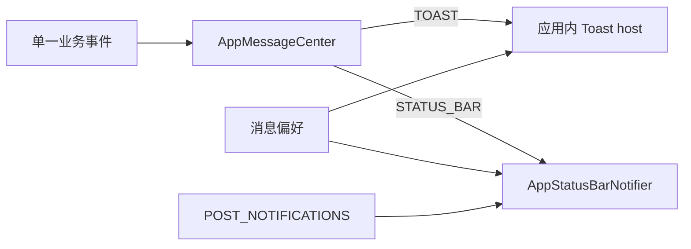

# 权限与消息

## 权限管理

`core.permission` 提供统一目录、状态快照、可请求权限筛选和系统设置入口。目录同时收集运行时权限与只需
Manifest 声明的权限，便于审计应用实际使用范围。

| 权限                           | 类型          | 主要用途               |
|------------------------------|-------------|--------------------|
| Camera                       | 运行时         | 扫描二维码              |
| Notifications                | API 33+ 运行时 | 状态栏消息和前台服务通知       |
| Internet                     | Manifest    | 下载站点图标             |
| ForegroundService / DataSync | Manifest    | 导入后图标同步            |
| Vibrate                      | Manifest    | 交互反馈               |
| Biometric                    | Manifest    | 生物识别认证             |
| QueryInstalledApps           | Manifest    | 自动填充/应用匹配；需持续审查必要性 |

Compose 通过 `PermissionRequester` 发起运行时请求；业务层只使用 `AppPermission` 和状态，不拼写 Android
permission 字符串。

## 设置绑定

“应用消息”开关控制产品偏好。用户开启需要状态栏投递的设置时，UI
再检查并请求通知权限；拒绝后设置与权限状态必须分别展示，不能假装通知已经可用。相机权限在进入扫码流程时按需请求。

## 消息通道

| 类别           | 展现           | 设置        |
|--------------|--------------|-----------|
| 一般错误/认证取消    | Toast        | 始终按统一错误策略 |
| 图标下载         | 状态栏通知/前台服务通知 | 图标下载通知    |
| 剪贴板清除        | Toast        | 剪贴板清除提醒   |
| 应用后台倒计时关闭前提醒 | Toast        | 应用关闭提醒    |

状态栏通知与 Toast 是不同契约。剪贴板清除和应用关闭不得因为开启“应用消息”而转成状态栏通知；前台服务通知还受
Android 系统生命周期约束，不能简单关闭必需通知。

## 发布规则

- 一个事件只在最接近事实发生的位置发布一次。
- ViewModel effect 与 Gateway 状态不得为同一取消事件各发布一次。
- 文本展示策略由消息 host 统一过滤，生产者只选择类别和 presentation。
- 短时间去重是保护网，不是修复双发布的替代方案。
- 消息不得包含密码、恢复码、完整网站凭据或附件路径。
