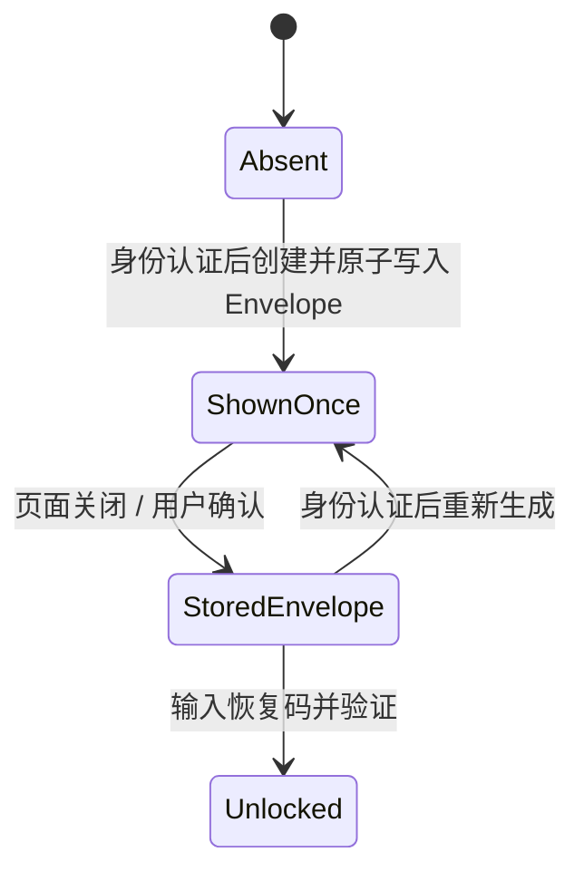

# 认证与恢复码

## 认证方式

| 方式   | 包装密钥来源                                    | 作用              |
|------|-------------------------------------------|-----------------|
| 生物识别 | Android Keystore + BiometricPrompt Cipher | 日常解锁            |
| 应用密码 | Argon2id(password, salt)                  | 独立于系统锁屏的解锁方式    |
| 恢复码  | Argon2id(recovery code, salt)             | 失去常规凭据时恢复 Vault |

认证 UI 负责 Android 生物识别编排；Domain `AuthRepository` 不接收 `BiometricPromptLauncher` 等
Android 类型。

## 恢复码生命周期

- 创建或重新生成前必须完成当前身份认证。
- 明文只展示一次；不存在“查看已有恢复码”。
- 重新生成会替换 Recovery Envelope，使旧码立即失效。
- 恢复码输入仅用于 Vault 解锁，不参与备份加密。
- ViewModel 页面关闭后清除明文状态；输入优先使用 `CharArray`。

认证页底部可以提供低强调度的“使用恢复码”入口，但入口只是导航，不应预先读取或缓存恢复码状态。

## 会话

认证成功后 `DekManager` 缓存 DEK 并派生会话密钥，同时启动空闲计时。认证取消只产生一个 UI
消息事件，不得关闭应用级单例 CoroutineScope，也不得由 Verification 与 Main 两条通道重复显示。

锁定由手动操作、超时、后台策略或安全事件触发。完整状态收口为：停止新敏感操作、关闭数据库、清除会话密钥、清除
DEK、发布 Locked 状态。
