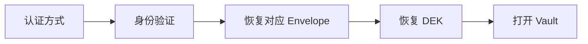
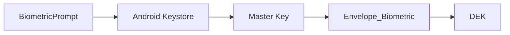
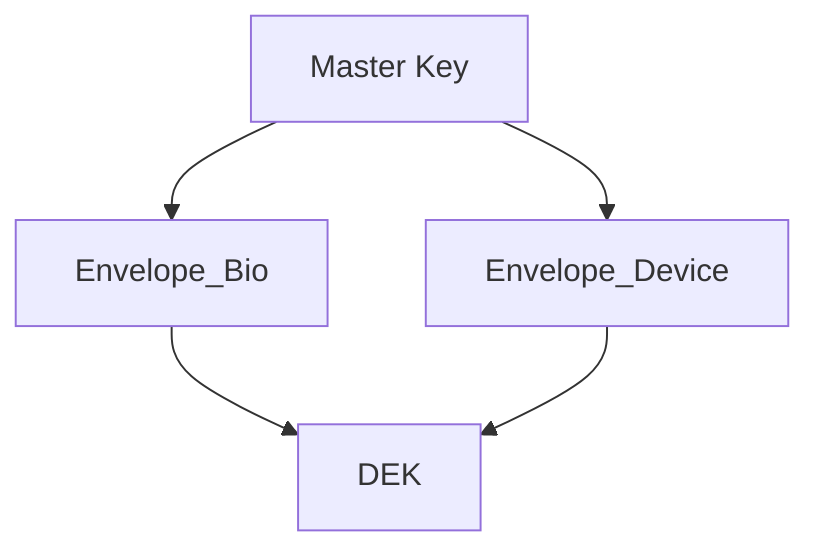

# Passly 认证架构（Authentication Architecture）

> 本文档定义 Passly 的认证体系、认证方式、解锁流程以及认证与数据加密之间的边界。
>
> 所有认证方式均应遵循统一架构，不得直接参与数据库加密，实现**认证（Authentication）**与**
> 加密（Encryption）**的彻底分离。

---

## 1. 设计目标

Passly 的认证系统遵循以下核心准则：

- **认证与加密分离**：认证负责证明用户身份，加密负责保护用户数据，两者职责严格分离。
- **认证方式可自由扩展**：新增或修改认证方式不影响数据库结构。
- **统一密钥目标**：所有认证方式最终用于恢复同一组 **DEK**（数据加密密钥）。
- **数据库体系不变**：数据库始终使用同一套加密体系，不因认证方式变化而改变。

---

## 2. 认证模型

所有认证方式遵循统一的 **Envelope Encryption（信封加密）** 流程。认证方式永远不会直接解密数据库，数据库始终只认识
**DEK_DB** 和 **DEK_FIELD**。

**认证核心模型流程：**

---

## 3. 支持的认证方式

当前系统支持多种认证凭据。新增认证方式时仅新增对应的 **Envelope**，不需要修改数据库。

- **现有支持**：生物认证、设备凭据、应用密码、恢复码。
- **未来扩展**：支持 Passkey、YubiKey 以及企业身份认证（Enterprise SSO）。

---

## 4. 生物认证

### 4.1 密钥链条恢复

生物认证通过以下链条逐层恢复密钥：

### 4.2 认证等级要求

- **强度要求**：认证时优先使用 **BIOMETRIC_STRONG**。
- **支持类型**：包括指纹、人脸（必须符合 Android Strong 准则）及虹膜认证。
- **限制原则**：系统不建议使用 **BIOMETRIC_WEAK**。

---

## 5. 设备凭据

设备凭据包括设备 PIN、Pattern 或 Password。该方式非常适合作为生物认证不可用时的备用方案。

**工作流程：**

---

## 6. 应用密码

应用密码属于 Passly 自身的认证方式。

- **工作流程**：

- **Argon2id 推荐参数**：
    - **Memory**：64 MB
    - **Iterations**：3
    - **Parallelism**：4
- **扩展性约束**：这些参数应支持未来升级，严禁在代码中写死。

---

## 7. 恢复码

恢复码仅作为最后的恢复方式。

- **展示原则**：恢复码在生成时仅显示一次。
- **存储原则**：系统不保存明文，且后续不允许用户再次查看。
- **工作流程**：

---

## 8. 多 Envelope 架构

Passly 支持多个 **Envelope** 同时存在。每个 Envelope 都可以独立创建、更新或删除，不会对其它 Envelope
产生任何影响。

**多路兼容拓扑：**

或者通过应用密码独立恢复：

---

## 9. 修改认证方式

- **无损更新**：修改应用密码时，系统仅重新生成 **Envelope_AppPassword**，不得修改 DEK 或数据库。
- **变更影响**：新增恢复码或删除生物认证时，仅操作对应的 Envelope，整个过程中数据库保持完全不变。

---

## 10. Vault 状态管理

Passly 定义了两种明确的状态边界：

- **Locked（锁定状态）**：SQLCipher 已关闭，DEK 已销毁，SessionKey 已销毁，Repository 严禁读取任何数据。
- **Unlocked（解锁状态）**：SQLCipher 已打开，Repository 可正常读取数据，字段可正常解密，Autofill 可访问数据。

---

## 11. 自动锁定机制

- **触发场景**：用户主动锁定、应用退出、长时间处于后台、系统回收进程、用户注销。
- **安全清理**：在锁定时，系统必须立即销毁 **SessionKey**、销毁 **DEK** 并关闭 **SQLCipher**。

---

## 12. Session 生命周期

在整个生命周期内，**DEK** 仅存在于 **Unlocked** 状态的内存中。

**生命周期演变：**

---

## 13. 与 Autofill 的关系

- **身份验证拦截**：当 Vault 处于锁定状态时，Autofill 返回 **Authentication Action**。
- **流程优化**：在系统完成认证后，流程重新进入 Pipeline，无需再次弹出认证，避免重复交互。

---

## 14. 扩展要求与硬约束

新增任何认证方式时必须满足以下硬性条件：

- **不修改数据库**：认证逻辑与存储结构解耦。
- **不修改 DEK**：加密核心保持稳定。
- **不重新加密数据**：修改认证方式无需重加密整个数据库。
- **仅新增 Envelope**：通过新增信封实现多认证支持。
- **完全兼容**：必须与已有认证方式无缝配合。

---

## 15. 总结

Passly 将认证与数据加密完全解耦。所有认证方式的最终目标均为恢复同一组 **DEK**
，而不是直接参与数据库加密。这种设计保证了系统的可扩展性与安全性，完美满足了 **Zero Knowledge** 与 *
*Envelope Encryption** 的架构要求。