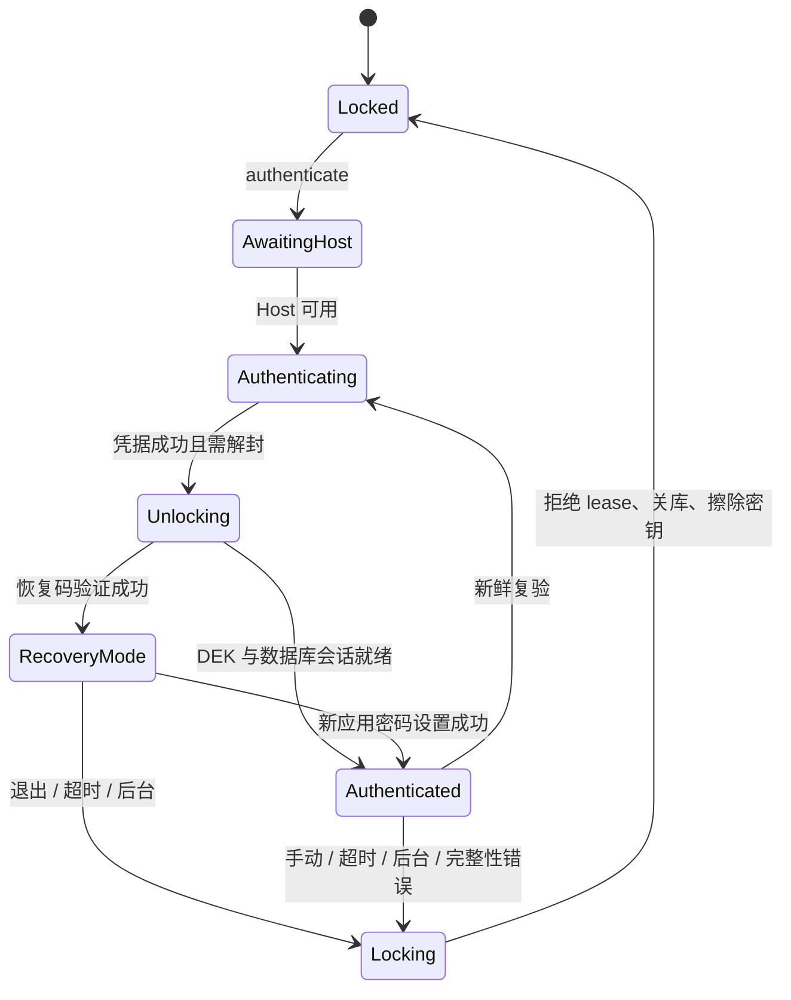
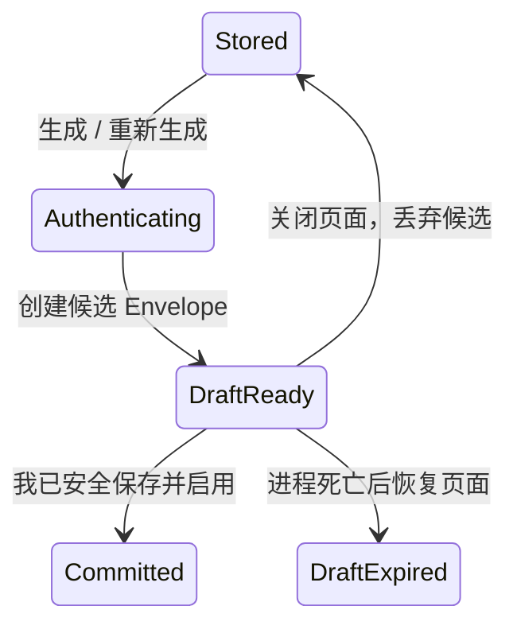

# 统一认证与恢复码

状态：当前实现。

## 契约与状态机

`AuthenticationManager` 是唯一认证编排入口。请求只包含目的、允许方式、新鲜认证要求和 correlation ID；不得携带
Activity、文案、资源 ID、Launcher、Cipher 或 PendingIntent。

同一时间只允许一个活跃请求。普通解锁可以复用有效会话；复验、安全设置、备份和诊断导出必须重新认证。用户主动取消
返回 `Cancelled(byUser = true)` 且不显示错误；其他情况由认证中心返回结构化 `AuthenticationFailure`
。调用方只能
转发失败，不能重新判断认证结果；页面按失败码和发起认证的方式生成本地化反馈。

## Host 与生物识别

Main、Autofill 和 Credential Response Activity 都在根 Compose 安装 `AuthenticationHost`。Registry 只保存 Host
弱引用、owner ID 和注册 token；取得 lease 与实际展示前都会检查 resumed、finishing、destroyed 和 token。无 Host
时最多等待 500 ms，Activity 销毁会取消所属请求，Autofill 请求不会转交 MainActivity。

PromptInfo 与 CryptoObject 分离。Enroll/Rotate 使用新的 ENCRYPT Cipher，Unlock 使用最新 alias 和 Envelope nonce
创建新的 DECRYPT Cipher，VerifyIdentity 不携带 CryptoObject。Cipher 不缓存，也不进入 Bundle、Intent、
SavedStateHandle 或 PendingIntent。`KeyMissing`、`KeyInvalidated`、`CryptoObjectInvalid` 和 `HostUnavailable` 分别映射。

## KDF 与敏感内存

应用密码和恢复码的 Argon2id 只在专用单线程 `KdfRunner` 上执行。取消会立即结束调用方等待，但 Native worker
可能继续；worker 返回后检查 request token，已取消的结果只擦除、不提交。密码副本、派生 key 和未交接 DEK 由拥有者
在同步 `finally` 中尽力覆盖，正常状态与 callback 在 Main.immediate 串行提交。

应用密码和恢复码的连续错误次数由认证中心记录。当前策略是每种凭据方式最多连续错误 5 次；第 5 次起返回
`RATE_LIMITED`，30 秒后允许再次尝试。成功认证会清除该方式的计数。计数只保存在进程内存中，不写入
DataStore、数据库或日志；页面只展示 `AuthenticationFailure` 中的剩余次数或等待时间，不能自行判断密码是否正确。

## 恢复码草稿

- 旧 Recovery Envelope 在用户确认前保持有效；确认提交后旧码才失效。
- 明文由 Activity-retained `RecoveryCodeDraft` 持有，不进入 StateFlow、SavedStateHandle、Bundle 或磁盘。
- SavedStateHandle 只保存 disclosure 标记和 generation ID。进程恢复但草稿不存在时显示
  “恢复码草稿已过期，请重新认证后生成”。
- 恢复码不再产生普通 `Authenticated` 会话。验证成功后进入受限 `RecoveryMode`：数据库可以为恢复任务打开，
  但 `VaultAccessState.isAuthorized` 仍为 false，主 Vault、详情、查看和复制密码都不能挂载。
- 恢复模式只允许设置新的应用密码、重新配置生物识别、`RECOVERY_EXPORT` 和退出锁定。设置新应用密码后才提升为
  普通完整会话。
- `RECOVERY_EXPORT` 只接受恢复码，并且只能输出要求新备份密码的 Passly 加密格式；恢复码不作为备份密码，也不能
  放宽普通 `BACKUP_EXPORT`。
- 不存在“查看已有恢复码”。

## 认证目的边界

| 目的                              | 生物识别 / 应用密码 | 恢复码                             |
|---------------------------------|-------------|---------------------------------|
| `UNLOCK_VAULT`                  | 允许          | 拒绝；恢复码改走 `RECOVER_AUTH_METHODS` |
| `REVEAL_SECRET` / `COPY_SECRET` | 允许          | 拒绝                              |
| `BACKUP_EXPORT`                 | 允许          | 拒绝                              |
| `RECOVERY_EXPORT`               | 拒绝          | 允许，仅恢复模式内的加密导出                  |
| `RECOVER_AUTH_METHODS`          | 拒绝          | 允许                              |
| `RECOVER_DATABASE`              | 允许          | 允许                              |
| `CLEAR_DATABASE`                | 允许          | 拒绝                              |

`AuthenticationRequest.allowedMethods` 只能继续缩小上表，不能扩大。最终交集由认证中心的
`allowedAuthenticationMethods` 计算，页面和 ViewModel 不复制认证方式映射。

## 生物识别策略轮换

Bootstrap 先写 PREPARED journal，再创建 candidate key/Envelope；单次更新切换 active binding 并登记旧 alias
待清理。提交后删除旧 alias 失败只记录并留待 Reconciler 重试，不回滚新 binding。启动和认证成功后都会清理 orphan
candidate 与 obsolete alias。
