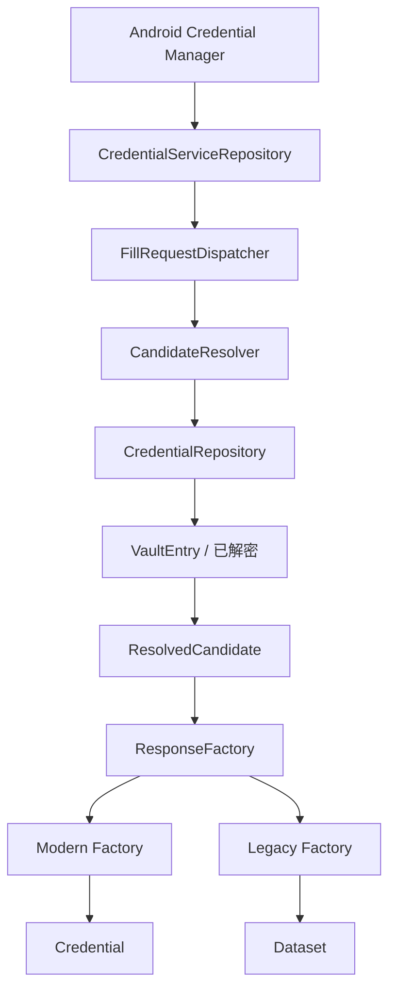

# Passly 自动填充安全架构（Autofill Security）

> 本文档定义 Passly Autofill 模块的数据流、安全边界及各组件职责。Autofill 的核心目标是在满足 Android
> Credential Manager 要求的同时，保证最小权限原则，实现数据库、密钥与 UI 的完全解耦。

---

## **1. 设计目标**

Passly 的自动填充系统遵循以下核心准则：

- **数据访问唯一性**：Repository 是唯一允许执行数据库查询的入口，确保存储访问受控。
- **解密边界闭环**：Repository 是唯一的解密入口，下游组件严禁处理任何原始密文数据。
- **密钥零接触原则**：Autofill Pipeline 及 UI 层严禁接触、传递或存储任何加密密钥（SessionKey）。
- **职责彻底解耦**：UI 层不接触数据库 Entity，Response Factory 不执行任何数据库查询。
- **单向数据流**：数据从 Repository 起始，经过转换层单向流向系统框架，杜绝逆向依赖。
- **最小权限原则**：各组件仅持有其完成当前任务所需的最小数据集。

---

## **2. 总体架构**

Autofill 模块采用层级分明的单向数据流架构：

- **存储接触**：整个 Pipeline 中只有 Repository 能够触碰底层数据库及 SQLCipher。
- **安全保证**：只有 Repository 允许执行 AES 字段解密逻辑。

---

## **3. 组件职责分解**

### **Repository：解密与访问中心**

- **核心职责**：负责查询数据库、执行字段解密，并返回解密后的 Domain Model。
- **数据输出**：返回已解密的 `VaultEntry` 对象，确保 Username、Password、Notes 等已为明文。
- **调用约定**：下游 Pipeline 调用方无需且严禁再次尝试解密。

### **CandidateResolver：数据转换层**

- **职责定位**：负责将复杂的 Domain Model 转换为轻量级的展示模型 `ResolvedCandidate`。
- **逻辑处理**：执行域名匹配、字段映射、计算展示名称（Display Name）及子标题。
- **严禁行为**：严禁在该层查询数据库、获取 SessionKey 或执行底层加解密操作。

### **ResolvedCandidate：安全隔离 DTO**

- **隔离作用**：彻底隔离数据库模型与 Autofill 最终模型，避免敏感元数据（如原始密文）泄露。
- **包含字段**：仅包含展示及填充所需的必要字段，如 `entryId`、`username`、`password`、`totpCode` 等。
- **暴露限制**：严禁暴露 DAO、Entity 或任何数据库实现细节。

### **FillRequestDispatcher：流程协调器**

- **协调职责**：作为管道“指挥中心”，负责 Vault 状态检查、请求分发、协调 Resolver 与 Factory 调用。
- **功能边界**：仅负责流程控制与统一异常处理，不处理具体的解密逻辑。

### **ResponseFactory：响应构建器**

- **对象构建**：将 DTO 转换为系统可识别的 `CredentialEntry` (Modern) 或 `Dataset` (Legacy)。
- **纯粹性**：仅负责对象构建逻辑，严禁依赖 Repository、SQLCipher 或进行生物认证操作。

---

## **4. 安全策略与最佳实践**

- **UI 隔离原则**：BottomSheet 仅展示 `List<ResolvedCandidate>`，点击后仅返回 `entryId`。
- **内存安全**：不保存 `VaultEntry` 至 UI 生命周期中，减少敏感数据在内存中的停留时间。
- **最小化传递**：使用 `updateLastUsed(entryId)` 替代传递完整对象，降低数据暴露风险。
- **解密边界闭环**：全流程仅允许一次解密（Repository 层），严禁 Factory 或 UI 再次调用 `decrypt()`。
- **Vault 状态感知**：Dispatcher 在请求起始检查解锁状态，若处于锁定状态则触发 Authentication Action。
- **错误处理屏蔽**：Dispatcher 负责将内部 `CryptoException` 转换为系统通用异常，不向系统层暴露内部细节。

---

## **5. 最小权限原则对照表**

- **Repository**：拥有【数据库访问】与【敏感字段解密】权限，无【UI 展示】与【凭据构建】权限。
- **CandidateResolver**：无【数据库/解密】权限，仅负责数据逻辑转换。
- **Dispatcher/Factory**：无【数据库/解密】权限，拥有【系统凭据构建】权限。
- **BottomSheet (UI)**：无【数据库/解密/凭据构建】权限，仅拥有基础数据【UI 展示】权限。

---

## **6. 开发硬约束**

- **禁令一**：严禁在 Repository 之外的任何地方调用解密函数或持有 SessionKey。
- **禁令二**：新增功能时不得直接持有 SQLCipher 或调用 FieldEncryptor。
- **禁令三**：所有展示数据必须溯源至 `ResolvedCandidate`，所有原始数据必须溯源至 Repository。

---

## **总结**

Passly Autofill 通过**单向数据流**和**严格的层级隔离**，确保敏感数据解密仅发生在受控的 Repository
边界内，实现了职责清晰、最小权限及高安全性的运行环境。