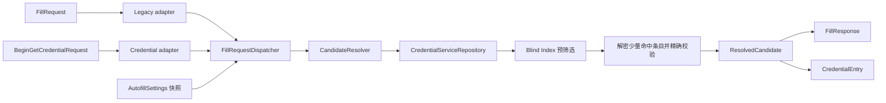

# 自动填充安全

传统 `AutofillService` 与 Android 14+ `CredentialProviderService` 是两个并行系统入口，
不会互相替代。二者共用设置策略、候选查询、身份验证和最小响应模型，但各自保留平台适配器。

## 约束

- Vault 锁定时不得隐式绕过认证；返回受控的认证响应或空结果。
- 候选查询使用包名/域名 Blind Index，不做敏感字段明文扫描。
- 数据库条目 ID 全链路使用字符串 UUID，不允许转成 `Int` 或使用 `0` 作为降级值。
- Credential Manager 二阶段必须按用户点选的 entry ID 查询，并再次校验发起包名/域名。
- 新凭据保存必须走 `EntryCommandRepository` 的正式事务，同时写入盲索引、修订与活动记录。
- `ResolvedCandidate` 只包含本次填充所需字段，并尽快释放。
- Service、Resolver 和 ResponseFactory 不依赖 Room Entity/DAO。
- 日志只记录请求阶段和匿名错误，不记录数据集值、域名凭据或密码。
- 未完成 RP 校验和签名之前，不注册 Passkey capability，也不返回模拟 Passkey。

## 设置策略

`InteractionSettings.autofill` 是两条入口的唯一设置来源。Dispatcher 在每次请求开始时读取一次
快照，统一应用总开关、Credential Manager 开关、候选上限、OTP、保存提示和未匹配候选策略。
“显示未关联条目”默认关闭；开启后可能在系统候选界面暴露最近条目的标题。

`requireAuthentication` 控制已解锁状态下选择凭据后的再次认证。Vault 已锁定时该选项不能绕过解锁。

