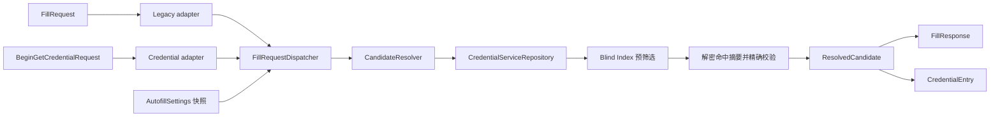

# 自动填充安全

状态：当前实现。

传统 `AutofillService` 与 Android 14+ `CredentialProviderService` 是两个并行系统入口，
不会互相替代。二者共用设置策略、候选查询、身份验证和最小响应模型，但各自保留平台适配器。

## 威胁边界

自动填充跨越目标应用、Android 系统、Passly Service、认证 Activity 和 Vault。系统提供的
`AssistStructure`、`AutofillId` 与调用包信息只描述当前填充上下文；Intent 中由 Passly 写入的 entry ID、
包名和域名也只是查询线索，不能单独作为授权依据。Credential Manager 的调用方身份必须来自系统注入的
`ProviderGetCredentialRequest` 或 `ProviderCreateCredentialRequest`，不得由 Passly 自己写入
PendingIntent。

在任何返回凭据的路径上都必须满足：

1. 当前设置允许该入口和该类候选。
2. Vault 已解锁；需要复验时取得 `AuthenticationPurpose.AUTOFILL` 的成功结果。
3. 候选仍与当前包名或规范化域名匹配。
4. 返回值只包含当前表单存在的字段，不携带无关秘密。

认证 Activity 在 `onCreate` 时先设置 `RESULT_CANCELED`。只有完整构建平台结果后才覆盖为
`RESULT_OK`，因此取消、Host 丢失、候选消失或构建失败都不会留下部分填充结果。

## 一次验证的作用域

“一次验证”表示**当前一次 Autofill 交互流程**中的一次新鲜身份验证，不是时间窗口，也不是可跨请求复用的令牌。

- `AuthenticationPurpose.AUTOFILL` 受认证中心的新鲜认证策略控制。即使主界面 Vault 已解锁，
  `requireAuthentication = true` 时仍需重新验证。
- `authenticatedForCurrentRequest` 只存在于当前 `AutofillFillViewModel` 实例中，用来避免“先解锁
  Vault，
  随即选择同一流程候选”时连续弹出两次认证。
- 该标记不得进入 `Intent`、`Bundle`、`SavedStateHandle`、磁盘、静态字段或单例；Activity 结束即失效。
- 成功结果只允许构建当前请求的 `FillResponse` 或 `Dataset`，不能授予下一次自动填充、详情查看、备份等操作。
- 用户取消返回 `RESULT_CANCELED`，不得因为 Vault 此前已解锁而降级为无认证填充。
- 新的 `FillRequest`、新的认证 Activity 或新的 Credential Manager 完成阶段必须重新执行各自的策略判断。

这一区分避免了两种相反问题：同一流程重复认证造成糟糕体验，以及把一次成功认证扩张成进程级通行证。

## Legacy Autofill 认证契约

Android 有响应级和数据集级两种认证。结果类型决定系统是刷新候选 UI，还是立即填充：

| 发起方式                                       | 使用场景                 | `EXTRA_AUTHENTICATION_RESULT` | 系统行为           |
|--------------------------------------------|----------------------|-------------------------------|----------------|
| `FillResponse.Builder.setAuthentication()` | Vault 锁定、认证后重新生成候选列表 | 完整 `FillResponse`             | 替换当前响应并刷新候选 UI |
| `Dataset.Builder.setAuthentication()`      | 已显示候选，选择某条后复验        | 完整 `Dataset`                  | 立即填充所选字段       |

不能在数据集级认证完成后无条件返回 `FillResponse`。虽然系统允许用它替换整个响应，但这只会刷新 UI，
用户通常还要再次选择；Passly 对数据集级入口返回 `Dataset`，对响应级入口返回 `FillResponse`。

`AutofillFillActivity` 必须使用 `RESULT_OK`，并把上述对象放入
`AutofillManager.EXTRA_AUTHENTICATION_RESULT`。返回对象必须已经包含最终 `AutofillValue`，不能再放认证占位值。
详见 Android 官方
[
`AutofillManager.EXTRA_AUTHENTICATION_RESULT`](https://developer.android.com/reference/android/view/autofill/AutofillManager#EXTRA_AUTHENTICATION_RESULT)、
[
`Dataset.Builder.setAuthentication`](https://developer.android.com/reference/android/service/autofill/Dataset.Builder#setAuthentication(android.content.IntentSender))
和
[
`FillResponse.Builder.setAuthentication`](https://developer.android.com/reference/android/service/autofill/FillResponse.Builder#setAuthentication(android.view.autofill.AutofillId%5B%5D,android.content.IntentSender,android.service.autofill.Presentations))。

### 临时 Dataset

认证后的 `Dataset` 含有明文用户名、密码或 OTP。Android 12（API 31）起，Passly 同时设置
`EXTRA_AUTHENTICATION_RESULT_EPHEMERAL_DATASET = true`：

- Dataset 只用于本次立即填充；
- 不替换系统缓存中原来的锁定 Dataset；
- 用户清空字段后，系统不会直接重新展示已解锁 Dataset；
- 下一次选择仍能重新走 `requireAuthentication`。

这个标志减少系统缓存中的明文驻留和认证绕过面，但不代表数据没有经过 Binder 或系统 Autofill 进程。
因此仍需遵守最小字段和最短生命周期原则。旧系统不支持该标志，只能依赖平台既有认证缓存行为。
详见
[
`EXTRA_AUTHENTICATION_RESULT_EPHEMERAL_DATASET`](https://developer.android.com/reference/android/view/autofill/AutofillManager#EXTRA_AUTHENTICATION_RESULT_EPHEMERAL_DATASET)。

### PendingIntent 与系统注入参数

Autofill 认证 PendingIntent 必须：

- 指向应用内显式、`exported = false` 的认证 Activity；
- 使用 `FLAG_UPDATE_CURRENT`，并在 Android 12+ 使用 `FLAG_MUTABLE`；
- 不使用 `FLAG_IMMUTABLE`，因为系统需要向认证 Intent 注入参数；
- 使用仅用于定位候选的最小自定义 extras，不传密码、DEK、Cipher 或会话许可。

系统可能注入：

- `EXTRA_ASSIST_STRUCTURE`：当前页面结构；
- `EXTRA_CLIENT_STATE`：原 `FillResponse` 的 client state；
- `EXTRA_INLINE_SUGGESTIONS_REQUEST`：当前 IME 的 inline suggestion 请求。

PendingIntent 可变是平台协议要求，不意味着其 extras 可信。认证 Activity 必须重新通过 Resolver 校验
entry ID、
包名和域名，且不得记录或持久化系统注入的页面结构。官方文档明确要求认证 PendingIntent 不得 immutable，参见
[
`Dataset.Builder`](https://developer.android.com/reference/android/service/autofill/Dataset.Builder)
和
[
`FillResponse.Builder`](https://developer.android.com/reference/android/service/autofill/FillResponse.Builder)。

## 数据与展示最小化

- Vault 锁定时不得隐式绕过认证；返回受控的认证响应或空结果。
- 响应级认证返回 `FillResponse`，数据集级认证返回可立即填充的临时 `Dataset`；两者不得混用。
- 认证 PendingIntent 必须显式可变，允许系统注入 AssistStructure、client state 等认证参数。
- 候选查询使用包名/域名 Blind Index，不做敏感字段明文扫描。
- 需要认证或使用 Passly 候选底部表时，候选阶段只解密 summary，不查询 `entry_secrets`；认证并点选后才按
  entry ID 解密单条凭据。
- 数据库条目 ID 全链路使用字符串 UUID，不允许转成 `Int` 或使用 `0` 作为降级值。
- Credential Manager 二阶段必须按用户点选的 entry ID 查询，并再次校验发起包名/域名。
- 新凭据保存必须走 `EntryCommandRepository` 的正式事务，同时写入盲索引、修订与活动记录。
- `ResolvedCandidate` 只包含本次填充所需字段，并尽快释放。
- Service、Resolver 和 ResponseFactory 不依赖 Room Entity/DAO。
- 日志只记录请求阶段和匿名错误，不记录数据集值、域名凭据或密码。
- 未完成 RP 校验和签名之前，不注册 Passkey capability，也不返回模拟 Passkey。

## 设置策略

`InteractionSettings.autofill` 是两条入口的唯一设置来源。Dispatcher 在每次请求开始时读取一次
快照，统一应用总开关、Credential Manager 开关、候选上限、OTP、保存提示和未匹配候选策略。
“显示未关联条目”默认关闭；开启后可能在系统候选界面暴露最近条目的标题。
候选底部表还会展示用户名以及关联域名/包名，因此这是元数据隐私开关；它不会提前解密多条密码。

`requireAuthentication` 控制已解锁状态下选择凭据后的再次认证。Vault 已锁定时该选项不能绕过解锁。

`FillRequestDispatcher` 在初始请求开始时读取一次快照。需要经过认证 Activity 的第二阶段会在构建最终结果前
再读取一次最新快照；每个阶段内部始终使用同一份快照。这样既不会在单个响应构建中混用策略，也能让用户在候选选择前
刚修改的安全设置及时生效。

## Credential Manager 边界

Android 14+ Credential Manager 不使用 `AutofillManager.EXTRA_AUTHENTICATION_RESULT`。查询阶段只返回候选元数据和
PendingIntent；用户点选后，完成阶段通过 `PendingIntentHandler` 返回 Credential Manager 自己的响应类型。
完整的源码契约、两阶段流程、代码边界与实现进度见
[Credential Manager Provider 实现](../features/credential-manager.md)。

Passly 按项目锁定的 `androidx.credentials:credentials:1.6.0` 源码实现两阶段协议。完成阶段必须从
`ProviderGetCredentialRequest` 或 `ProviderCreateCredentialRequest` 获取系统确认的调用方，按 entry ID
重新查询，
并再次检查设置、作用域、`allowedUserIds` 与认证结果。查询 Intent 不得携带密码或自声明调用包。

有效 Credential 响应和有效 Credential 异常都必须以 `RESULT_OK` 返回；`RESULT_CANCELED` 只用于连标准异常都无法
构造的情况。浏览器 delegated origin 在没有受信签名 allowlist 前保持关闭。Passkey 在实际私钥、WebAuthn
attestation/assertion、RP/origin 校验和真机验证完成前不注册 capability，也不返回模拟条目。

Legacy `FillResponse`、`Dataset`、`AutofillId` 和 Credential Manager 响应不得跨适配器复用。

## 生命周期与故障诊断

认证 Activity 返回后出现以下日志通常是正常行为：

- `TopResumedActivityChangeItem{onTop=false}`；
- `PauseActivityItem{finished=true}`；
- `ActivityResultItem{result=-1, data=Intent { (has extras) }}`；
- `DestroyActivityItem{finished=true}`；
- `FINISH INPUT`。

它们表示临时认证 Activity 已把结果交回目标 Activity 并销毁，不能单独证明填充失败。排查顺序如下：

| 现象                    | 优先检查                                                         |
|-----------------------|--------------------------------------------------------------|
| `RESULT_OK` 后没有立即填充   | 数据集级入口是否错误返回了 `FillResponse`；Dataset 是否含有效 `AutofillId` 和非空值 |
| 认证后只刷新候选、需要再点一次       | 是否把数据集级结果包装成了 `FillResponse`                                 |
| 认证 Activity 能打开但上下文缺失 | PendingIntent 是否错误使用 `FLAG_IMMUTABLE`                        |
| 下一次选择不再要求认证           | Android 12+ 是否设置 ephemeral Dataset；是否把请求级认证标记放进了长生命周期状态      |
| 返回 `RESULT_CANCELED`  | 用户取消、认证失败、Host 丢失、候选为空或目标字段不可填充                              |
| 某些应用可填、某些应用不可填        | 检查解析得到的 `AutofillId`、字段角色、包名/域名匹配，而不是认证 Activity 生命周期        |

诊断日志只能记录阶段、返回载荷类型、字段数量和匿名失败码；禁止记录用户名、密码、OTP、完整域名、AssistStructure
内容或序列化后的 Intent extras。

## 官方文档重点

- [Autofill framework](https://developer.android.com/identity/autofill)：AutofillService
  与目标应用之间由系统框架协调。
- [Build autofill services](https://developer.android.com/identity/autofill/autofill-services)
  ：服务声明、响应和认证流程示例。
- [Dataset](https://developer.android.com/reference/android/service/autofill/Dataset)：Dataset
  是一组可共同填充的字段，也可以在选择后认证。
- [Dataset.Builder](https://developer.android.com/reference/android/service/autofill/Dataset.Builder)
  ：敏感值应保持锁定到认证完成，认证 PendingIntent 不能 immutable。
- [FillResponse.Builder](https://developer.android.com/reference/android/service/autofill/FillResponse.Builder)
  ：响应级认证用于解锁整个候选响应。
- [AutofillManager](https://developer.android.com/reference/android/view/autofill/AutofillManager)
  ：认证结果、AssistStructure、client state、inline request 和临时 Dataset extras 的权威定义。
- [Integrate Credential Manager with a credential provider](https://developer.android.com/identity/sign-in/credential-provider)
  ：Provider 注册、两阶段 get/create、可变 PendingIntent、Passkey 和 clear-state 的官方流程。
- [CredentialProviderService](https://developer.android.com/reference/androidx/credentials/provider/CredentialProviderService)
  ：查询阶段与完成阶段的职责及系统最终请求注入契约。
- [PendingIntentHandler](https://developer.android.com/reference/androidx/credentials/provider/PendingIntentHandler)
  ：最终请求提取、响应/异常写入以及 Activity result code 规则。
- [CallingAppInfo](https://developer.android.com/reference/androidx/credentials/provider/CallingAppInfo)
  ：系统调用包、签名信息、特权 origin 和 allowlist 校验。
- [Web Authentication Level 3](https://www.w3.org/TR/webauthn-3/)
  ：creation options、request options、authenticator data、attestation 与 assertion 的规范。

## 相关实现

- [统一认证与新鲜认证策略](authentication.md)
- [AutofillFillActivity](../../app/src/main/java/com/aozijx/passly/feature/autofill/framework/AutofillFillActivity.kt)
- [AutofillFillViewModel](../../app/src/main/java/com/aozijx/passly/feature/autofill/framework/AutofillFillViewModel.kt)
- [LegacyResponseFactory](../../app/src/main/java/com/aozijx/passly/service/autofill/framework/builder/LegacyResponseFactory.kt)
- [LegacyDatasetFactory](../../app/src/main/java/com/aozijx/passly/service/autofill/framework/builder/LegacyDatasetFactory.kt)
- [ModernCredentialService](../../app/src/main/java/com/aozijx/passly/service/autofill/credential/ModernCredentialService.kt)
- [CredentialBeginGetHandler](../../app/src/main/java/com/aozijx/passly/service/autofill/credential/CredentialBeginGetHandler.kt)
- [CredentialBeginCreateHandler](../../app/src/main/java/com/aozijx/passly/service/autofill/credential/CredentialBeginCreateHandler.kt)
- [CredentialResponseViewModel](../../app/src/main/java/com/aozijx/passly/feature/autofill/credential/CredentialResponseViewModel.kt)
- [CredentialResponseUseCases](../../app/src/main/java/com/aozijx/passly/domain/autofill/usecase/CredentialResponseUseCases.kt)
- [Credential Manager Provider 实现](../features/credential-manager.md)
