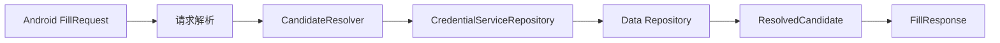

# 自动填充安全

Autofill Service 是 Android 系统入口，不是数据层。它通过 Domain 的 `CredentialServiceRepository`
查询候选，并把结果转换为最小化的 `ResolvedCandidate`，避免系统响应构建器接触完整 Vault 领域对象。

## 约束

- Vault 锁定时不得隐式绕过认证；返回受控的认证响应或空结果。
- 候选查询使用包名/域名 Blind Index，不做敏感字段明文扫描。
- `ResolvedCandidate` 只包含本次填充所需字段，并尽快释放。
- Service、Resolver 和 ResponseFactory 不依赖 Room Entity/DAO。
- 日志只记录请求阶段和匿名错误，不记录数据集值、域名凭据或密码。

