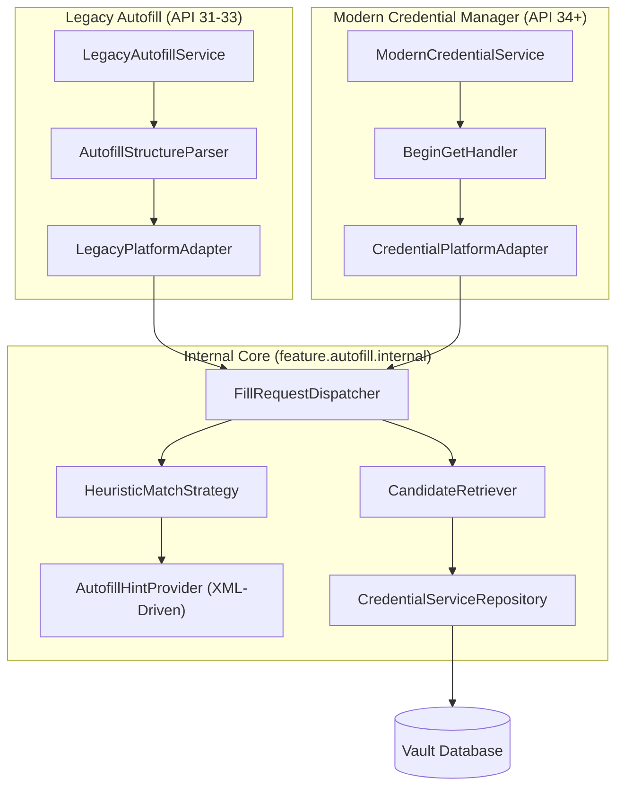

# 自动填充安全与架构

状态：当前实现。

Passly 采用双框架并行的自动填充系统：针对 API 31-33 的 **Legacy Autofill** 和针对 API 34+ 的 **Modern Credential Manager**。
系统通过分层架构将平台差异屏蔽在适配层，核心业务逻辑（检索、匹配、策略）在 `feature.autofill.internal` 中实现共享。

## 架构概览

### 核心层 (Internal Core)
- **`FillRequestDispatcher`**：核心调度员，负责编排锁定检查、候选检索、字段匹配和响应组装。
- **`HeuristicMatchStrategy`**：启发式匹配器。通过多层过滤（Hint -> InputType -> ID -> 文本正则）识别字段角色。
- **`AutofillHintProvider`**：配置源。从 `autofill_hints.xml` 加载匹配规则，支持多语言扩展且无需修改代码。

### 适配层 (Platform Adapters)
- **Legacy**：负责解析 `AssistStructure` 视图树，并构建 `RemoteViews` 渲染的下拉/内联候选。
- **Modern**：深度集成系统底部选择器，通过安全通道传递 `PasswordCredentialEntry`。

---

## 匹配逻辑优化：猜测与规避

为了解决“非标准页面填不上”和“错填”问题，Passly 实施了以下增强策略：

### 1. 强化“猜密码”与弱目标放行
当页面未提供标准 `autofillHints` 时，`HeuristicMatchStrategy` 会通过以下方式“盲猜”：
- **文本术语识别**：扫描 Hint 和 ContentDescription 是否包含“密码”、“口令”、“passwd”等关键字。
- **弱目标合成**：如果页面识别到了密码术语，即便账号框无法明确识别，也会在用户点击输入框时，自动将当前**聚焦的可编辑字段**识别为账号/密码，确保填充入口弹出。

### 2. 确认框智能规避
在注册和改密页面，系统会自动识别“确认密码”、“再次输入”等字段（通过 `autofill_confirmation_keywords`）。
- **策略**：确认类字段会被赋予高优先级排除，防止主密码被填入确认框而导致填充失败或表单提交错误。

### 3. 保存提示的启发式兜底
在 `LegacyAutofillService.onSaveRequest` 中，如果角色匹配器未能 100% 确定字段：
- **盲猜保存**：系统会扫描页面上所有包含有效内容的编辑框。
- **优先级推断**：通常将最后一个符合密码特征（掩码、密码类型或 ID 命中）的字段作为密码，将其之前的字段作为账号。这极大提升了在复杂 WebView 页面上的账号捕获成功率。

---

## 安全防御：防范时序攻击

自动填充系统涉及大量敏感字符串（域名、包名、Hash）的匹配。Passly 实施了**恒定时间比较（Constant-time comparison）**来防范时序攻击（Timing Attacks）：

- **哈希校验**：在 Blind Index 检索后的二次校验阶段，使用 `ConstantTime.isEqual`（封装了 `MessageDigest.isEqual`）对比摘要。这确保了比较耗时与匹配程度无关，攻击者无法通过观察响应时间推断内部数据的部分内容。
- **持久化结果复核**：Blind Index 预筛选后的包名与域名复核使用恒定时间比较；选中条目的内存作用域检查使用统一规范化规则。
- **DEK 验证**：Vault 解锁时的 DEK 完整性检查（Verification Tag）也采用了相同的防时序攻击逻辑。

---

## 威胁边界

自动填充跨越目标应用、Android 系统、Passly Service、认证 Activity 和 Vault。系统提供的
`AssistStructure`、`AutofillId` 与调用包信息只描述当前填充上下文；Intent 中由 Passly 写入的 entry ID、
包名和域名也只是查询线索，不能单独作为授权依据。Credential Manager 的调用方身份必须来自系统注入的
`ProviderGetCredentialRequest` 或 `ProviderCreateCredentialRequest`，不得由 Passly 自己写入
PendingIntent。

在任何返回凭据的路径上都必须满足：

1. 当前设置允许该入口和该类候选。
2. Vault 已解锁；需要复验时取得 `AuthenticationPurpose.AUTOFILL` 的成功结果。
3. 候选仍与当前包名或规范化域名匹配。
4. 返回值只包含当前表单存在的字段，不携带无关秘密。

---

## 一次验证的作用域

“一次验证”表示**当前一次 Autofill 交互流程**中的一次新鲜身份验证，不是时间窗口，也不是可跨请求复用的令牌。

- `AuthenticationPurpose.AUTOFILL` 受认证中心的新鲜认证策略控制。即使主界面 Vault 已解锁，
  `requireAuthentication = true` 时仍需重新验证。
- **短期会话授权（`AutofillSessionGrantStore`）**：为了避免“解锁 Vault -> 选择同一流程候选”连续弹出两次认证，系统在认证成功后对当前包名/域名授予 30 秒 TTL 的单槽授权。
- **会话回收时机**：`AutofillRequestSession` 只在**最终步骤**（取消，或交付可立即填充的响应）关闭并 SEAL vault。同时包含 60 秒**非活动自动锁定**机制。

---

## 数据与展示最小化

- **包名/域名 Blind Index**：查询候选时不做明文扫描。
- **按需加载秘密**：候选列表阶段只解密摘要（标题、用户名），不查询密码密文；只有在认证通过并用户点选后，才解密单条凭据。
- **临时 Dataset (API 31+)**：设置 `EXTRA_AUTHENTICATION_RESULT_EPHEMERAL_DATASET = true`，确保凭据不在系统缓存中长期驻留，且清空字段后不会自动重新展示。

---

## 官方文档参考

- [Autofill framework](https://developer.android.com/identity/autofill)
- [Integrate Credential Manager with a credential provider](https://developer.android.com/identity/sign-in/credential-provider)
- [AutofillManager](https://developer.android.com/reference/android/view/autofill/AutofillManager)

---

## 相关实现

- [AutofillHintProvider](../../domain/src/main/kotlin/com/aozijx/passly/domain/autofill/port/AutofillHintProvider.kt)
- [HeuristicMatchStrategy](../../app/src/main/java/com/aozijx/passly/feature/autofill/internal/HeuristicMatchStrategy.kt)
- [LegacyAutofillService](../../app/src/main/java/com/aozijx/passly/feature/autofill/legacy/service/LegacyAutofillService.kt)
- [ModernCredentialService](../../app/src/main/java/com/aozijx/passly/feature/autofill/credential/service/ModernCredentialService.kt)
- [AutofillCandidateBottomSheet](../../app/src/main/java/com/aozijx/passly/presentation/feature/autofill/AutofillCandidateBottomSheet.kt)
- [autofill_hints.xml](../../app/src/main/res/values/autofill_hints.xml)
- [ConstantTime](../../core/crypto/src/main/kotlin/com/aozijx/passly/core/crypto/ConstantTime.kt)
