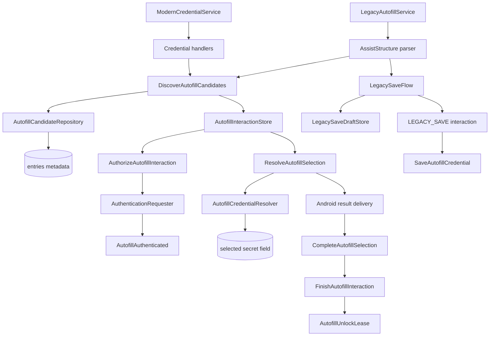

# 自动填充安全与架构

状态：当前实现。

代码核对日期：2026-10-14。

Passly 同时支持传统 Autofill Service 与 Android 14+ Credential Manager。两套 Android 入口只负责解析系统请求和构造各自的平台响应；候选发现、交互授权、单条秘密解析、类型化保存和结束由共享操作负责。传统 Autofill 的 `SaveCallback`、Legacy `Dataset`/`FillResponse` 与 Credential Manager response 是三套独立 Android 合同，不合并、不互相转换。

## 当前架构

```mermaid
flowchart TD
    Legacy[LegacyAutofillService] --> Parse[AssistStructure parser]
    Credential[ModernCredentialService] --> CredentialAdapter[Credential handlers]
    Parse --> Discover[DiscoverAutofillCandidates]
    Parse --> LegacySave[LegacySaveFlow]
    CredentialAdapter --> Discover
    Discover --> CandidateRepository[AutofillCandidateRepository]
    CandidateRepository --> Metadata[(entries metadata)]
    Discover --> Store[AutofillInteractionStore]
    Store --> Authorize[AuthorizeAutofillInteraction]
    Authorize --> Auth[AuthenticationRequester]
    Auth --> Temporary[AutofillAuthenticated]
    Store --> Resolve[ResolveAutofillSelection]
    Resolve --> Resolver[AutofillCredentialResolver]
    Resolver --> Secret[(selected secret field)]
    Resolve --> Platform[Android result delivery]
    Platform --> Complete[CompleteAutofillSelection]
    Complete --> Finish[FinishAutofillInteraction]
    Finish --> Lease[AutofillUnlockLease]
    LegacySave --> SaveDraft[LegacySaveDraftStore]
    LegacySave --> SaveAuth[LEGACY_SAVE interaction]
    SaveAuth --> SaveCredential[SaveAutofillCredential]
```

共享操作的职责如下：

- `DiscoverAutofillCandidates`：读取当前设置、识别字段、建立或恢复 interaction，并只查询候选元数据。
- `AuthorizeAutofillInteraction`：以 `AuthenticationPurpose.AUTOFILL` 完成一次交互授权；并发授权会合并为同一次认证。
- `ResolveAutofillSelection`：验证 interaction、规范化作用域和“确实展示过”的 entry ID 后，才读取该条目的密码；只有请求包含 OTP 字段时，才沿 `OTP_FOR` 关系读取关联 OTP 条目的配置与独立加密 secret 并生成验证码。
- `AutofillResultDelivery`：只接收平台无关的成功收据；Legacy Activity 与 Credential Manager Activity 各自发布自己的结果，再启动不可取消的成功收尾。两套 Android 结果协议不合并、不互相转换。
- `CompleteAutofillSelection`：结果发布后以 interaction 终态转换作为幂等门；首次转换仍持有 lease 完成使用记录，并在 `finally` 中释放临时会话，重复回调不再重复产生副作用。
- `SaveAutofillCredential`：接收已经由所属平台流程校验的类型化草稿，并使用正式 Entry 写事务；它本身不读取 Legacy 或 Credential Manager 开关。
- `FinishAutofillInteraction`：统一完成、取消或过期 interaction，并释放 Autofill 持有的临时解锁。

`HeuristicMatchStrategy` 仅供传统 Autofill 解析非标准表单；Credential Manager 使用严格字段策略。平台适配器不得直接依赖 Entry repository 或认证端口，这一依赖方向由 `SourceBoundaryPolicy` 验证。

## 信任边界

Autofill 跨越目标应用、Android 系统、Passly Service、认证 Activity 和 Vault：

- Credential Manager 的调用方身份只能来自系统注入的 `ProviderGetCredentialRequest`、`ProviderCreateCredentialRequest` 或原始 `BeginGetCredentialRequest`。
- PendingIntent 自定义 extras 只携带 Passly 生成的 `interactionId`、不透明 `entryId`，或 Legacy 保存的一次性随机 token，不能携带或重建调用方授权。
- 传统 Autofill 的包名、域名和字段来自当前 `AssistStructure`；返回 Dataset 前仍需通过 interaction 中记录的规范化作用域。
- 进程死亡会丢失 process-local interaction。旧选择因此被拒绝并由 Android 重新发起查询；Passly 不从 extras 恢复授权。

## Legacy 保存合同

传统 Autofill 的总开关与“保存新登录”开关分别生效；Credential Manager 开关不会关闭 Legacy 保存，Legacy 保存开关也不会关闭 Credential Manager 创建。只有总开关和 Legacy 保存开关同时开启时才广告保存：

- `LegacyResponseFactory` 只从已分类角色生成 `SaveInfo`。所有识别出的密码 ID 是 required IDs，用户名 ID 是 optional IDs；没有密码字段时不广告保存，也不会退回使用未分类的 `parsed.allIds`。
- `SaveInfo` 声明密码数据类型，有用户名时再声明用户名数据类型，并设置 `FLAG_SAVE_ON_ALL_VIEWS_INVISIBLE`。即使候选列表为空，也可以返回只含 `SaveInfo` 的 `FillResponse`。
- Android 调用 `onSaveRequest()` 后，服务从 `request.fillContexts` 的最新一个上下文重新解析当前字段并重新运行 Legacy 分类。它不查找、不保留、也不重新打开先前已结束的填充 interaction。
- 非空包名和至少一个已分类的非空密码是保存草稿的最低条件；用户名可省略，`pageTitle` 固定为 `null`。

已有完整 `Authenticated` 会话时，验证后的草稿立即写入。否则，`LegacySaveDraftStore` 在进程内暂存草稿并返回随机 token，服务以 `SaveCallback.onSuccess(IntentSender)` 启动内部 `LegacySaveActivity`。该 Activity 消费 token 后建立独立的 `LEGACY_SAVE` interaction，至多认证一次，完成写入并只清理自己的 interaction。

草稿 store 最多保存 8 条，固定 60 秒过期，消费是原子且单次的；暂存、显式移除和新增条目都会清理相应状态。Intent 只包含随机 token，用户名、密码、包名和域名不进入 Intent、日志、磁盘或 `SavedStateHandle`。同进程配置变更期间，已消费草稿只由 Activity-retained ViewModel 持有；进程死亡后无法恢复，并且不会把凭据误报为已保存。

返回秘密前必须同时满足：

1. 当前入口与设置仍然启用；
2. interaction 已授权且未结束；
3. 最终系统请求的包名/域名与 interaction 作用域一致；
4. entry ID 属于本次实际展示的候选集合；
5. Credential Manager 的 `allowedUserIds` 在展示与最终选择阶段均通过；
6. 解析结果包含可填充的非空密码。

## 一次认证与临时解锁

授权绑定 `AutofillInteractionId`，不是按包名授予的时间窗口。多个已经分别授权的 interaction 可以共享同一个
`AutofillAuthenticated` 数据库 lease，但不能共享候选集合、作用域或选择权限。

- Vault 锁定或设置要求填充前验证时，interaction 进入 `RequiresUnlock`；系统认证进行中显式进入 `Authenticating`。
- 成功认证后，同一个 interaction 进入 `Authorized`；解锁后重新发现和最终选择不会再次认证。
- “每次填充前验证”默认开启；关闭时可复用完整 App 会话，开启时即使 App 已解锁也会执行一次 Autofill 专用验证。Vault 已锁定时不受此开关影响，始终必须认证。
- Autofill 解锁发布 `AutofillAuthenticated`，主应用仍停留在认证页；只有 `UNLOCK_VAULT` 成功才提升为完整
  `Authenticated`。如果提升已完成，迟到的 `AUTOFILL_REQUEST_FINISHED` 不得锁定主应用。
- `AutofillUnlockLease` 记录所有借用临时解锁的活跃 interaction。临时状态只有成功借到 lease 才能直接授权；回收中的
  orphan 状态会回到 `RequiresUnlock`，不会产生已授权但数据库已关闭的请求。
- 成功构造 Dataset 或 Credential 后，Activity 先通过 `setResult(RESULT_OK, ...)` 发布结果，再完成 interaction；Legacy 保存提示不再延长临时解锁。下一次填充建立新的 interaction 并按当时状态重新认证。
- Legacy 保存 continuation 与填充 interaction 分属 `LEGACY_SAVE` 和 `LEGACY`，各自取消、完成和过期。保存借用或取得的临时解锁在终态释放；用户原本持有的完整会话不会被关闭。
- 每个 interaction 创建时安排 60 秒 process-local 超时。Android 选择器被放弃、Activity 未返回或调用方未清理状态时，超时会把 interaction 标记为 `Expired` 并释放临时解锁；正在认证或解析秘密时会延后一轮，避免回收活跃操作。
- 应用原本已经解锁时，Autofill 结束不会额外锁定用户会话。

## 数据最小化

- 候选阶段只使用 `AutofillCandidateSummary`，其中只有 `EntryListItem` 元数据和匹配原因，不允许出现 `Entry` 聚合、`EntrySecret` 或 credential secret 类型。
- `AutofillCredentialResolver` 只在最终选择后读取单个条目的密码字段。
- Autofill 数据端口使用独立的临时会话权限；普通 Entry 查询、编辑、备份和设置仍只接受完整会话。Credential Manager 密码创建通过 `AutofillEntryWriter` 的窄写入口执行，不能借临时会话调用任意 Vault 写命令。
- 密码不会进入候选列表、PendingIntent extras、SavedStateHandle 或 interaction snapshot。
- Legacy 待保存密码只存在于有界的一次性内存 store，以及消费后的 ViewModel 内存 continuation；不会进入可保存 UI state。
- 传统 Autofill 的认证结果使用临时 Dataset 标志，减少系统长期缓存。

## 取消与清理

- 成功、失败、用户取消和协程取消都必须进入统一终态；成功路径必须先发布平台结果，再在不可取消的收尾区释放 lease。
- Credential Manager 的 `onClearCredentialStateRequest()` 会过期所有该来源的活跃 interaction，但不会删除密码或锁定原本由用户打开的 Vault。
- 对已经完成的 interaction 重复结束是幂等操作。
- Legacy 保存 token 只能成功消费一次；重复 continuation 至多执行一次写入。认证取消、持久化失败、返回键和协程取消只终止该 `LEGACY_SAVE` interaction。

## 相关实现

- [AutofillInteractionStore](../../app/src/main/java/com/aozijx/passly/feature/autofill/runtime/AutofillInteractionStore.kt)
- [AutofillInteractionTimeout](../../app/src/main/java/com/aozijx/passly/feature/autofill/runtime/AutofillInteractionTimeout.kt)
- [DiscoverAutofillCandidates](../../app/src/main/java/com/aozijx/passly/feature/autofill/core/DiscoverAutofillCandidates.kt)
- [AuthorizeAutofillInteraction](../../app/src/main/java/com/aozijx/passly/feature/autofill/core/AuthorizeAutofillInteraction.kt)
- [ResolveAutofillSelection](../../app/src/main/java/com/aozijx/passly/feature/autofill/core/ResolveAutofillSelection.kt)
- [LegacyAutofillService](../../app/src/main/java/com/aozijx/passly/feature/autofill/legacy/service/LegacyAutofillService.kt)
- [LegacySaveFlow](../../app/src/main/java/com/aozijx/passly/feature/autofill/legacy/LegacySaveFlow.kt)
- [LegacySaveDraftStore](../../app/src/main/java/com/aozijx/passly/feature/autofill/legacy/runtime/LegacySaveDraftStore.kt)
- [ModernCredentialService](../../app/src/main/java/com/aozijx/passly/feature/autofill/credential/service/ModernCredentialService.kt)

## 官方文档

- [Autofill framework](https://developer.android.com/identity/autofill)
- [Integrate Credential Manager with a credential provider](https://developer.android.com/identity/sign-in/credential-provider)
