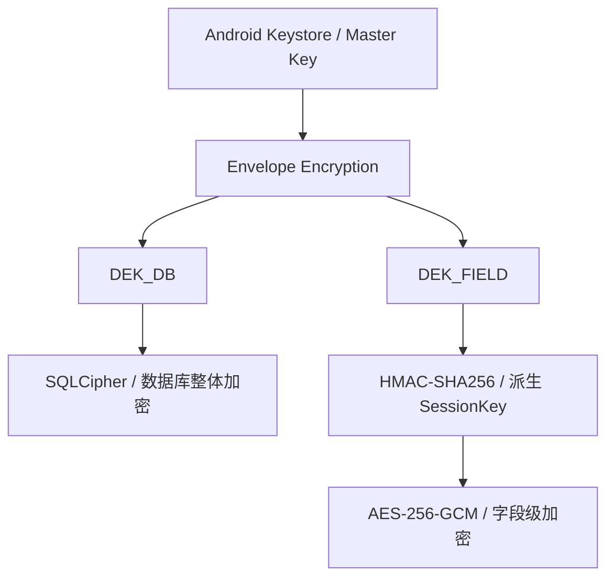
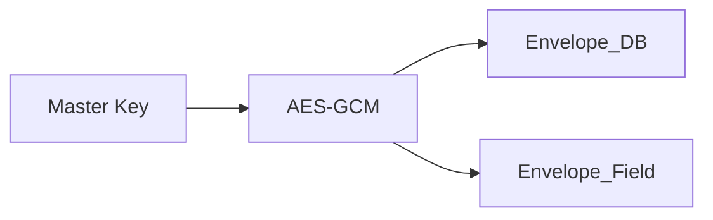
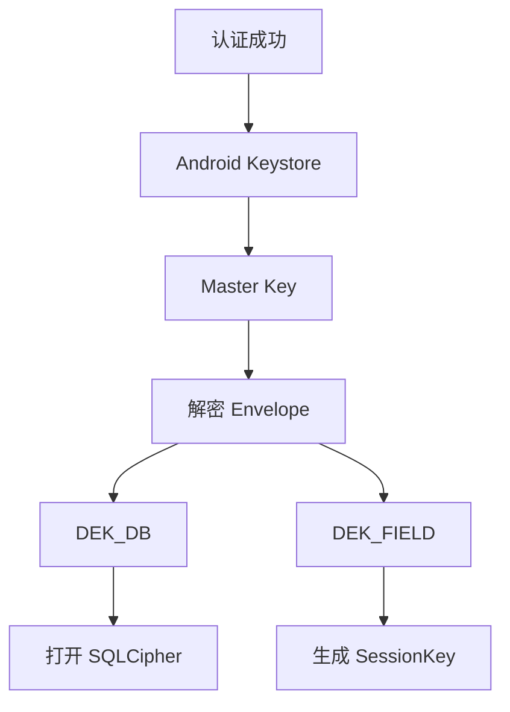
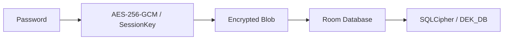
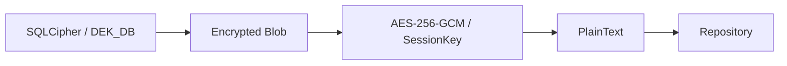

# Passly 密码学架构 (Crypto Architecture)

> 本文档定义 Passly 的密码学架构、密钥体系、数据加密流程以及密钥生命周期。
>
> Passly 的密码学设计遵循 **Zero Knowledge** 与 **Defense in Depth** 原则，是项目最重要的安全基石，其它所有安全功能均应遵循本规范。

---

## 1. 设计目标

Passly 的密码学架构遵循以下核心原则：

- **Zero Knowledge**：服务端或本地非授权环境无法获取任何明文数据。
- **Offline First**：所有加密操作均在本地完成，不依赖在线服务。
- **Envelope Encryption**：使用信封加密机制，实现认证方式与加密体系的解耦。
- **Defense in Depth**：从硬件 Keystore 到应用层加密，构建多层防御体系。
- **Key Separation**：不同用途的密钥严格分离，降低单一密钥泄露的影响。
- **Least Privilege**：各组件仅能接触到其功能所需的最小密钥/数据子集。

---

## 2. 总体架构

Passly 采用三层密钥体系，确保数据的极致安全性。

### 2.1 核心隔离原则

数据库及加密层不感知具体的认证方式（如生物认证、密码等），它们只识别生成的 **DEK_DB** 和 **DEK_FIELD**。

### 2.2 单一入口

整个系统中只有 **Master Key** 可以恢复 DEK。数据库从不接触具体的认证凭据，仅通过 DEK 进行操作。

---

## 3. 密钥体系

### 3.1 Master Key (主密钥)

- **存储位置**：保存在 **Android Keystore**。
- **核心职责**：负责解密 Envelope 以恢复 DEK，永不导出。
- **安全要求**：优先硬件保护（Hardware-backed），支持 **Strong Biometric** 及 **Device Credential**。
- **使用约束**：Master Key 永远不会直接用于数据加密。

### 3.2 DEK_DB (数据库加密密钥)

- **核心职责**：唯一负责 **SQLCipher** 数据库的整体加密。
- **技术特点**：AES-256 随机生成，生命周期贯穿 Vault 开启期间，永不直接保存明文。

### 3.3 DEK_FIELD (字段加密密钥)

- **核心职责**：保护 Password, Username, Notes, TOTP Secret 等核心敏感字段。
- **使用方式**：不直接用于 AES 加密，而是作为根密钥派生 SessionKey。

### 3.4 SessionKey (会话密钥)

- **派生算法**：由 DEK_FIELD 经过 **HMAC-SHA256** 派生（Label: `passly-field-key-v1`）。
- **生命周期**：仅存在于内存，严禁写入磁盘，用于最终的 **AES-256-GCM** 操作。

---

## 4. Envelope Encryption（信封加密）

Passly 不直接保存明文 DEK，而是保存由 Master Key 加密的 **Envelope**。

- **信封本质**：加密后的 DEK（即 `AES-GCM(DEK)`）。
- **解耦作用**：更换认证方式仅需重新生成 Envelope，无需重加密数据库数据。

---

## 5. 解锁流程

当用户认证成功后，密钥恢复链路如下：

### 5.1 恢复可读性

流程完成后，数据库恢复可读，字段恢复可解密，Vault 进入 **Unlocked** 状态。

---

## 6. 数据写入流程

### 6.1 写入流程 (Write Flow)

以保存密码为例，数据经历多层叠加保护：

### 6.2 读取流程 (Read Flow)

---

## 8. 字段加密规范

所有敏感字段统一使用 **AES-256-GCM** 算法：

- **Key**：使用 SessionKey。
- **Nonce**：96-bit 随机生成。禁止使用固定 IV、重复 IV 或计数器 IV。
- **Authentication Tag**：128-bit。校验失败必须立即阻断并抛出异常。
- **AAD (附加认证数据)**：必须绑定 `table_name`, `row_id`, `column_name`，防止密文复制攻击。

---

## 9. Key Separation（密钥分离）

Passly 严禁单一密钥承担多个职责，确保风险隔离：

- **Master Key**：专用于身份认证与 Envelope 解密。
- **DEK_DB**：专用于数据库整体加密（SQLCipher）。
- **DEK_FIELD**：专用于敏感字段逻辑隔离。
- **SessionKey**：专用于最终的 AES 加解密操作。

---

## 10. Key Rotation（密钥滚动）

- **无损更新**：修改应用密码或新增认证方式（如 Passkey）时，仅重新生成/新增 **Envelope**。
- **稳定性**：上述操作不得修改 DEK 或触发数据库的重新加密，确保系统响应迅速且安全。

---

## 11. 密钥生命周期管理

### 10.1 初始化阶段

生成 DEK_DB、DEK_FIELD，并使用 Master Key 创建对应的加密 Envelope。

### 10.2 解锁阶段

解密 Envelope 并恢复 DEK 与 SessionKey 到内存。

### 10.3 锁定阶段

立即销毁内存中的 SessionKey 和 DEK，彻底关闭 SQLCipher 句柄，并执行内存擦除。

---

## 12. 内存安全规范

- **及时释放**：认证完成后立即释放原始字节。
- **主动擦除**：对包含敏感数据的 **ByteArray** 使用后进行主动覆盖。
- **String 最小化**：尽量缩短 String 生命周期，在处理极敏感数据时优先使用字符数组或字节数组。

---

## 13. 与 Autofill 的关系

Autofill 管道严禁接触底层加密组件：

- **单点解密**：数据解密由 **Repository** 在安全边界内单点完成。
- **职责隔离**：Autofill Pipeline 永远不接触 SQLCipher、DEK 或 SessionKey。
- **数据流向**：Database → Repository (解密) → VaultEntry → ResolvedCandidate → Credential Manager。

---

## 14. 实现原则与约束

新增任何功能时必须遵守以下硬约束：

- **不修改数据库**：认证逻辑与存储结构完全解耦。
- **不修改 DEK**：核心加密组件保持高度稳定性。
- **单向演进**：新增认证方式只能新增 Envelope，不得修改加解密主流程。

---

## 15. 总结

Passly 的密码学架构由 **硬件保护**、**信封加密**、**数据库加密** 和 **字段级认证加密** 四层组成。该设计实现了
**Zero Knowledge** 与 **Defense in Depth**，在保证极致安全性的同时，为系统提供了卓越的可扩展性，确保新增认证方式无需重加密底层数据。