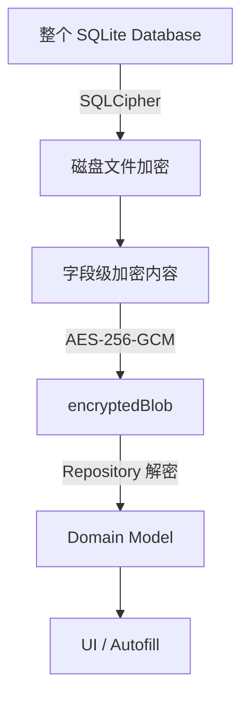
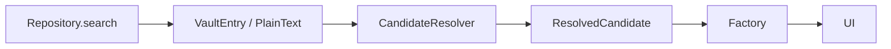

# Passly 数据库加密规范 (Database Encryption)

> 本文档定义 Passly 数据库加密策略、字段分类、Repository 解密职责以及与 SQLCipher 的协作方式。
>
> Passly 遵循 **整库加密** 与 **字段级加密** 双重保护机制，确保即使数据库文件离线泄露，敏感字段依然处于加密状态。

---

## 1. 设计目标

Passly 数据库设计遵循以下核心原则：

- **Database Encryption**：使用 SQLCipher 对数据库文件进行整库加密。
- **Field Encryption**：对特定的敏感字段进行二次 AES-256-GCM 加密。
- **Least Privilege**：各组件仅能接触其完成任务所需的最小数据集。
- **Repository 统一解密**：Repository 是唯一允许执行字段解密逻辑的组件。
- **UI 永不接触密文**：UI 层、Autofill Pipeline 严禁接触密文或加密密钥。

---

## 2. 整体架构

Passly 数据库采用两层保护架构，确保数据的纵深防御（Defense in Depth）。



- **SQLCipher**：负责保护数据库文件物理层安全。
- **AES-256-GCM**：负责保护字段级逻辑安全。
- **职责边界**：二者职责互不替代，共同构建安全基石。

---

## 3. SQLCipher 的职责

SQLCipher 作为底层防护体系，承担以下职责：

- **物理保护**：负责数据库文件、SQLite Page、WAL 及 Journal 文件的加密。
- **离线安全**：防止数据库在被非法拷贝后的离线读取（database.db）。
- **透明加解密**：在底层读写时自动处理，业务层无需感知其细节。
- **局限性**：SQLCipher 不负责字段级的业务逻辑权限控制或数据完整性校验。

---

## 4. 字段分类

Passly 根据安全等级将数据库字段划分为三类：

### 4.1 第一类：公开元数据 (Metadata)

- **用途**：用于条目过滤、排序及界面展示的基础信息。
- **存储**：明文存储。
- **示例**：`id`, `favorite`, `deleted`, `iconName`, `category`, `createdAt`, `updatedAt`。

### 4.2 第二类：业务标识 (Identity Metadata)

- **用途**：帮助用户识别条目及支持自动填充匹配逻辑。
- **存储**：默认明文存储，以支持搜索与快速定位。
- **示例**：`title`, `associatedDomain`, `packageName`。
- **注**：未来可提供“隐藏标题模式”对此类字段进行可选加密。

### 4.3 第三类：敏感数据 (Sensitive Data)

- **用途**：条目的核心机密信息，必须加密。
- **存储**：统一写入 **encryptedBlob**。
- **示例**：`username`, `password`, `notes`, `totpSecret`, `identityInfo`, `cardInfo`。

---

## 5. encryptedBlob 存储规范

所有敏感字段严禁拆散保存，必须统一序列化后再执行加密。

**加密流程：**


**核心优势**：这种方式方便了未来字段的灵活扩展，而无需频繁修改数据库 Schema。

---

## 6. Repository 职责与解密时机

Repository 是整个系统中的解密唯一出口，采用按需解密（Lazy Decryption）策略。

- **核心职责**：通过 **FieldDecryptor** 处理 `encryptedBlob` 的解密。
- **数据输出**：返回的数据始终为明文 **Domain Model**。
- **权限边界**：下游组件严禁再次解密，确立“密钥零接触”环境。

**数据流转路径：**

 ```mermaid
 graph LR
     DAO[DAO / Entity] --> FD[FieldDecryptor]
     FD --> VE[VaultEntry / Domain Model]
     VE --> REP[Repository 返回]
 ```

---

## 7. 组件行为约束

- **DAO 约束**：仅负责基础的 CRUD。严禁在 DAO 层获取密钥、处理解密逻辑或进行加解密操作。
- **UI 约束**：永远只接触明文 **Domain Model**。严禁 UI 调用 `FieldEncryptor` 或接触 `encryptedBlob`。
- **CandidateResolver 约束**：输入始终为解密后的 `VaultEntry`。严禁查询数据库或尝试重复解密。
- **ResponseFactory 约束**：保持纯 Factory 职责。严禁工厂类依赖 Repository、DAO 或进行密码学操作。

---

## 8. AAD (Additional Authenticated Data)

为防止密文复制攻击（Ciphertext Copy-Paste Attack），AES-256-GCM 必须绑定 AAD。

- **推荐绑定**：`table_name`, `row_id`, `column_name`。
- **校验逻辑**：AAD 参与 Tag 校验。若密文被复制到其它行，解密时校验将因 AAD 不匹配而失败。

---

## 9. 错误处理规范

当发生解密失败或 **Authentication Tag** 校验失败时：

- **异常处理**：Repository 必须立即抛出 `CryptoException.TagVerificationFailed`。
- **安全禁令**：严禁返回部分已解密的数据，严禁忽略异常继续返回空值字段。

---

## 10. 调试与审计要求

- **审计禁令**：严禁在日志中打印 `encryptedBlob`, `SessionKey`, `DEK`, `SQLCipher Key`。
- **日志脱敏**：调试日志中不得出现任何敏感业务数据（如密码、TOTP 密钥）。

---

## 11. Repository 返回契约

Repository 对外保证返回的数据均为 **已解密** 状态。全流程仅解密一次。



---

## 12. 总结

Passly 数据库架构通过 **SQLCipher + AES-256-GCM** 的嵌套保护，实现了职责清晰的防御体系。Repository
作为唯一的解密入口，确立了“密钥零接触”的下游运行环境，完美贯彻了职责分离与最小权限的设计哲学。