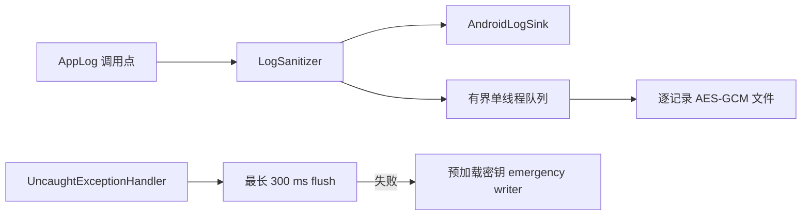

# 安全诊断

状态：当前实现。

## 数据流

Sanitizer 在分发前删除凭据、Token、URL、用户名、路径和 Throwable message；Sink 只接收 `SanitizedLogEvent`。
Debug Android Sink 从 DEBUG 开始，Release 只写 WARN/ERROR。旧 `Logcat`、Filter、Exporter 和旧 CrashHandler
已经删除。

## 文件格式与保留

日志位于 `noBackupFilesDir/diagnostics`。每个文件有 magic、版本和独立随机数据密钥；数据密钥由专用且无需用户认证的
Android Keystore key 以 AES-GCM 包装。记录使用独立随机 nonce 与固定格式 AAD。文件按日期或 1 MiB 滚动，最多
保留 3 天、3 个文件或 3 MiB。

Release 默认关闭文件日志。用户在设置中开启后，独立 Proto 保存 24 小时截止时间；到期后停止写入。查看最多加载
500 行。导出要求 `ExportDiagnostics` 新鲜认证，生成 cacheDir 临时明文文件，分享后延迟删除；再次导出会先清理旧文件。

## 崩溃路径

Application 先安装只依赖 Android Sink 的最小 CrashHandler，再在后台读取策略、初始化 Keystore 包装密钥并预生成
emergency 文件密钥。普通 writer 队列满时丢弃低级日志；ERROR/FATAL 使用受控 emergency fallback。

CrashHandler 先等待普通队列最多 300 ms。失败时 daemon emergency writer 使用预加载密钥写独立 crash 文件，
崩溃线程最多等待 200 ms；该路径不调用 Keystore、不取得普通 writer 锁，也不依赖中断阻塞 I/O。密钥未就绪时只保留
脱敏 Android 日志。
