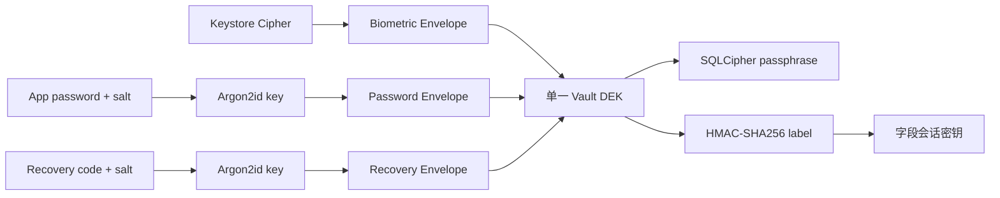

# 密钥管理

## 当前密钥体系

当前实现不是双 DEK。一个随机 256-bit Vault DEK 被多个认证 Envelope 包装；字段会话密钥使用固定域分离标签从
DEK 派生。该决策由 [ADR-0019](../decisions/ADR-0019-single-dek-derived-session-key.md) 替代旧
ADR-0003。

## VaultBootstrapStore

Envelope 与 verification tag 必须在数据库打开前可用，因此保存于独立 VaultBootstrapStore。接口位于
Domain 的 `access.port`，生物识别轮换状态位于 `access.model`；当前 Proto DataStore 实现位于 Data 层。
Room 的 `key_envelopes` 表是未清理的遗留实现，不是当前真相源。

## 生命周期

1. 初始化生成 DEK、verification tag 和首个 Envelope。
2. 解锁时读取指定 Envelope，解封并验证 DEK。
3. `DekManager` 保存 DEK 的内存副本并派生会话密钥。
4. 添加认证方式只新增或替换 Envelope。
5. 锁定时关闭数据库并覆盖内存数组。
6. 删除 Vault 时清除 VaultBootstrapStore 和数据库数据，操作必须显式且不可伪装成错误恢复。

`SecretKeySpec.encoded` 可能返回副本，对它调用 `fill(0)` 不能证明内部密钥已被擦除。文档和注释只能表述为“尽力缩短并覆盖可控副本”。
