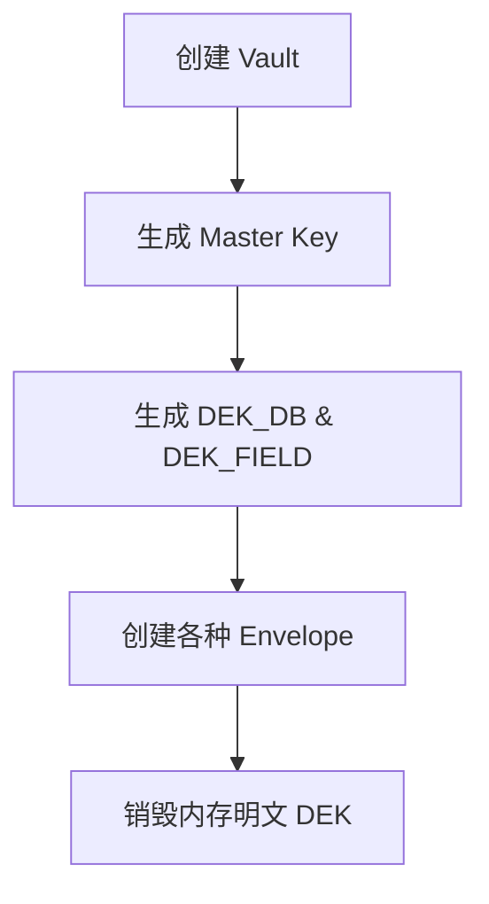
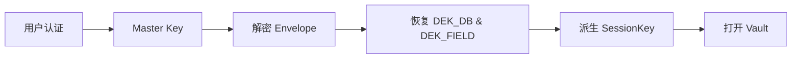

# Passly 密钥管理规范 (Key Management)

> 本文档定义 Passly 中所有密钥的职责、生命周期、存储位置、创建方式及销毁策略。
>
> 所有涉及密钥生成、存储、恢复、销毁的实现均应遵循本规范，确保**认证方式**与**数据加密**的完全解耦。

---

## 1. 设计目标

Passly 的密钥管理遵循以下核心原则：

- **密钥隔离 (Key Separation)**：不同用途的密钥严格分离，严禁一钥多用。
- **最小权限 (Least Privilege)**：各组件仅能接触到其功能所需的最小密钥子集。
- **信封加密 (Envelope Encryption)**：数据加密密钥不直存，通过上级密钥封装保存。
- **硬件保护 (Hardware-backed)**：根密钥优先受硬件安全模块保护，确保不可导出性。
- **生命周期最小化**：敏感密钥仅在内存中按需存在，使用完毕立即销毁。

---

## 2. 密钥分类

Passly 定义了四类核心密钥，构建起分层的安全体系：

| 名称             | 核心职责           | 持久化方式            | 生命周期        |
|:---------------|:---------------|:-----------------|:------------|
| **Master Key** | 解密 Envelope    | Android Keystore | 永久 (受硬件保护)  |
| **DEK_DB**     | 数据库整体加密        | Envelope (加密状态)  | 仅解锁期间 (内存)  |
| **DEK_FIELD**  | 字段加密根密钥        | Envelope (加密状态)  | 仅解锁期间 (内存)  |
| **SessionKey** | 实际 AES-GCM 加解密 | 不持久化             | 仅加解密瞬时 (内存) |

---

## 3. Master Key (主密钥)

- **核心职责**：唯一用于加密及解密 **Envelope** 以恢复 DEK。
- **创建方式**：初始化 Vault 时在 **Android Keystore** 中生成，必须设置为不可导出（Non-exportable）。
- **安全约束**：优先使用硬件支持（Hardware-backed），并绑定用户认证要求（UserAuthenticationRequired）。
- **禁令**：严禁直接用于数据库整体加密、字段加密或任何形式的 AES-GCM 业务数据加密。

---

## 4. DEK_DB (数据库加密密钥)

- **职责定义**：作为 **SQLCipher** 的加密密钥，负责数据库文件的物理层整体安全性。
- **创建时机**：仅在创建 Vault 时生成一次，由 `SecureRandom` 产生 32 字节随机数。
- **包装存储**：生成后立即使用 Master Key 包装为 **Envelope_DB** 存储，内存明文随后立即销毁。
- **生命周期**：仅在 Vault 解锁期间恢复至内存，Vault 锁定时必须立即从内存销毁。
- **更新约束**：修改应用密码、新增认证方式或数据库版本升级时，严禁重新生成 DEK_DB。

---

## 5. DEK_FIELD (字段加密根密钥)

- **职责定义**：作为字段加密体系的根密钥，仅用于派生 **SessionKey**。
- **使用约束**：严禁直接用于 AES-GCM 算法进行数据加解密操作。
- **状态管理**：Vault 初始化时生成一次。在 Vault 锁定时在内存中彻底擦除，确保存储中仅存在加密后的
  Envelope。

---

## 6. SessionKey (会话密钥)

- **派生逻辑**：由 DEK_FIELD 经过 **HMAC-SHA256** 派生，使用固定标签 `passly-field-key-v1`。
- **输出长度**：256-bit。
- **存储禁令**：严禁持久化，不得写入数据库、DataStore、SharedPreferences 或任何形式的日志系统。
- **内存边界**：仅在 Vault 已解锁期间存在，处理完加解密任务后应尽快从内存中安全擦除。

---

## 7. Envelope (信封) 机制

Envelope 是认证与加密解耦的核心媒介。

- **本质定义**：使用 Master Key 加密后的 DEK 密文（采用 AES-GCM 算法）。
- **多路支持**：每种认证方式拥有独立的 Envelope，例如：
    - **Envelope_Biometric**：生物识别信封。
    - **Envelope_DeviceCredential**：设备凭据信封。
    - **Envelope_AppPassword**：应用密码信封。
    - **Envelope_Recovery**：恢复码信封。

---

## 8. 核心流程可视化

### 8.1 密钥生成流程

### 8.2 解锁恢复流程

### 8.3 锁定销毁流程

---

## 9. 认证方式变更规范

- **修改认证方式**：如修改应用密码。通过当前已恢复的 DEK 使用新凭据生成新 Envelope，并替换旧信封。*
  *不得重新生成 DEK**。
- **删除认证方式**：仅物理删除对应的 Envelope 记录，不得影响其它 Envelope 或数据库。
- **新增认证方式**：如新增 Passkey。仅需生成对应的新 Envelope 并保存，无需迁移或重加密数据。

---

## 10. 密钥销毁与内存安全

- **主动覆盖**：对于内存中的 `ByteArray` 密钥，使用完毕后应进行覆盖填充（如清零）。
- **引用清理**：锁定后立即释放所有密钥对象引用，确保护存不被意外泄露。
- **类型选择**：敏感数据处理严禁使用 String（因其不可变性），必须优先使用 **ByteArray** 或 **CharArray
  **。

---

## 11. 开发禁令 (Prohibitions)

- **严禁**：以任何形式在持久化磁盘中保存明文 DEK 或 SessionKey。
- **严禁**：在日志输出中包含密钥或其任何派生结果。
- **严禁**：将密钥通过 **Intent** 或 **Bundle** 在 Android 组件间进行传递。
- **严禁**：在 SharedPreferences 或普通 DataStore 中存储非 Envelope 形式的密钥。
- **严禁**：将密钥对象直接进行序列化处理。

---

## 12. 安全总结

Passly 采用 **Master Key → Envelope → DEK → SessionKey**
的分层密钥体系。该架构通过硬件保护根密钥，通过信封机制持久化中间密钥，并在内存中派生最终会话密钥。这种设计不仅实现了极致的安全性，更实现了认证凭据与底层数据加密的彻底解耦。