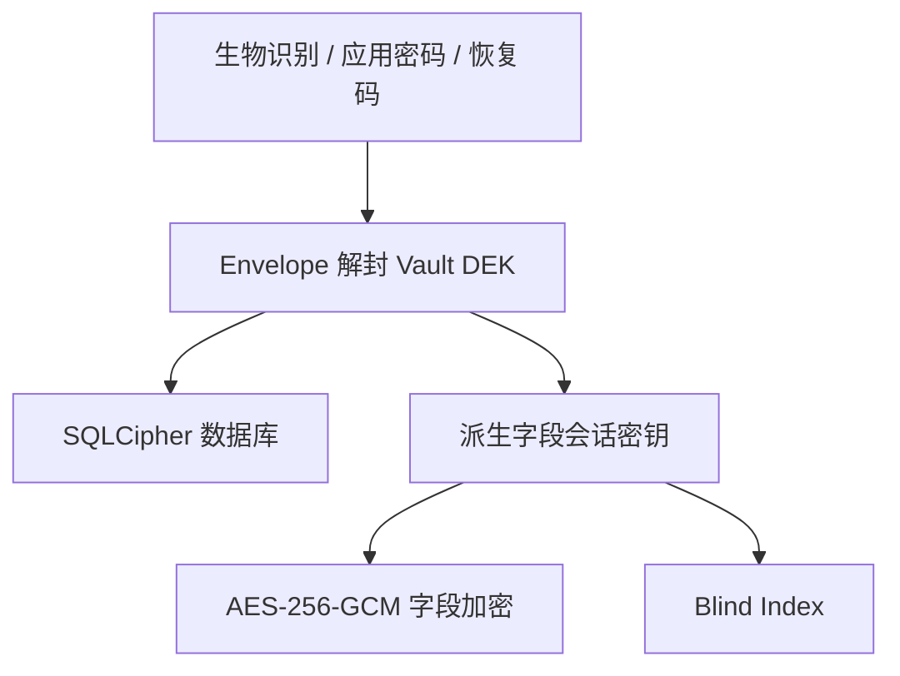

# 安全总览

Passly 的目标是保护离线设备上的保险库数据，并把凭据暴露限制在完成用户操作所需的最短时间。安全设计不声称抵御已完全控制系统或能持续读取进程内存的攻击者。

## 防护层

- Android Keystore 保护生物识别包装密钥。
- Argon2id 从应用密码或恢复码派生包装密钥。
- 多个 Envelope 包装同一份随机 Vault DEK；认证方式可变化而不重加密全部数据。
- SQLCipher 保护数据库整体，敏感负载另做字段级认证加密。
- 锁定时先关闭数据库，再擦除 DEK 与派生会话密钥。

## 信任边界

| 区域             | 允许持有                                    | 禁止                      |
|----------------|-----------------------------------------|-------------------------|
| UI/ViewModel   | 短生命周期明文、`CharArray` 输入、UI state         | 持久化密钥、记录凭据日志            |
| Repository     | 解锁会话中的领域明文                              | 向 Domain 暴露 Entity/密文细节 |
| Security       | DEK、派生密钥、Envelope 操作                    | 依赖 Room/DataStore 具体实现  |
| BootstrapStore | Envelope 密文、salt、nonce、verification tag | 明文 DEK                  |
| Room/SQLCipher | 加密数据库与字段密文                              | 自动删库恢复                  |

## 开发约束

- AES-GCM nonce 每次随机生成且同一密钥下不得复用。
- 密钥、密码和恢复码不得进入日志、异常消息或持久 UI state。
- `ByteArray`/`CharArray` 使用后尽快覆盖，但 JVM/Android 运行时不保证所有副本可被可靠擦除。
- 数据损坏、错误凭据和版本不兼容必须区分，禁止用删除数据隐藏错误。
- 密码学原语或格式变更必须新增 ADR 和测试向量。

参见[威胁模型](threat-model.md)、[密钥管理](key-management.md)和[认证](authentication.md)。

