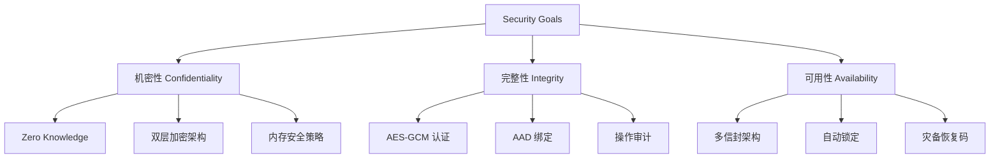

# Passly 安全设计目标 (Security Goals)

> 本文档定义 Passly 的核心安全设计目标、安全需求、威胁模型以及关键的安全设计决策。
>
> Passly 的安全架构致力于保护用户密码与敏感数据的 **机密性 (Confidentiality)**、**完整性 (Integrity)
** 与 **可用性 (Availability)**。

---

## 1. 核心安全原则

Passly 的安全设计围绕以下四项目标构建，确立纵深防御体系：

- **机密性 (Confidentiality)**：所有敏感数据在存储与传输时必须加密，确立 **Zero Knowledge** 运行环境。
- **完整性 (Integrity)**：使用 **AEAD**（如 AES-GCM）确保数据未被篡改，并绑定上下文信息防止密文搬移。
- **可用性 (Availability)**：支持多认证方式（生物识别、密码、恢复码），确保用户在不同场景下均能安全访问数据。
- **不可否认性 (Non-Repudiation)**：记录关键安全操作审计日志，确保安全操作的可追溯性。

---

## 2. 安全防护模型

---

## 3. 安全需求规范

### 3.1 数据存储安全

- **整库加密**：使用 **SQLCipher** 保护数据库物理文件，防止离线读取。
- **字段级加密**：对敏感字段执行二次 **AES-256-GCM** 加密，确立逻辑隔离。
- **篡改防护**：利用 **GCM 认证标签** 确保密文完整性，识别任何未经授权的修改。
- **密文绑定**：通过 **AAD** 绑定数据库记录元数据（row_id, table_name），防止密文跨记录替换。

### 3.2 密钥管理安全

- **内存化 DEK**：数据加密密钥（**DEK**）仅在 Vault 解锁期间存在于内存，严禁持久化。
- **即时销毁**：Vault 锁定后，内存中的所有密钥与敏感数据必须立即清零。
- **硬件根密钥**：利用 **Android Keystore** 保护根密钥，确保密钥永不出硬件安全模块。
- **前向兼容**：**KDF 参数** 随信封持久化，支持未来算法的平滑升级。

### 3.3 认证安全

- **生物认证**：集成 Android 系统级 **BiometricPrompt**，仅支持强认证。
- **抗暴力破解**：应用密码采用 **Argon2id KDF** 派生，并设有错误尝试锁定机制。
- **灾备恢复**：提供 **恢复码** 机制，作为所有认证方式失效后的最后防线。

### 3.4 内存安全

- **非 String 策略**：敏感数据处理核心路径严格使用 **ByteArray**，规避 JVM String 的不可变性。
- **主动擦除**：使用后立即通过 **MemoryCleaner** 擦除内存残留，缩短敏感数据驻留时间。

---

## 4. 威胁模型覆盖范围

| 威胁等级          | 攻击场景            | 覆盖策略                                        |
|:--------------|:----------------|:--------------------------------------------|
| **L1: 物理访问**  | 设备丢失或被盗         | **自动锁定** + **生物识别** 强制认证                    |
| **L2: 应用层攻击** | 恶意软件尝试读取数据库     | **字段加密** + **密钥内存隔离**                       |
| **L3: 系统层攻击** | 根权限泄露 / ADB 备份  | **SQLCipher** + **Android Keystore** 硬件保护   |
| **L4: 硬件层攻击** | 芯片级侧信道攻击        | 有限防护（依赖 Android 系统安全补丁）                     |
| **L5: 内存取证**  | 冷启动攻击 / 内存 Dump | **ByteArray** 主动擦除 + 缩短 **SessionKey** 生命周期 |

---

## 5. 关键安全决策 (ADR)

### 5.1 双层加密架构 (SQLCipher + 字段加密)

- **决策内容**：在整库加密的基础上，对特定字段实施 **AES-256-GCM** 加密。
- **决策原因**：即使 SQLCipher 密码泄露，核心敏感字段仍受保护；同时有效防止了通过数据库文件进行的批量密文分析。

### 5.2 多信封架构 (Multi-Envelope)

- **决策内容**：采用 **信封加密** 机制，为每种认证方式分配独立的 **Envelope**。
- **决策原因**：实现了认证方式与加密体系的完全解耦。更换密码或增删指纹时，无需重新加密整个数据库。

### 5.3 最小暴露原则

- **决策内容**：UI 层不接触 `VaultEntry` 实体，仅接触解密后的 `ResolvedCandidate`。
- **决策原因**：极大降低了敏感数据泄露至 UI 渲染层的风险，确保职责边界清晰。

---

## 6. 安全边界定义

| 边界                  | 强制执行手段                            |
|:--------------------|:----------------------------------|
| **DEK → 应用层**       | 严禁直接暴露。通过专用加密引擎按需调用。              |
| **Database → UI**   | 严格通过 **Repository** 接口隔离。         |
| **VaultEntry → UI** | 转换为 **ResolvedCandidate**，剔除原始密文。 |
| **Keystore → 应用**   | 密钥生成与运算均在硬件隔离环境内完成。               |

---

## 7. 安全审计核查表 (Audit Checklist)

- [ ] **密钥销毁**：DEK 是否在锁定指令发出后的 **100ms** 内完成内存清零？
- [ ] **内存安全**：敏感字段的处理链路中是否存在意外的 **String** 转换？
- [ ] **解密出口**：解密逻辑是否仅存在于 **Repository** 这一单一点？
- [ ] **认证规范**：是否使用了 **BIOMETRIC_STRONG** 等级？
- [ ] **加密算法**：AES-GCM 的 **Nonce** 是否保证了全局唯一性且不重复？
- [ ] **AAD 绑定**：AAD 是否正确包含了 `row_id` 和 `table_name`？

---

## 8. 总结

Passly 的安全设计旨在构建一个 **分层防御** 且 **职责分明** 的体系。通过将认证、密钥管理、数据库持久化与
UI 展示层层隔离，我们确保了即使在部分边界被突破的情况下，用户的核心资产依然能得到硬件级别的保护。