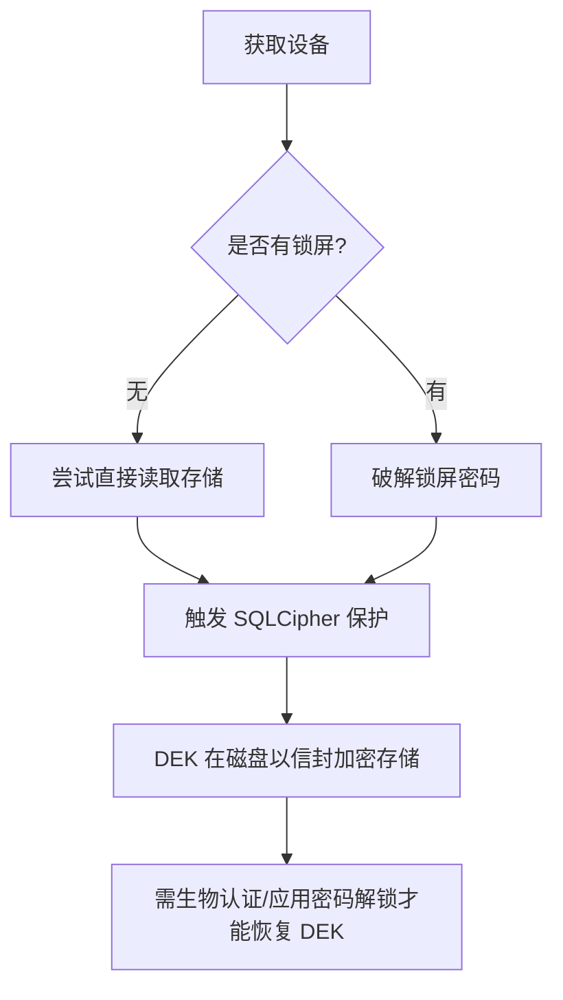
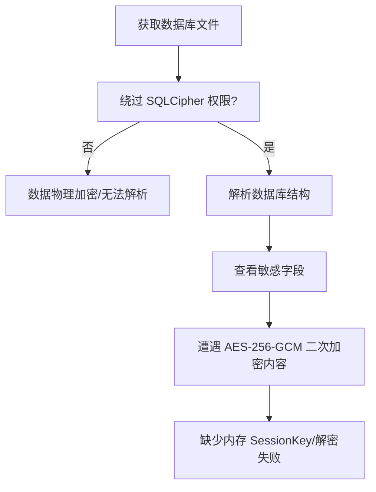
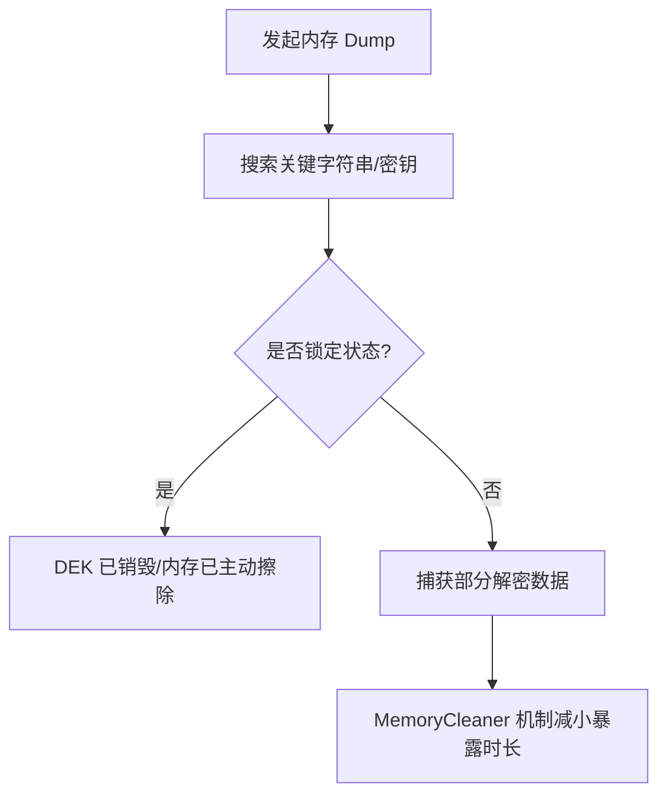

# Passly 威胁模型 (Threat Model)

> 本文档定义 Passly 的威胁等级、攻击场景及防御边界。
>
> Passly 采用分层威胁模型，从 **L1（物理访问）** 到 **L5（侧信道攻击）**
> 构建全方位的防御体系，确保在不同层级的攻击下依然能够保护用户的核心凭据。

---

## 1. 威胁等级定义 (Threat Levels)

### 1.1 L1：物理访问攻击

**场景描述**：攻击者物理接触设备，尝试通过直接手段获取敏感数据。

- **威胁行为**：
    - 直接访问设备存储（SD 卡、内部存储镜像）。
    - 尝试暴力破解设备锁屏。
    - 设备丢失或被盗后的脱机数据提取。
- **核心防护**：
    - **SQLCipher**：数据库整库加密。
    - **字段级加密**：核心字段二次 AES-256-GCM 加密。
    - **自动锁定**：超时或后台自动锁定时立即销毁内存密钥。
    - **生物识别/应用密码**：作为恢复 DEK 的强制认证手段。
- **剩余风险**：设备被 Root 后 Keystore 可能受损；极端情况下的冷启动攻击。

### 1.2 L2：应用层攻击

**场景描述**：恶意应用利用系统漏洞或用户行为诱导窃取数据。

- **威胁行为**：
    - 恶意应用扫描应用私有目录。
    - 剪贴板监听与敏感数据劫持。
    - 社交工程攻击（钓鱼、诈骗）。
- **核心防护**：
    - **Android 文件权限**：采用 MODE_PRIVATE 严格隔离私有目录。
    - **最小暴露原则**：UI 层与管道层不接触原始密文，不展示非必要敏感数据。
    - **剪贴板保护**：自动清理敏感内容，限制读取频率。
- **剩余风险**：恶意输入法窃取键盘记录；用户主动分享密码。

### 1.3 L3：系统层攻击

**场景描述**：操作系统环境被攻破（如被 Root 或内核提权）。

- **威胁行为**：
    - 内核级钩子拦截系统调用。
    - 进程注入或内存 Dump 尝试提取密钥。
    - 绕过 Android 沙箱机制。
- **核心防护**：
    - **Android Keystore**：硬件级隔离（TEE/StrongBox），确保密钥永不离开硬件。
    - **MemoryCleaner**：利用内存屏障主动擦除敏感字节。
    - **会话销毁**：锁定后立即清除 SessionKey，缩短暴露窗口。
- **剩余风险**：Root 环境下系统组件可能被篡改；极端的内存取证攻击。

### 1.4 L4：硬件层攻击

**场景描述**：针对底层芯片、总线或存储介质的物理级攻击。

- **威胁行为**：
    - 芯片侧信道分析。
    - 闪存数据物理恢复（NAND 提取）。
    - 硬件植入拦截总线数据。
- **核心防护**：
    - **Hardware-backed**：强制要求硬件支撑的根密钥，确保不可导出性。
    - **StrongBox**：在支持的设备上启用独立安全芯片保护。
- **剩余风险**：StrongBox 并非所有设备支持；解锁状态下内存总线暴露。

### 1.5 L5：侧信道攻击

**场景描述**：通过测量运行特征（耗时、功耗、辐射）推导密钥信息。

- **威胁行为**：
    - 计时攻击（Timing Attack）。
    - 功耗分析与电磁辐射监控。
- **核心防护**：
    - **标准加密库**：严禁自研算法，使用经过审计的系统加密实现。
    - **常量时间逻辑**：尽可能在关键路径使用常量时间操作。
- **剩余风险**：JVM 垃圾回收机制导致的不可控执行耗时。

---

## 2. 攻击场景模拟 (Attack Scenarios)

### 2.1 场景一：设备丢失

当攻击者获取丢失设备并尝试进入存储系统：

### 2.2 场景二：恶意软件读取数据库

攻击者通过漏洞非法获取了数据库物理文件：

### 2.3 场景三：内存 Dump 攻击

恶意程序尝试读取 Passly 进程内存快照：

### 2.4 场景四：生物识别欺骗

**攻击路径**：

1. 攻击者使用照片/3D 模型尝试欺骗生物识别传感器。
2. 尝试获取 Vault 访问权限。

**核心防护**：

- **系统级验证**：Android `BiometricPrompt` 使用系统级生物识别并负责活体检测。
- **强生物识别要求**：强制要求强生物识别等级（`AUTH_BIOMETRIC_STRONG`），确保物理安全性。
- **备用认证**：应用密码作为生物识别不可用时的最后认证屏障。

### 2.5 场景五：备份文件泄露

**攻击路径**：

1. 攻击者获取备份文件。
2. 尝试通过暴力破解获取数据。
3. 获取所有敏感数据。

**核心防护**：

- **Argon2id KDF**：备份文件加密使用 Argon2id 高强度密钥派生算法，抵抗暴力破解。
- **AES-256-GCM**：备份内容采用标准的 AES-256-GCM 认证加密。
- **强制设置备份密码**：严禁无密码备份，确保离线数据的安全性。

---

## 3. 风险评估矩阵 (Risk Assessment)

| 威胁等级          | 发生可能性 | 潜在影响 | 优先级    | 防御状态 |
|:--------------|:------|:-----|:-------|:-----|
| **L1: 物理访问**  | 高     | 高    | **紧急** | 已闭环  |
| **L2: 应用层攻击** | 中     | 中    | **高**  | 已闭环  |
| **L3: 系统层攻击** | 低     | 高    | **高**  | 硬件隔离 |
| **L4: 硬件层攻击** | 极低    | 极高   | **中**  | 依赖硬件 |
| **L5: 侧信道攻击** | 极低    | 中    | **低**  | 算法防护 |

---

## 4. 安全设计权衡 (Security Trade-offs)

### 4.1 性能 vs 安全性

- **选择**：安全性优先。
- **理由**：虽然双层加密（SQLCipher + AES-GCM）会带来毫秒级的查询延迟，但对于密码管理器而言，该开销是必要且可接受的。

### 4.2 可用性 vs 安全性

- **选择**：平衡兼顾。
- **理由**：提供多种认证方式确保用户不会被锁定，但所有方式最终必须恢复同一组高强度的 DEK，保证安全底座统一。

### 4.3 兼容性 vs 安全性

- **选择**：安全优先。
- **理由**：系统最低支持 Android 8.0，以确保能够使用 Keystore 2.0 及更强的安全 API，StrongBox 则作为增强选项。

---

## 5. 安全加固建议 (Hardening Recommendations)

1. **启用 StrongBox**：在支持的设备上，密钥生成时应强制启用 StrongBox 标志。
2. **缩短自动锁定时间**：建议默认自动锁定时间不超过 5 分钟，减少密钥在内存中的停留。
3. **强制离线备份恢复码**：生成恢复码时，强制要求用户物理记录而非保存在同一设备内。
4. **强制强生物识别**：仅允许 `BIOMETRIC_STRONG` 等级的生物特征用于 Vault 解锁。

---

## 6. 总结

Passly 的安全架构并不假设系统环境是绝对安全的. 通过 **SQLCipher + 字段级加密 + 硬件 Keystore**
的组合，我们将防御重心从单纯的“防止文件被读”转移到了“确保数据无法被解密”。这种纵深防御架构确保了即使在设备丢失或系统受损的极端场景下，用户的核心机密依然能得到硬件级别的保护。